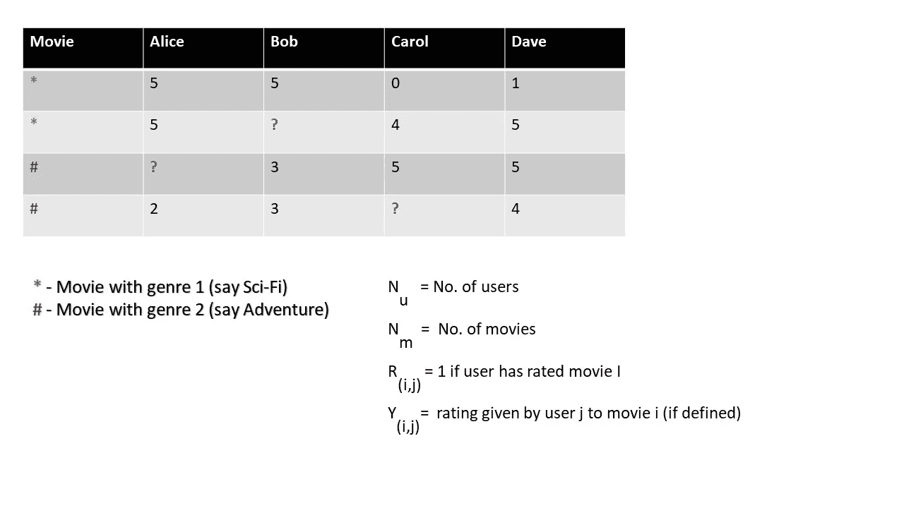
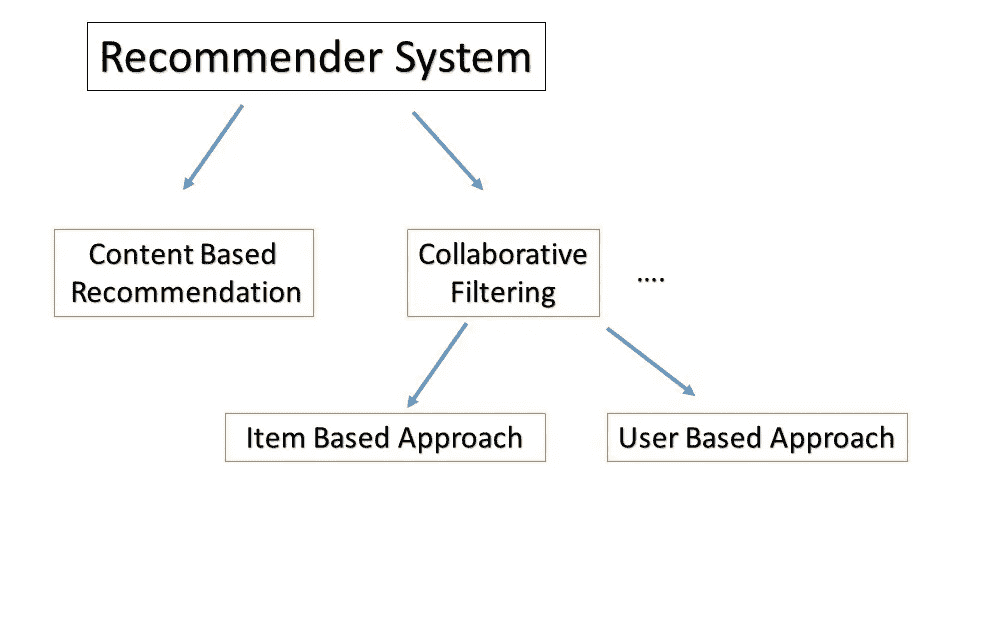
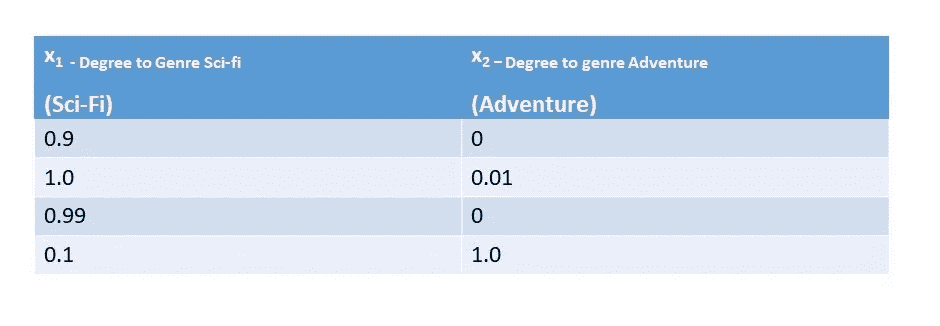
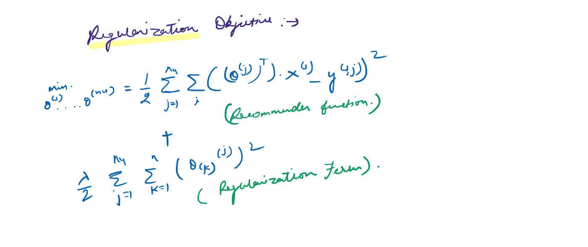
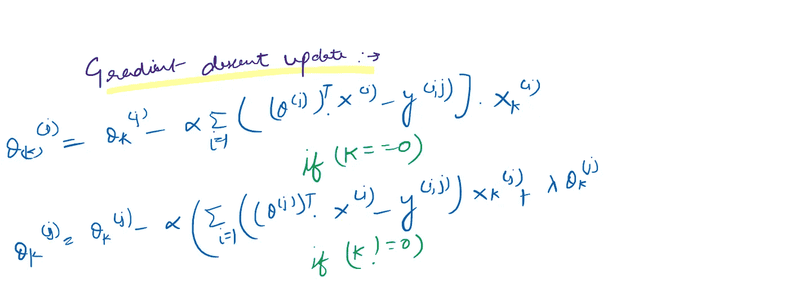
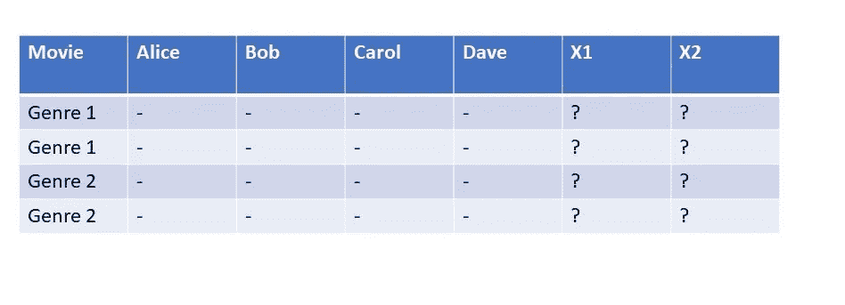
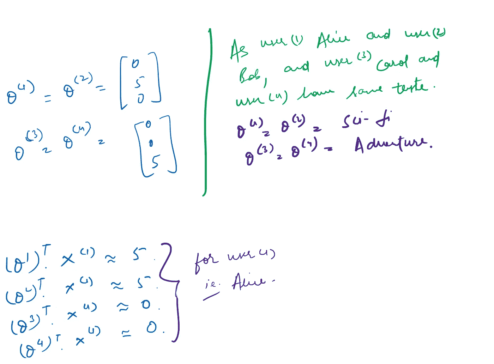
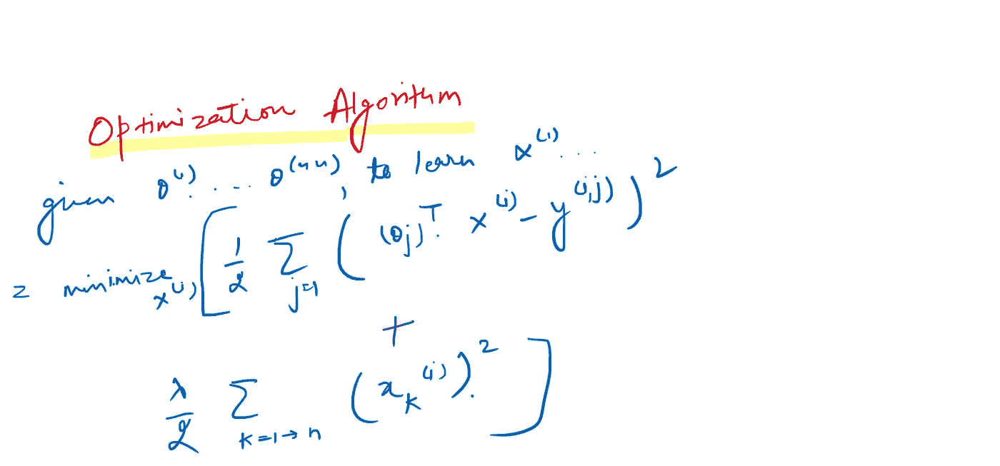
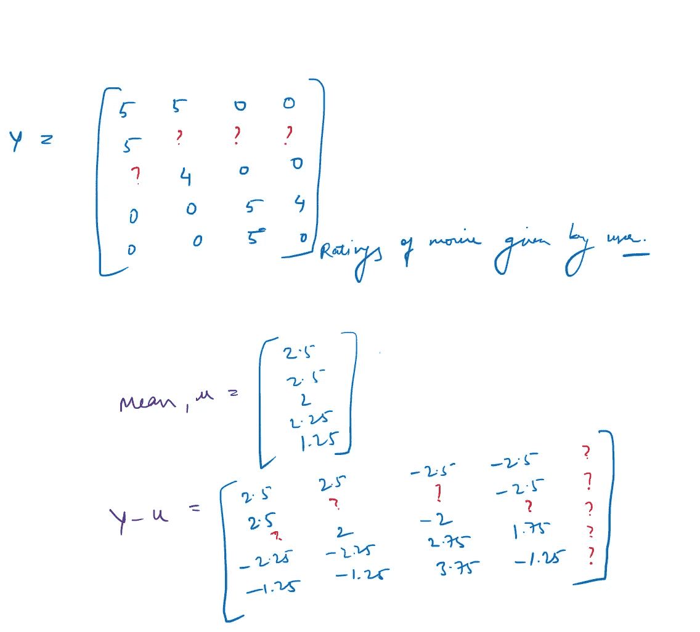

# 这是一个 match❤️️——推荐系统

> 原文：<https://medium.com/analytics-vidhya/its-a-match-%EF%B8%8F%EF%B8%8F-the-recommender-system-9d373a242562?source=collection_archive---------28----------------------->

欢迎，今天我们将看到亚马逊如何根据之前的购买情况向您推荐要购买的商品，网飞向您推荐“看了*这个*也看了*那个*的用户”及其背后的算法。

**什么是** [**推荐人制度**](https://en.wikipedia.org/wiki/Recommender_system#:~:text=A%20recommender%20system%2C%20or%20a,primarily%20used%20in%20commercial%20applications.) **？**

维基说…推荐系统是信息过滤系统的一个子类，它试图预测用户对某个项目的“评分”或“偏好”。它们主要用于商业应用。推荐系统被用于各种领域，最常见的是作为视频和音乐服务的播放列表生成器，如[网飞](https://en.wikipedia.org/wiki/Netflix)、 [YouTube](https://en.wikipedia.org/wiki/YouTube) 和 [Spotify](https://en.wikipedia.org/wiki/Spotify) ，服务的产品推荐器，如[亚马逊](https://en.wikipedia.org/wiki/Amazon_(company))，或社交媒体平台的内容推荐器，如[脸书](https://en.wikipedia.org/wiki/Facebook)和[推特](https://en.wikipedia.org/wiki/Twitter)。

先举个预测电影收视率的例子。

(评分从 1★到 5★)

通过从用户数据中获得洞察力，我们可以假设爱丽丝和鲍勃喜欢科幻电影胜过冒险，反之亦然。

> ✦直觉:找到并预测缺失的值。

推荐系统大致包括两种类型。

*   基于内容的过滤
*   协同过滤

# 基于内容的过滤

基于内容的过滤基于这样一个事实，即基于先前的观察列表来推荐用户。让我们假设用户(x)喜欢看类型(y)的电影。一部新电影上映了一部同样流派、演员等的电影。该过滤器将以某种概率向用户(x)推荐电影。

> 基于内容的推荐系统的主要范例是由这样一句话驱动的:“向我展示更多我以前喜欢的相同内容。”

让我们假设每个用户对哪部电影属于特定类型给出了一定程度的评价。*(从 0 到 1)*

体裁程度

我们来做一个特征度的向量*(此处体裁)*

*那么*X(1)=【0.9；1.0;0.99;0.1]

对于每个用户 j，学习参数θ(j)将用户 j 预测为用((θ^j)Transpose).X^(i)和*将预测每个用户的评分视为一个独立的线性回归问题。*

爱丽丝- θ，鲍勃-θ，卡罗尔-θ，Dave-θ⁴

(说)θ是[0；5;0]且 X =[1；0.99;0]

为观看电影 3 的爱丽丝预测:

((θ )^T).X = 5*0.99 = 4.95★

***问题提法***

对于观看电影(I)的用户(j ),预测评级:-

((θ(j))转置)。(十㈠)

如果 m(j)是用户 j 评分的电影数量。

要学习θ(j):

**R(x) =最小化θ(j) : 1/2m * ∑ [(θ(i)转置)。X(i)- y(i，j)]，**类似于[线性回归问题](/analytics-vidhya/working-of-linear-regression-3c0e294a6d22)。

**学习目标:**

= R(x)+λ/2 *∑(θk(j))；即。推荐系统函数+正则项(可选)

所以，对于 n 个用户:1/2 * ∑(从 j=1 到 nu) * ∑[R(x)]

**优化算法**

优化算法在这里…

PS:抱歉写得不好

**梯度下降更新**

如在[线性回归文章](/analytics-vidhya/working-of-linear-regression-3c0e294a6d22)中所述，梯度下降和优化参数和目标的工作。

# 协同过滤

协同过滤基于这样的事实，即用户(x)可能喜欢他的邻居中流行的东西，并且这可能是用户最喜欢的方面。

> 协同过滤推荐系统的主要范式是由这样一句话驱动的:“告诉我我的邻居中流行什么，因为我可能也会喜欢。”协同过滤技术找到相似的用户群，并基于该用户群中相似的品味提供推荐。

让我们反过来看前面的例子。现在我们不知道一个特定流派的程度，但用户已经给出了他们更喜欢的流派。现在我们必须预测类型相反的程度。

**优化算法:-**

“所以，我们可以连续计算:给定 x(1)，x(2)……x(n)估计θ(1)…。反之亦然。我们能做的是同时计算两者。”

我们同时最小化 X 和θ，并组合两种优化算法。

**包起来~**

第一步。将 x(1)，x(2)，x(3)…初始化为小的随机值。

第二步。最小化 J **(** *x(1)，x(2)，x(3)…… x(n)* ***，*** *θ(1)，θ(2)，θ(3)……θ(n)***)**使用梯度下降或任何高级优化技术。

第三步。对于具有参数θ的用户和具有*(已学习)*特征 x 的电影，预测θ^T(X).的星级

**低秩矩阵分解和均值归一化**

协同过滤也叫*低秩因子分解，因为我们可以用矩阵的形式呈现评分。我们计算每个评级的均值矩阵，并减去均值以使结果标准化。*

**

*均值归一化*

***怎么算？***

*我们最小化电影(I)和电影(j)之间的差异，使得它们彼此相似。*

*|| x(i)-x(j) ||应该小。*

***推荐系统的优势***

*   *更广泛的曝光。*
*   *持续使用或购买产品的可能性。*
*   *提供更好的体验。*

# ***感谢您阅读本文:)***

*如果你喜欢这个，你可能也会喜欢我的[其他文章](/@trainyourbrain)😛*

**