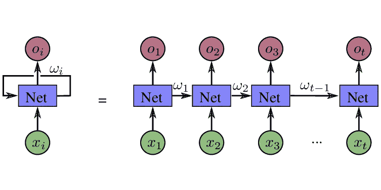
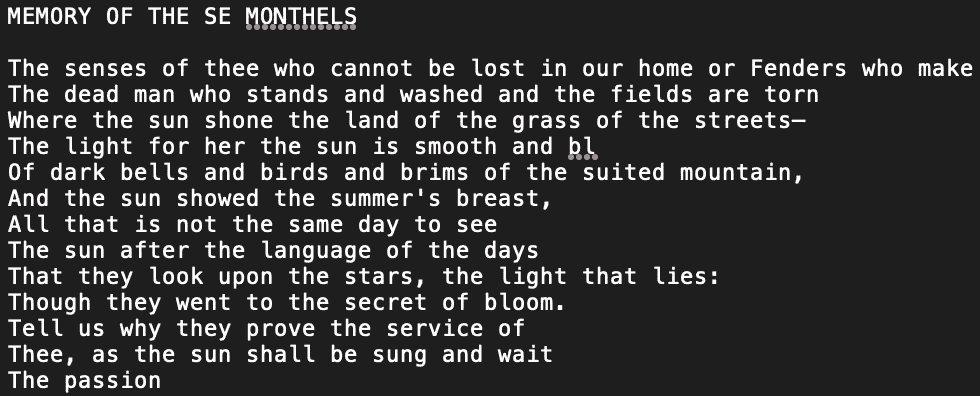
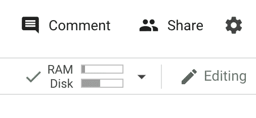
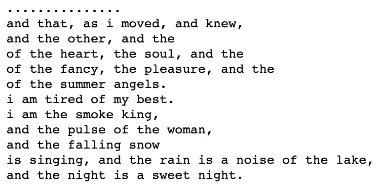

# 它还活着！从那些讨厌的“编年史”中拯救死文

> 原文：<https://medium.com/analytics-vidhya/its-alive-rescuing-dead-text-from-those-pesky-annals-of-history-ad97a3c48713?source=collection_archive---------20----------------------->

通过用 **textgenrnn** 快速生成诗歌


我曾不止一次地向[和](/python-in-plain-english/daunting-python-and-the-holy-poetry-generator-d9259913acb) [表达了对未来的哲学思考，在未来，人类和机器合作写作将成为惯例。我倾向于幻想一个人类作家在商店里摆弄他们的几个迷你机器人同伴。阿达·洛芙莱斯和玛丽·雪莱的混合体，加上少量的 Gepetto，在另一个宇宙中写作、制作和生成。](/analytics-vidhya/machine-take-my-hand-5ab0aef44839)

目前，我将在我(手指交叉)无疾病、与世隔绝的办公室里满足于可定制的递归神经网络。在我并不可爱的笔记本电脑上，在无处不在的、看不见的云中创建。

# 简单的背景定义

对于那些 TL；dr'ers(读作 tulldurrers)在那里，跳到**自己动手**部分。

## 递归神经网络

递归神经网络(RNNs)是一种非常适合处理语言的神经网络。传统神经网络和 RNNs 之间的关键区别在于，普通神经网络独立处理输入，而 RNNs 顺序处理输入*。也就是说，RNN 从一次输入中学到的东西会影响它在下一次输入中学到的东西。或者……RNN 将使用每个输入的输出来帮助它训练每个额外的输入。这听起来是循环的，因为它基本上是。*



([来源](https://www.researchgate.net/figure/Recurrent-Neural-Network-Structure-The-left-is-the-typical-RNN-structure-The-right-part_fig3_311805526))

这使得它成为自然语言处理任务的理想选择，因为语言确实是有序的。某些单词更可能跟随其他单词，某些字符更可能跟随其他字符。RNN 能发现这些关系和使用的可能性，因为它学习每一步，*记住*它以前学过的，并利用这些记忆。

## 长短期记忆(LSTM)

理论上，这种顺序学习和记忆可以在所有输入上发生，但传统的 rnn 往往会遇到一个称为爆炸梯度的问题。当一个 RNN 人学到如此多的东西，以至于真的让自己的大脑爆炸时，就会发生这种情况。好吧，也许不是字面意思。但是基本上。误差梯度堆积起来，导致模型变得不稳定，但有一个解决方案！

LSTMs 是一种 RNN，它能够保存信息，而不会不断地影响一切。LSTM 的记忆被放在一边，模型可以根据它认为重要的东西，有选择地忘记和记住它以前学过的东西。


里面好像发生了很多事…

但是不要再试图简化复杂的话题了，让我们开始有趣的事情吧！

# textgenrnn

rnn 已被广泛用于预测和生成文本，但它们可能很难设置，并且调整它们可能有点不透明。幸运的是，这个世界上有些人非常好，愿意零成本地为你提供便利。

介绍 Max Woolf 的 [textgenrnn](https://github.com/minimaxir/textgenrnn) :一个简单、可用、可重新训练的 rnn，它可以根据你选择的源文本开始生成文本，只需几次击键和一点时间。它建立在 Keras 和 TensorFlow 之上，使用字符嵌入来生成文本。

## 字符嵌入

没错！你听说过[单词嵌入](/@joshua.szymanowski/word-embeddings-5db2272fcc50)和 Word2Vec。但是你知道吗，你可以把同样的逻辑应用到单个角色身上。我当然没有。

textgenrnn 创建字符嵌入，或高维(默认为 100 维)向量，然后将这些值放入多个 LSTM 层。和 yadda-yadda-Attention-Layer-yadda，它输出每个字符成为序列中下一个字符的概率的平均权重。它使用这些概率来生成在格式和精神上都与其来源相似的文本。



字符级生成

## 单词级模型

也可以训练一个“单词级模型”，虽然我不确定它和默认设置到底有什么不同。它可能将源文本标记成单词，但是乍一看，它似乎只是使用了一个较小的窗口大小(对应于模型中的`max_length`设置)。例如，对于字符级模型，建议使用 20–40 的`max_length`，而对于单词级模型，建议使用 5–10 的`max_length`。


单词级生成

一个足够大的语料库是必要的。我尝试使用一个更小的我自己写作的语料库，遇到了很多空白和重复，老实说，这可能更多地是关于我的写作而不是关于模型。

# 自己做

这就是那些简单的击键(或点击)的用武之地。如果你以前使用过 Google Colab，这将非常容易。如果您以前使用过 Jupyter 笔记本，这将是一个不同的馅饼。如果你是新手，这就像你猜的冰淇淋蛋糕一样简单。不比馅饼难多少。其实挺软的。美味可口。


导航到[这个页面](https://colab.research.google.com/drive/1mMKGnVxirJnqDViH7BDJxFqWrsXlPSoK)(你可能需要在 Google Colab 或类似的地方点击*打开)，点击*文件*，然后*在驱动器*中保存一份副本，然后如果你愿意的话重命名文件(哪个怪物不想重命名文件呢？？).*

## 单元格#1

第一个单元格是:

```
%tensorflow_version 1.x
```

对于你的 Jupyter 顽固分子，在那里点击并按下 Shift+Enter 来运行单元格。也可以点击*播放*按钮。该单元只是确保您不使用 TensorFlow 2，这显然会导致一些问题。

## 细胞#2

运行下一个单元来下载和导入必要的包。不要担心任何张量流警告消息。

## 3 号牢房

下一个单元格是您可以设置参数的地方。如果这是你第一次运行它，我建议保持原样。对于第二次尝试，我建议尝试一个单词级模型来与默认的字符级模型进行比较。

为了训练一个单词级别的模型，设置:`'word_level': True`，`'max_length': 10`，根据你的语料库中独特单词的数量，我会考虑增加`'max_words'`的值。

其他一切都可以保持不变，尽管在随后的运行中有很多地方需要修改，并且代码被很好地注释了，所以您可以阅读这些内容作为指导。

## 单元格#4(并上传一个 txt 文件！)

在这里，您可以调整模型的名称，以及指向您上传的 txt 文件。


您上传的文件非常重要，应该按照您希望的理想文本格式进行格式化。如果你想生成脚本，上传一个由一个或多个脚本组成的文本文件，这些脚本被格式化为类似脚本的格式。如果你想生成诗歌，确保你的文本文件像诗歌一样被**格式化**——换行符、标题等等。这个模型非常擅长复制你的来源的风格。

要真正上传一个文件，一直走到页面的左边，点击小文件夹图标，然后将文件从本地计算机拖到文件窗口。上传后，通过设置更改文件:

`file_name = 'your_files_name.txt'`

跑手机！

## 5 号牢房

这是一个大的，所以你要确保你连接到一个谷歌 Colab GPU。如果您在窗口的右上角看到以下内容，那么您很好:



如果不是，应该说*在那个点连接*。点击它，它应该会变成上面的图像。

系好安全带，跑牢房去！这将比在本地计算机上运行所有这些花费更少的时间，并且取决于你上传的文件的大小，它应该花费不到半个小时。您将看到训练的进度，因此如果它似乎花费了异常长的时间，您可以随时停止它，调整参数或确保您使用的是 GPU，然后再次运行它。

对我来说，我使用了大约 4300 首长短不一的诗歌，在我的本地电脑上花了两个多小时，在谷歌实验室花了不到半个小时。如果您开始增加参数的值，训练时间很可能会增加，但是在 Colab 笔记本中比在本地机器上更合理。

## 警告！

该死，应该留着那份礼物…

给聪明人一句话:Google Colab 通过资源共享工作，这意味着如果资源被分配到其他地方，你的笔记本(和你的模型的训练)总是有可能被中断。以我的经验，这种情况不常发生。但这总是有可能的，所以要牢记在心，不要太担心。

## 6 号牢房

第一轮没什么需要改变的。通过改变`temperature`变量的值，可以产生非常不同的结果。根据我的经验，1.0 的值会产生最有趣的结果，但是它总是取决于您的用例。值越接近 0，可能会更接近地模仿源文本，甚至在理论上复制它。

简而言之，该单元格生成文本并将其保存到文件中。运行它！

## 7 号牢房

这里不需要改变任何东西。这是保存实际模型本身的地方。运行它！

## 使用你的新模型

要在本地机器上使用您的模型，并继续生成文本，请将您在前一个单元格中下载的文件移动到与 Jupyter 笔记本相同的文件夹中，并运行以下代码(确保交换出`MODEL_NAME`):

```
from textgenrnn import textgenrnntextgen = textgenrnn(weights_path='MODEL_NAME_weights.hdf5',
                       vocab_path='MODEL_NAME_vocab.json',
                       config_path='MODEL_NAME_config.json')

textgen.generate_samples(max_gen_length=1000)
textgen.generate_to_file('textgenrnn_texts.txt', max_gen_length=1000)
```


# 坚持尝试，享受乐趣！

**奖励**:这里有一些精选的世代。

