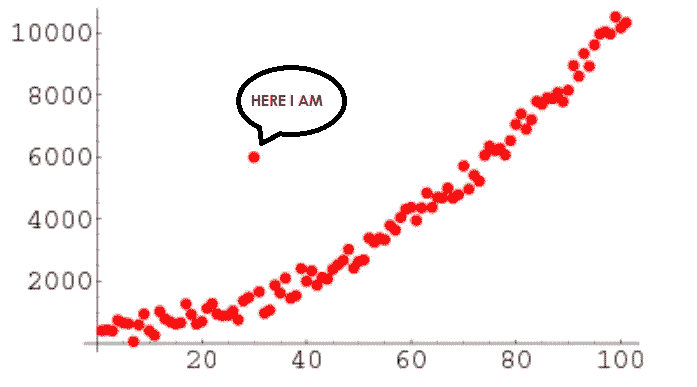

# 都是关于离群值的

> 原文：<https://medium.com/analytics-vidhya/its-all-about-outliers-cbe172aa1309?source=collection_archive---------3----------------------->

离群值是数据集中远离所有其他观察值的数据点。位于数据集总体分布之外的数据点。或者用外行人的话来说，我们可以说，离群值是与数据的组合/收集行为不同的东西。

异常值可以提供关于主题领域和数据收集过程的大量信息。理解异常值是如何出现的以及…