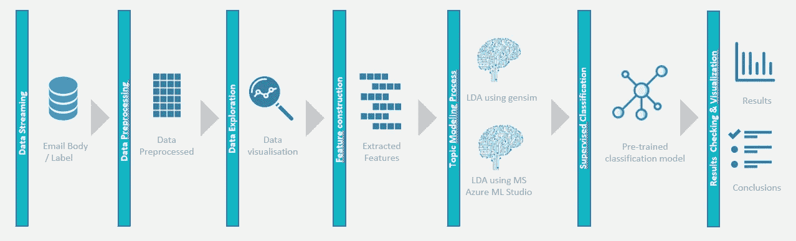
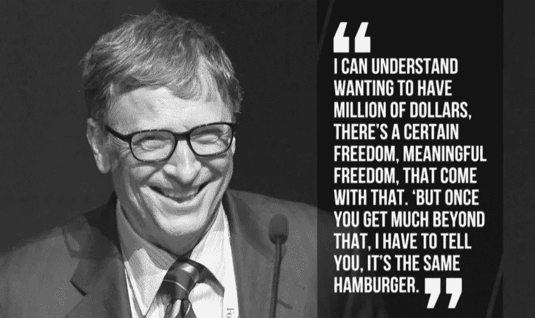
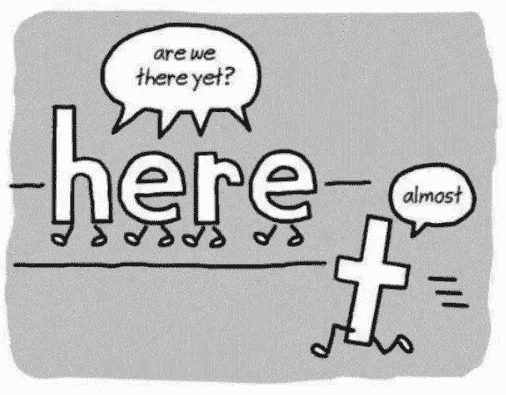
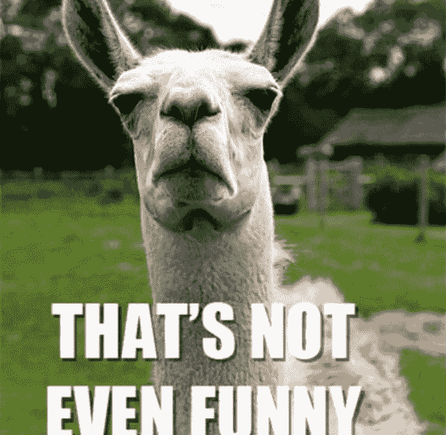
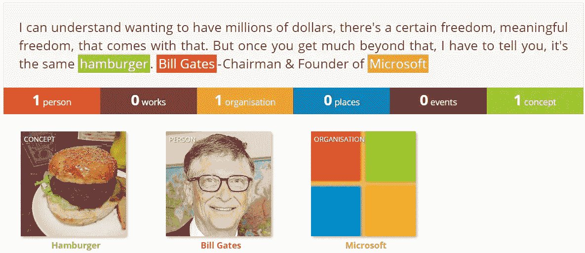

# 是同一个汉堡！！

> 原文：<https://medium.com/analytics-vidhya/its-the-same-hamburger-1262ce67892a?source=collection_archive---------30----------------------->

> 自然语言处理(下)
> 
> 以下是 NLP 系列文章的一部分。(查 [*第一部分*](/@azabou.sofiene/its-the-same-hamburger-983a7966acd8) *&* [*第三部分*](/@azabou.sofiene/how-do-they-read-your-mind-c145d1b3de74) *)*

正如我们在上一篇文章中看到的，NLP 提供了有趣的功能，这些功能正在改变当今的许多行业。电脑能做那么多事情，这很酷，但是它是怎么做到的呢？哦，是的，你猜对了，我们要去一些严肃的地方..东西！

# NLP 框架

我们将逐步构建一个自然语言处理框架，在本“教程”结束时，您将能够构建自己的 NLP 模型。我们开始吧！



NLP 框架

首先，我们来看这段文字。这是比尔·盖茨的一句名言，也是我最喜欢的一句。如果我的电脑能读懂这句话，尤其是能“理解”它，那就太棒了，不是吗？要实现这一点，我们需要采取几个步骤。



比尔·盖茨——微软创始人兼董事长

# 数据预处理

数据预处理被认为是这项工作中最烦人的部分，因为它在技术上没有吸引力，而且相对费力，但仍然很重要。数据科学家中有一句名言:“垃圾进，垃圾出”。这意味着，如果你给你的机器学习模型输入肮脏的数据，它会直接把它扔回到你面前(抱歉😊)..换句话说，它会给你无意义的结果。够公平吧？这就是为什么这部分工作要严谨的做。
通常，在处理结构化数据时，数据预处理往往涉及到删除重复数据、空值和错误。当涉及到文本数据时，有许多常见的数据预处理技术，也称为文本清洗技术。
为了应用预处理技术，我们将使用一个非常强大的 Python 库: [**NLTK:自然语言工具包**](https://www.nltk.org/) 。NLTK 提供了一套文本处理库，用于分类、标记化、词干提取、标记等。坚持住，我们将在几分钟后看到所有这些功能。敬请期待！

## 句子分割

基本上，它是把我们的文本分成单独的句子的行为。在我们的例子中，我们将以这个结束:

1.“我能理解想要拥有数百万美元，随之而来的是某种自由，有意义的自由。”2
2。“但是一旦你吃得太多，我不得不告诉你，这还是同一个汉堡。”
3。*“比尔·盖茨——董事长&微软创始人”*

在这种情况下，我们可以假设每个句子代表一个独立的想法。因此，开发一个理解单个句子而不是整个段落的算法要容易得多。

## 符号化

现在我们把文本分成句子，让我们做得更好，把它分成单词，或者更准确地说是“记号”。例如，让我们从引用的第一句话开始:

“我能理解想要拥有数百万美元，随之而来的是某种自由，有意义的自由。”

应用标记化后，结果如下:

*"我"、"能"、"懂"、"想"、"有"、"百万"、"美元"、"有"、"有"、"某"、"自由"、"有意义"、"自由"、"那个"、"那个"、"来了"、"有了"、"那个"、"那个"。"*

```
text = '''*I can understand wanting to have millions of dollars, there’s a certain freedom, meaningful freedom, that comes with that*. *But once you get much beyond that, I have to tell you, it’s the same hamburger. Bill Gates — Chairman & Founder of Microsoft'''*#Import NLTK Library
import nltk#Segmentation
nltk.tokenize.sent_tokenize(text)#Tokenization
nltk.tokenize.word_tokenize(text)
```

## 文本剥离

如果你和我想的一样，那你就错了..但是我们还是会脱下一些东西。
**使文本小写:**这是一种标准化检查点，以避免我们要处理的字符数。
**扩展缩写:**非正式英语充满了应该被替换的缩写，总是试图尽可能地使我们的文本正常化。
例如，在我们的引用中，“there's”将被替换为“there is”。

我在 [StackOverFlow](https://stackoverflow.com/questions/19790188/expanding-english-language-contractions-in-python) 上找到了下面使用的 **cList** 。

```
###Make text lowercase & Expand contractions#Load English contracted/expanded words list from a .py file
from contractions import cList# Compile a regular expression pattern for matching 
import re
c_re = re.compile('(%s)' % '|'.join(cList.keys()))#Create a function to look for contractions and replace them with their full form
#Put text in lowercase to make sure all words are included
def expandContractions(text, c_re=c_re):
    def replace(match):
        return cList[match.group(0)]
    return c_re.sub(replace, text.lower())#Notice it's a bit grammatically incorrect, but it doesn't matter since we gonna remove the stopwords later
expanded_text = expandContractions(text)
```

注意这有点语法错误，但是没关系，因为我们稍后会删除停用词😉

**删除标点符号:**标点符号代表不需要的字符，让我们去掉它们。

```
###Remove punctuations#Import string library
import string#Create a function to remove punctuation / special characters '!"#$%&\'()*+,-./:;<=>?#@[\\]^_`{|}~'
def clean_text(text):
    text = re.sub('[%s]' % re.escape(string.punctuation), '', text)
    return text
```

**拼写纠正:**想法很简单；我们将使用一个大语料库作为参考来纠正我们文本中的单词拼写。
**删除停用词:**停用词是被过度使用的词，对每篇文章所传达的信息没有额外的重要信息。大多数常见的停用词是限定词(如 the，a，an)，介词(如 above，cross，before)和一些形容词(如 good，nice)。让我们把他们赶出去！

*我能* **理解想要** *拥有* **百万******美元*** **，有一种* **确定的自由** *，* **有意义的自由** *，那种* **伴随着那种而来** *。
*但是一旦你* **得到远远超出** *的那一点，我就不得不* **告诉** *你，这是一样的* **汉堡** *。*
**比尔盖茨***——***董事长** *&* **创始人*****微软******

```
**###Remove stopwords#nltk.download('stopwords')
from nltk.corpus import stopwords#Create a function to remove stopwords
def remove_stopwords (sentence = None):
    words = sentence.split()
    stopwords_list = stopwords.words("english")
    clean_words = []
    for word in words:
        if word not in stopwords_list:
            clean_words.append(word)
    return ' '.join(clean_words);**
```

****

****词性过滤:**目的是通过给每个单词添加标签来识别其词汇类别:动词、形容词、名词、副词、代词、介词……**

```
**###Part of Speech Tagger#nltk.download('averaged_perceptron_tagger')
import nltk
from nltk import pos_tag, word_tokenize#Create a function to pull out nouns & adjectives from text
def nouns_adj(text):
    is_noun_adj = lambda pos: pos[:2] == 'NN' or pos[:2] == 'JJ'
    tokenized = word_tokenize(text)
    nouns_adj = [word for (word, pos) in pos_tag(tokenized) if 
    is_noun_adj(pos)] 
    return ' '.join(nouns_adj)#Return list of tuple [word; PoS]
tokens = word_tokenize(clean_text_sw)
tuple_list = nltk.pos_tag(tokens)**
```

****

**在大多数语言中，单词可以以不同的形式出现。将每个单词替换成它的基本形式会很有趣，这样我们的计算机就可以理解不同的句子可能在谈论同一个概念。所以，让我们来引用我们的话吧！**

**就我们而言，“我可以理解想要拥有数百万美元的愿望”**

**变成“我可以理解为**【想要】**有**【百万】****【美元】**”**

```
**###Lemmatization#nltk.download('wordnet')#Lemmatize text with appropriate POS tag
from nltk.stem import WordNetLemmatizer
from nltk.corpus import wordnet#Create a function to map NLTK's POS tags to the format wordnet lemmatizer would accept
def get_wordnet_pos(word):
    tag = nltk.pos_tag([word])[0][1][0].upper()
    tag_dict = {"J": wordnet.ADJ,
                "N": wordnet.NOUN,
                "V": wordnet.VERB,
                "R": wordnet.ADV}
    return tag_dict.get(tag, wordnet.NOUN)#Create an instance of the WordNetLemmatizer()
lemmatizer = WordNetLemmatizer()#Create a function to return text after lemmatization
def lemmatize_text(text):
    lemm_text = [lemmatizer.lemmatize(w, get_wordnet_pos(w)) for w in nltk.word_tokenize(clean_text_sw)]
    return ' '.join(lemm_text)**
```

****命名实体识别:**是一个算法以一串文本(句子或段落)作为输入，识别相关名词(人、地点、组织等)的过程..)在那串中提到的。**

```
**###Named Entity recognition#nltk.download('maxent_ne_chunker')
#nltk.download('words')
from nltk import ne_chunk#Create a function to tokenize and PoS your text
def NER(text):
    text = nltk.tokenize(text)
    text = nltk.pos_tag(text)
    return texttext_NER = NER(text)pos_list = ne_chunck(text_NER)**
```

****

**来看看吧！**