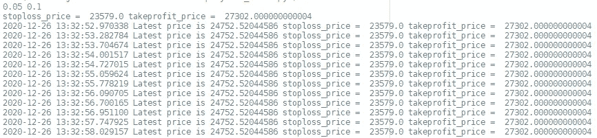
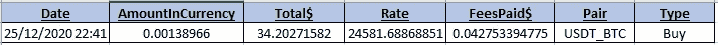
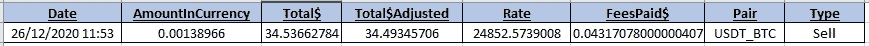

# 四.结论部署一个普罗尼克斯交易机器人

> 原文：<https://medium.com/analytics-vidhya/iv-deploy-a-poloniex-trading-bot-c3af87eba48c?source=collection_archive---------13----------------------->

> 使用 Poloniex API 创建一个自主交易机器人

T 他的文章是描述创建、回溯测试和部署交易机器人的逐步过程的系列文章的一部分。第一篇文章关注于**计算预测变量**，第二篇关注于**构建深度学习模型**，第三篇关注于**用模型识别有利可图的交易策略**，最后一篇关注于程序中的现实实现(**部署**)。本文末尾给出了链接。

一旦我们建立了模型并确定了交易策略，现在就应该用 Python 脚本来实现它，这样它就可以自己创造利润了。本文的最终目标是生成一个**自主 Python 代码，该代码将根据我们在上一篇文章(第三篇— [1])中确定和评估的有利可图的*看涨*策略，实时做出交易决定**。以下代码一次只进行一笔交易( **1TAAT** )，但一些直接的修改可以使其适用于多笔同时进行的交易监控。由于这有点复杂，我只暴露了*和*的原则，让读者根据自己的需要来选择。

0-导入库和加载数据

I —正在初始化 Poloniex API 连接

二——定义买入和卖出函数，计算变量

三、一次一个交易(1TAAT)交易机器人

四、结论

**0-导入库和加载数据**

第一步是导入必要的库，并(重新)定义我们在构建这个交易机器人时使用的常数。这包括蜡烛的 ***停用*** 、 ***获利*** 、 ***期*、**、*、*等，还包括我们交易的**对**——在 Poloniex API 和网站上均有提及(如*、 *USDT_BTC* 比特币交易)和**金额**此外，我们还设置了阈值概率***min _ threshold***，从中我们可以在*看涨*的预测中遵循我们的模型。默认情况下，该阈值被设置为 0.5(即*我们每次都跟随*看涨*的模型)，但我们可以设置更高的阈值来产生更具选择性的交易策略(见第三条— [1])。人们还应该注意根据他的目录结构修改第 14 行的路径。******

**我们还导入了一个名为 *Deployment_functions* 的定制库，这将在本文的第二部分中描述。**

**初始化代码如下所示:**

**图 1:部署的初始化代码**

****I —初始化 Poloniex API 连接****

**一旦我们导入了库，我们就可以通过输入我们的 API 密钥和密码来初始化到 Poloniex API 的连接。这些十六进制代码对每个帐户都是唯一的，允许用户直接从 Python 进行交易。关于 API 和如何获得您的密钥的更多信息可以在[2]找到。使用我们的程序，你只需要**在*Deployment _ functions . py***(下一段)的第 62 & 63 行设置你的。**

**此外，初始化连接的代码非常简单，如下所示:**

**图 2:初始化 Poloniex API 私有连接**

****II —定义购买和销售功能，计算变量****

**如前所述，为了简化交易脚本，我决定将所有函数存储在一个名为*Deployment _ functions . py*的定制库中。该文件包含先前介绍的函数，如预测变量的计算(见文章 I — [3])。它还包含两个非常重要的函数，即 *buy_asset()* 和 *sell_asset()* 函数。这些功能使我们能够**以市场上可获得的最佳价格**购买/出售给定数量，并且只有在购买/出售全部数量时才能实现。为了避免挂单恶化现实生活中的交易，这些功能必须定义清楚。潜在的想法是使代码尽可能具有高性能，以便获得尽可能接近回溯测试结果的真实结果(参见文章 III — [1])。**

**下面给出了这些函数的代码，按照之前的指定，您应该更改第 62 & 63 行:**

**图 3:定义交易函数**

****III —一次一笔交易(1TAAT)交易机器人****

**既然我们已经建立并定义了所有的工具，现在是创建交易循环的时候了。在我们的例子中(*1tat*)，我们只是一遍又一遍地重复一个连续的过程。我们等待蜡烛线的数据被传送，然后我们应用这 3 个任务:**请求最近的数据**，**通过计算变量和应用模型计算预测**，然后最后如果我们的看涨标准被达到(见文章 II [4]关于我们如何定义我们的最小值和最大值)，我们**进入交易并跟踪它**。当我们进入交易时，首先我们购买预定数量的货币对，然后我们等到价格达到止损点或止盈点。当它最终达到极限时，我们卖掉我们的资产。我们一遍又一遍地重复这个过程。**

**该代码用于在控制台中显示一些监控信息(*图 4* )并存储每笔交易的特征(*图 5 & 6* )。注:Poloniex 网站储存了所有交易的信息。**

**当交易正在进行时，控制台看起来是这样的，*即*当我们等待价格到达止损点或止盈点时:**

****

**图 4:监控交易时的控制台**

****

**图 5:在买入操作中存储的数据(交易的进入点)**

****

**图 6:卖出操作中存储的数据(交易的出口点)**

**交易循环非常精炼，它包含 26 行，这使得它很容易理解:**

**图 7:交易循环**

****四——结论****

**首先，我们可以回忆一下，整个项目以及代码都可以在一个专门的 GitHub 存储库中获得[5]。**

**这个项目是一个伟大的成就，因为我们设法展示了如何从零开始建立一个有利可图的交易机器人。该管道易于调整，可以适应各种金融市场。此外，所需的输入数据有限，因此访问历史数据应该不成问题。**

**我们在回溯测试模拟中展示了该管道正在产生**稳健且有利可图的交易策略**(第三篇文章)，并且我们在最后一篇文章中揭示了如何在简单的 Python 脚本中实现交易机器人的原理。**

**我们可能还记得，这一系列文章的目的是让每个人都可以理解这个概念，并且显然可以通过多种方式来增强所提议的管道。特别是，人们可以考虑**添加一些更多的预测变量，增加深度学习架构的层数，甚至改善实现循环**。为了同时进行和监控多个交易(可能在多个市场上),调整交易循环也是可行的。**

**为了给出一些可能性的概述，我可以邀请感兴趣的读者看看学术论文，尤其是理学硕士和博士论文。在另一个层面上，我写了一份关于我构建这种高级交易机器人的报告，可以在[6]上找到。**

**不要犹豫留下任何反馈/问题/ *鼓掌*或联系我以获取更多信息。**

****2021 年 04 月 01 日:**在购买/出售功能中有几个错误。期待尽快纠正它们。**

****联系人:** sebcararo@hotmail.fr**

****系列其他文章:****

*   **[I .用于创建股票预测数据集的交钥匙 Python 代码|作者 sébastien Cararo | Analytics vid hya | 2020 年 12 月| Medium](/analytics-vidhya/i-a-turnkey-python-code-for-creating-a-stock-forecasting-dataset-ad25f673f3b7)**
*   **[二。利用 Python 中的深度学习预测加密趋势|作者 sébastien Cararo | Analytics vid hya | 2020 年 12 月| Medium](/analytics-vidhya/ii-forecasting-crypto-tendencies-with-deep-learning-in-python-5948909617db)**
*   **[三。创造有利可图的交易策略|作者 sébastien Cararo | Analytics vid hya | 2020 年 12 月| Medium](/analytics-vidhya/iii-creating-profitable-trading-strategies-1858a2fc8b85)**

****另一篇文章** *(用机器学习构建体育博彩算法)* [新冠肺炎如何阻止我在 2020 年成为百万富翁|作者 sébastien Cararo | Analytics vid hya | 2020 年 12 月| Medium](/analytics-vidhya/how-covid-19-prevented-me-from-being-a-millionnaire-in-2020-5b2144e8bdef)**

**来源:**

**[1]第三条**

**[三。创造有利可图的交易策略|作者 Sébastien Cararo |分析 vid hya | 2020 年 12 月| Medium](/analytics-vidhya/iii-creating-profitable-trading-strategies-1858a2fc8b85)**

**[2]波洛涅克斯 API**

 **[## 参考

### 确保您安装了 Poloniex 提供了 HTTP 和 websocket APIs 来与 exchange 交互…

docs.poloniex.com](https://docs.poloniex.com/#create-an-api-key)** 

**[3]第一条**

**[I .用于创建股票预测数据集的交钥匙 Python 代码|作者 sébastien Cararo | Analytics vid hya | 2020 年 12 月| Medium](/analytics-vidhya/i-a-turnkey-python-code-for-creating-a-stock-forecasting-dataset-ad25f673f3b7)**

**[4]第二条**

**[二。利用 Python 中的深度学习预测加密趋势|作者 sébastien Cararo | Analytics vid hya | 2020 年 12 月| Medium](/analytics-vidhya/ii-forecasting-crypto-tendencies-with-deep-learning-in-python-5948909617db)**

**[5] GitHub 知识库**

**[Seb943/TBpolo:使用 Python 和 Poloniex API(github.com)的盈利交易机器人](https://github.com/Seb943/TBpolo)**

**[6]全文**

****

**图 8:封面图片**