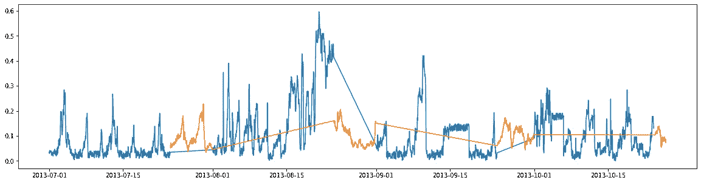

# JanataHack 黑客马拉松:时间序列预测-公共 LB 第二，私人 LB 第七。

> 原文：<https://medium.com/analytics-vidhya/janatahack-hackathon-time-series-forecasting-public-lb-2nd-private-lb-7th-f091a2e87e84?source=collection_archive---------27----------------------->

时光飞逝，当我们参加黑客马拉松时，我们能更好地理解这一点。“48 小时”，是的，这就是我们被给予的，这里是偷偷窥视那些竞争小时。

问题陈述-给定 4 年中每月 23 天的每小时电力消耗数据集，预测每月剩余天数的电力消耗。

> **倒计时开始……**

## 局部验证集的决定:

我们考虑了两种创建验证集的方法。

1.  我们会从完整的训练数据中随机抽取数据。
2.  由于我们获得了每月前 23 天的数据，并且我们必须预测该月的剩余天数，因此我们考虑创建一个由前 21 天组成的训练数据集，而验证集将由第 22 天和第 23 天组成。然后，如果模型在验证集中表现良好，我们将使用完整的数据集训练模型。

第二种方法提出了多次训练的情况，我们也没有观察到任何显著的改进，所以我们决定采用第一种方法。

## 取 1-树:

我们的第一个尝试是看看像决策树这样的简单模型如何处理这些数据。XGBoost 给了我们一个手动调谐的**RMSE 82**(公磅)的成绩。我们没有进行网格搜索，因为我们认为数据带来了深度学习模型可以更好地建模的复杂性。

## 以 2 为例，即 12 个 LSTMs:

我们采用 LSTMs 并把它作为一个回归问题来处理。由于只能从 sliding_window+1 中获取目标标签，因此每月的前几天(滑动窗口的大小)在训练中没有用处。因此，我们想为每个月创造 12 个不同的模型。

我们对每个模型进行了大约 30 个时期的并行训练，花费了大约 6 个小时，得到的分数仅比 XGBoost 给出的分数略高。到目前为止，超过 36 个小时已经过去了，我们只有 12 个小时来训练一个好的模型。

## 以 3 为例——一个 LSTM 的力量:

作为单一模型，我们可以在短时间内运行更多的纪元。3 个多小时给了我们 70 个时代和 66 分的 **RMSE 公共 LB 评分。我们用稍微多一点的纪元训练了一些模型，但这是我们能得到的最好的了。**

## 第 4 条—欢迎 Wavenet:

大约还有 6 个多小时，我们想尝试一下 wavenet 架构。训练速度相对较慢，因为我们必须从随机重量开始。我们可以在 4 小时内挤进 30 个时代。它在公众 LB 上给出了 71 分的 RMSE 评分。

## 残局—还有 2 个小时:

三个 LSTM 和 Wavenet 的组合让我们在公共 LB 中获得了 62 个的 **RSME，这将我们推到了[公共 LB 第二的位置](https://datahack.analyticsvidhya.com/contest/janatahack-time-series-forecasting/#LeaderBoard)。**

但不知何故，我们所有的模特在公共 LB 中都有严重的过度配合，我们在私人 LB 中以 86 分的 **RMSE 得分被拉至[第 7 位。](https://datahack.analyticsvidhya.com/contest/janatahack-time-series-forecasting/#LeaderBoard)**

蓝色:23 天的训练数据，橙色:剩余天数的预测。

## 结论:

虽然这种努力给了我们很好的结果，但我们也发现了许多可以让我们得到更好分数的细节。

参加黑客马拉松很有趣，我们学到了很多新东西，迫不及待地想在即将到来的比赛中尝试一下！