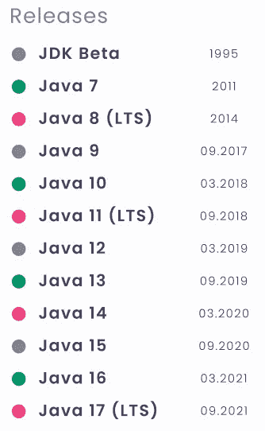

# 简而言之，Java 11

> 原文：<https://medium.com/analytics-vidhya/java-11-in-a-nutshell-f3f452bf2951?source=collection_archive---------6----------------------->

布莱克·维斯兹在 [Unsplash](https://unsplash.com/s/photos/java?utm_source=unsplash&utm_medium=referral&utm_content=creditCopyText) 上的照片

Java 是世界上使用最广泛、需求最大的编程语言之一。自从 1995 年问世以来，Java 一直在不断改进。随着近年来频繁的发布周期，它需要更多的努力来跟上新的发布。

我们将从一个小的问答部分开始，理清问题，然后用“简单概括”的方法讨论 Java 11 的变化。大约 15 分钟后，您将熟悉 Java 11 的变化。还有一篇文章的[幻灯片版本](https://drive.google.com/file/d/1PpNXu4U05uvaT3eRhyI3dhF6Ukza4cl2/view?usp=sharing)。

我们开始吧。

## 首先，为什么会有这么多发布？

Oracle 过去每 2 到 3 年发布一个新版本。然而，公司一次采用太多的变化需要付出很大的努力。

Oracle 随后采用了连续发布的方式，并宣布了 6 个月的发布期。从 Java 9 开始，Oracle 每 6 个月发布一个相对较小变化的新 Java 版本。

## 什么是 LTS？

一个长期版本将会成为几年内的行业标准。即使新的版本在它之后出现，它仍然会得到更新。例如，Java 8 于 2014 年发布，仍然在 2020 年获得更新，并将获得扩展支持，直到 2030 年。

## 那么我应该升级到哪个版本呢？

Oracle 强烈建议切换到 Java 11 或最新版本。维基百科下面的部分很重要，

> Oracle(和其他公司)“强烈建议您卸载旧版本的 Java”，因为未解决的安全问题会带来严重的风险。由于不再支持 Java 9(和 10)，Oracle 建议其用户“立即过渡”到 Java 11 (Java 15 也是非 LTS 的选项)- [wiki](https://en.wikipedia.org/wiki/Java_(software_platform))

Java 11 是最新的 LTS，直到 2021 年 9 月 Java 17 发布。它向后兼容 Java 8(我们会谈到细节)。除了 Java 8 之外，它还带来了值得注意的特性和改进。

## Java 11 可以免费使用吗？

简而言之，是的。

困惑来自于许可。有两种类型的许可证。OpenJDK 可以免费使用，而 Oracle JDK 提供长期支持，但需要付费。这些文件的二进制文件几乎完全相同，因此您可以轻松使用 OpenJDK。如果你感兴趣的话，这里的[是 Java 11 差异的完整列表。](https://www.oracle.com/java/technologies/javase/jdk-11-relnote.html#Diffs)

让我们继续看看 Java 11 带来了什么。

# 新功能概述

1.  HTTP API
2.  启动单文件 Java 程序
3.  字符串、集合和文件的新库方法
4.  性能和安全性改进
5.  其他增强功能
6.  已删除和已弃用的功能

# 1.HTTP API

> HTTP API 是一个执行 HTTP 请求的 Java 库。

## 动机

取代 1997 年 Java 1.1 推出的`HttpURLConnection`，使用和维护都很困难。

## **功能**

*   支持 HTTP/1.1 和 HTTP/2 协议
*   支持常见的 HTTP 方法，如 GET、POST、PUT、DELETE
*   可以处理同步和异步通信

## 如何使用

1.  创建、初始化和配置`HttpClient`
2.  创建并初始化`HttpRequest`
3.  将`HttpRequest`传递给`HttpClient`，执行请求并检索`HttpResponse`
4.  为您的目的处理`HttpResponse`

## 例子

Http Api 示例

# 2.启动单文件 Java 程序

> Java 11 支持用单个命令执行单个文件 Java 程序。

## 细节

*   支持初学者友好的 Java 开发和高速原型开发。
*   它必须是一个单文件程序(有一个或多个类)。
*   我们不能使用外部依赖。

## 如何使用

假设我们的文件名是`MyProgram.java`，要执行它，我们只需要使用`java MyProgram.java`。

# 3.字符串、集合和文件的新库方法

> 为了方便起见，Java 11 为提到的库添加了一些有用的方法。

## 字符串 api

*   **重复一串**:用`String.repeat(Integer)`重复一串 n 次。示例:`" ".repeat(10)`
*   **检查空白/空白**:检查字符串是空的还是只有空白。`String.isBlank()`。如果字符串为空，它将抛出`NullPointerException`。
*   **删除空白**:删除前导`String.stripLeading()`、尾随`String.stripTrailing()`或两个空白`String.strip()`
*   **处理多行字符串**:用`String.lines()`将多行`/n`字符串转换成行流

## 收集 api

*   **将集合转换成数组**:这个过程在 Java 11 中变得更加容易。例如，用`students.toArray(String[]::new)`将学生列表转换成字符串数组

## 可选 and 谓词。

*   **否定谓词**:我们可以用`Predicate.not(myCustomPredicate)`过滤掉不具备一定条件的元素。

## 文件 api

*   **更容易的文件读/写**:多亏了`Files.readString(path)`和`Files.writeString(path, charSequence, options)`我们才能实现这种操作。

# 4.性能和安全性改进

## 性能改进

*   **G1 垃圾收集器改进** : G1 是在 Java 7 中引入的，在 Java 9 中成为默认的垃圾收集器。在 Java 11 中，G1 得到了改进，具有更高的性能。Java 11 将暂停时间(由 GC 引起的客户端等待应用程序响应)提高了 60% ( [来源](https://mail.openjdk.java.net/pipermail/hotspot-gc-use/2018-June/002759.html))。
*   **ZGC** :一个实验性的可扩展的低延迟 GC。它保证了 10 毫秒的最大暂停时间。ZGC 非常适合处理大量数据的应用程序。
*   Epsilon:一个实验性的低开销 GC。它非常适合短期应用程序(执行一个命令然后关闭)。

## 安全改进

*   最新的传输层安全性(TLS)提高了 HTTPS 的性能和安全性。Java 11 支持 TLS 1.3 协议。

# 5.其他增强功能

*   **在 lambdas** 中使用 `**var**` **:我们在 Java 10 中遇到过`var`，现在可以在 lambdas 中使用了。这个功能的优点是现在我们可以注释 lambda 变量(例如`@NotNull`)**
*   **采用 Unicode 10** : Java 11 使用 Unicode 10，是 Java 10 与 Unicode 8 的升级。这包括 16，018 个新角色和 10 个新剧本。
*   **嵌套访问控制**:内部类可以访问外部类的所有私有变量和方法(例如`Outer.name`)。
*   **Java 飞行记录器** : JFR 是一个剖析和诊断(资源使用等。)工具。我们还可以使用 Java Mission Control 来可视化 JFR 提供的数据。

# 6.已删除和已弃用的功能

## 移除的功能

Java 11 向后兼容 Java 8。因此，您可以快速地从 Java 8 转换到 Java 11。如果您使用下面的一些包，您需要做的就是将替换依赖项添加到您的项目中。

此外，小程序和 Java Web Start 被完全删除，没有替换。如果您正在寻找 Java 桌面应用程序开发，请查看 JavaFX。

## 不推荐使用的功能

*   **Nashorn JavaScript 引擎:**由于很难保持与 ECMAScript 快速变化的兼容性，现在已经弃用。

## 结论

Java 11 是最新的 LTS 版本，在以前版本的基础上引入了有益的特性和改进。引入了新的 HTTP 客户端、新的字符串、集合、谓词和文件库方法。此外，垃圾收集器的性能得到了优化，还有两个新的垃圾收集器，ZGC 和艾司隆。

如果你想学习 Java 的所有方面，请随意查看我的 [Java 简介](/@hakaneroztekin/java-in-a-nutshell-a-quick-review-guide-of-important-topics-of-java-962cbf62b761)文章。

编码快乐！