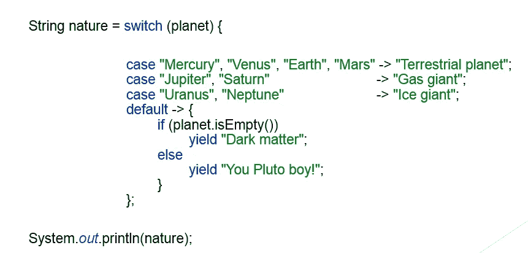
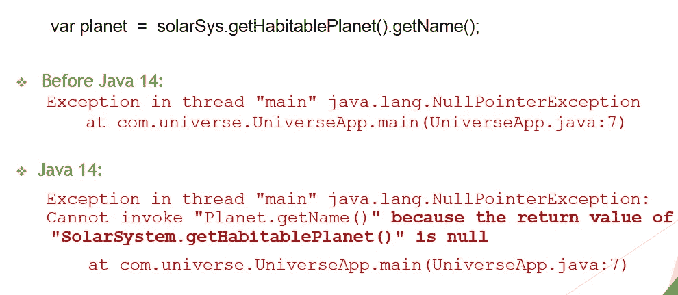
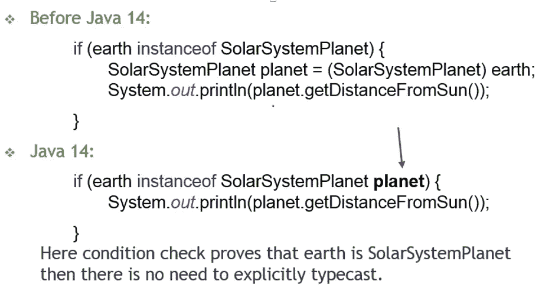
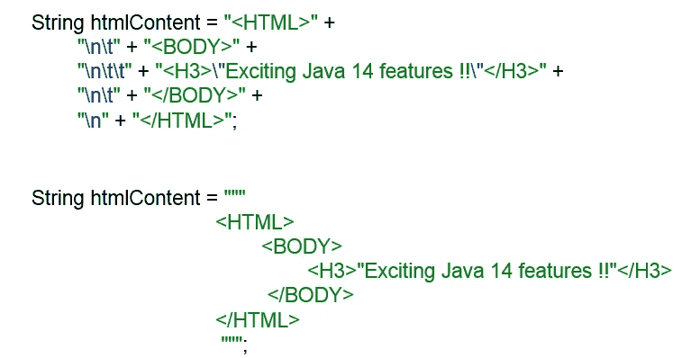
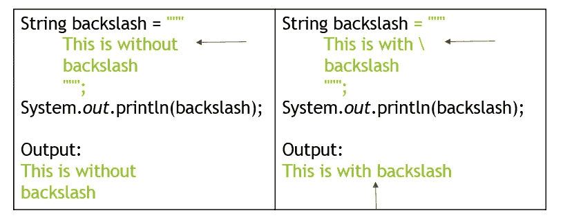
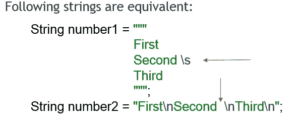
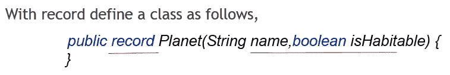
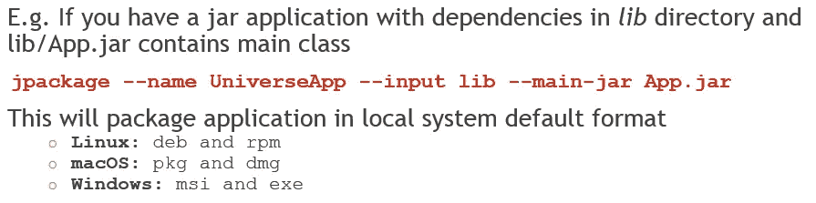
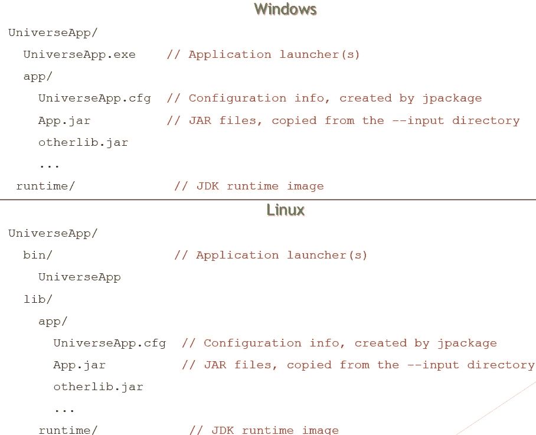

# Java 14 激动人心的新特性

> 原文：<https://medium.com/analytics-vidhya/java-14-exciting-new-features-bcb82c321d26?source=collection_archive---------23----------------------->

Java 14 有 16 个 JDK 增强提案(jep)

我们将研究一些重要的问题。

> **开关表达式:**

切换表达式是 JDK 12 和 13 的预览版，现在是版本 14 的标准功能。
这个特性有助于将 java 中的大小写转换为语句或表达式，减少了代码量和冗长性。

> **有用的空指针异常**

NullPointerExceptions 是 java 中常见异常类型，通过查看日志或堆栈跟踪(尤其是在生产环境中)很难理解它们。
以前的版本只指定了发生 NullPointerException 的文件名和行号。Java 14 引入了这个新的 JVM 特性，它通过描述性消息准确地告诉我们哪个变量或对象为空。

> **用于**实例的模式匹配

Java 14 引入了一个预览特性，有助于消除检查的条件实例中存在的显式强制转换的需要。

> 文本块

文本块是 Java 13 中的预览特性，这是 Java 14 中的第二个预览。

文本块使得处理多行字符串文字更加容易。

它有助于使用三个引号编写更加优雅和简洁的代码，这对于在 java 类中创建 HTML、JSON、SQL 查询字符串非常有用。

Java 14 在文本块中引入了两个新的转义序列。

通过文本块中的\(反斜杠)转义序列，它禁止在行尾插入新的行字符。

New \s 是指单个空格，它保留它之前的所有空格。

> 记录

记录有助于创建纯数据类。

这些类只保存数据，没有任何自定义行为。

通常在 java 类中，我们有很多模板代码，比如 equals、hashcode、toString、accessors、constructor 等方法。

大多数 ide 提供了自动生成它们的方法，但是代码仍然变得冗长。

Java 编译器会自动生成构造函数、私有 final 字段、访问器、equals、hashcode、toString 方法。

记录的字段被标记为 final，所以它们不能被重新分配，但这并不意味着类是不可变的。存储在内部的引用或对象可以被变异。

> 包装工具(培养箱)

打包工具帮助将 java 应用程序打包到一个特定于平台的包中，该包包含应用程序所需的所有必要依赖项。

默认情况下，jpackage 工具为应用程序创建一个简单的本地启动器。

我们可以用选项--参数-- Java 选项定制默认的启动器。

打包应用程序前的 jpackage 创建包含应用程序映像和将运行应用程序的 JDK 运行时映像的应用程序映像。

> JFR (JDK 飞行记录器)事件流

Java 14 为进程内和进程外应用程序引入了一个持续消耗磁盘上 JFR 数据的 API。

HotSpot VM 使用 JFR 发出 500 多个数据点，除了解析日志文件之外，大多数数据点无法通过其他方式获得。

现在，要使用数据，用户必须开始记录、停止记录、将内容转储到磁盘，然后通过除解析日志文件之外的其他方式解析记录文件。

这有利于应用程序分析，但不利于监控，因为监控仪表板需要显示数据的连续动态更新。

模块 jdk.jfr 中的包 jdk.jfr.consumer 扩展了异步订阅事件的功能。用户可以直接从磁盘库中读取记录数据，而无需转储记录文件。

> **G1 的 NUMA 感知内存分配**

提高 G1 垃圾收集器在非统一内存访问(NUMA)系统上的整体性能。

> **非易失映射字节缓冲器**

使用非易失性内存时，为 JDK 添加文件映射模式。

> **外来记忆存取(FMA)** (孵化器)

提供了一个应用程序编程接口，顾名思义，它允许 Java 程序安全地与其虚拟机堆之外的内存进行通信。

谢谢！