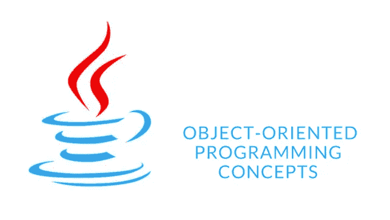

# 面向对象编程

> 原文：<https://medium.com/analytics-vidhya/java-object-oriented-programming-1b6b9be579bd?source=collection_archive---------27----------------------->

## 面向对象编程的基本概念

H ello 朋友们，在这篇文章中我将和你们讨论一下**方法重载**和**方法重载**。因此，方法重载和方法覆盖在 java 中是一个非常重要的概念。因为对于新手
程序员来说，它们是令人困惑的概念。因此，我将举例说明它们的定义、区别和例子。

1.  **方法重载**

一个类中有两个或更多的方法具有不同参数的相同方法。

## 例如:

过载

**2。方法覆盖**

有两个方法具有相同的方法名和参数，但一个方法是父类，另一个方法是子类。
因此，覆盖允许子类(子类)提供已经提供给其父类的方法的特定实现。

## 例如:

压倒一切。

**3。方法覆盖和方法重载的区别**

方法重载和 java 中的方法重载有很多区别。

方法重写和重载之间的区别。

如上所述，这些是我们在方法重载和方法重写中必须看到的主要区别。

# **所以下一章，我希望带给你关于超级关键词的介绍。**