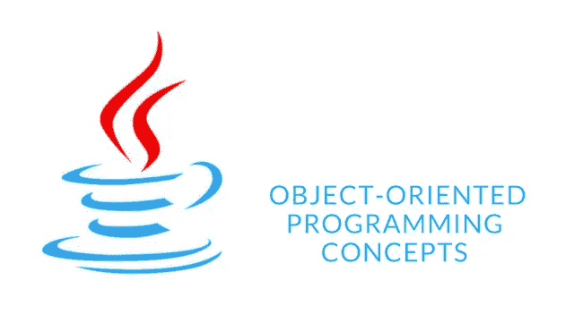
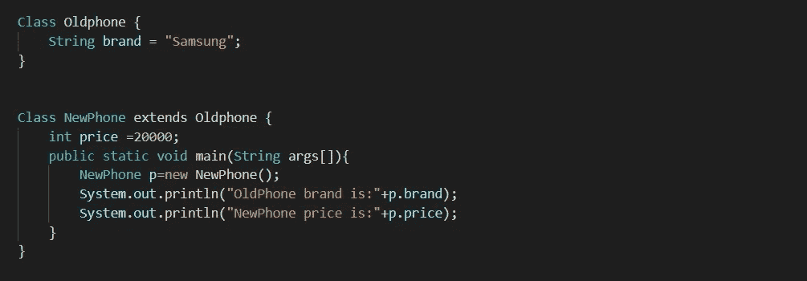
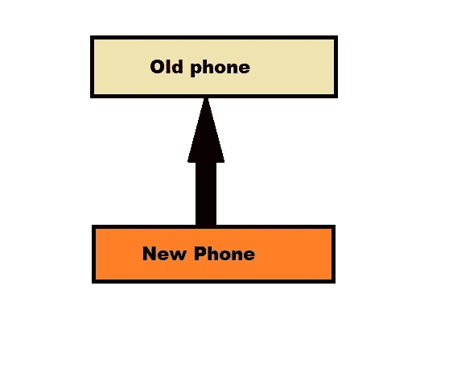

# 面向对象编程

> 原文：<https://medium.com/analytics-vidhya/java-object-oriented-programming-55ecbfb1559e?source=collection_archive---------39----------------------->

## 面向对象编程的基本概念

H ello 朋友们，上一篇文章，我跟你们讨论了关于类和对象的问题。我想你明白了。所以在这篇文章中，我打算和你讨论一下**的传承**。

# 遗产

**什么是传承？**

继承用于从现有的类中组织和创建可重用的类。继承是面向对象编程中的另一个基本概念。

**此外……**

因此，我们将现有的类称为父类或超类或基类，并将派生类命名为子类或子类。子类继承父类的特征。程序员可以添加新的变量或方法，也可以修改继承的变量或方法。

**如何创建继承？**

> 例句:我们用旧手机给父母上课，用新手机给孩子上课。

在新的 phone 类(子类)中，它从旧的 phone 类(超类)中获取实质内容。因此我们可以在一个 UML 类图中展示上面的例子。

在 UML 图中，有一个指向父类的开放箭头。

> 继承应该创建一个 is-a 关系，这意味着子节点是父节点的更具体的版本

**各种形式的继承**

不仅继承，访问修饰符也非常重要。所以让我们讨论一下访问修饰符。

**什么是访问修饰符？**

java 中的访问修饰符指定了字段、方法、构造函数或类的可访问性或范围。我们还可以通过应用来改变字段、构造函数、方法和类的访问级别。

有 4 种类型的访问修饰符。

1.  私人的
2.  默认
3.  保护
4.  公共

**1。私有访问修饰符**。

在这个修饰符中，可以从类外部访问它

**2。默认访问修饰符**。

在此修饰符中，访问级别仅与包相关。不能从包外部访问。因此，当您不定义任何访问级别时，它将是默认的。

**3。受保护的访问修饰符**

访问级别在包和包内，通过子类。因此，如果不创建子类，就不能从包的外部访问。

**4。公共访问修改器**

访问级别无处不在。它可以从类内、类外、包内和包外访问。

这是一个表格，你可以很容易地理解访问修饰符的用法。

作为本课的总结，我与您讨论了继承和访问修饰符。我认为，你从这篇文章中学到了一些新的东西。

## 下一章，我希望给你介绍方法重载和方法覆盖。