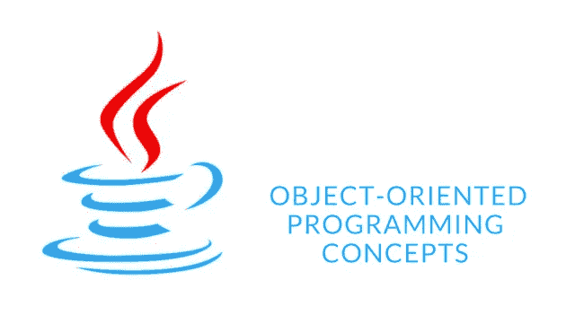
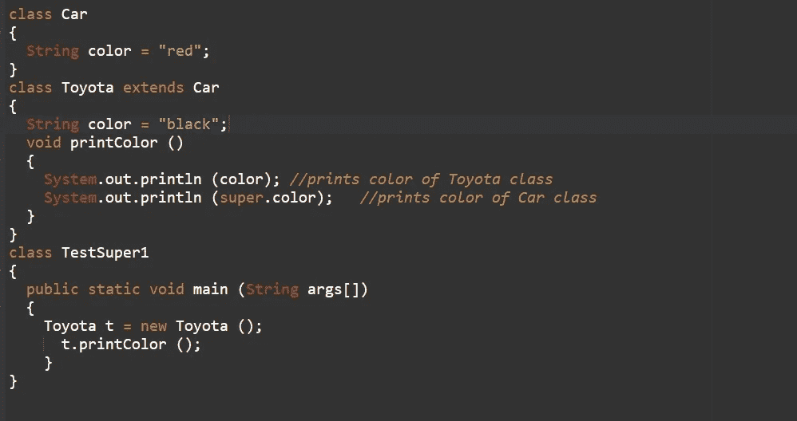
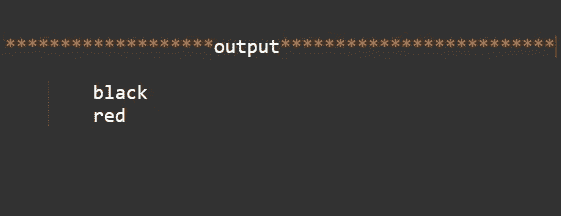
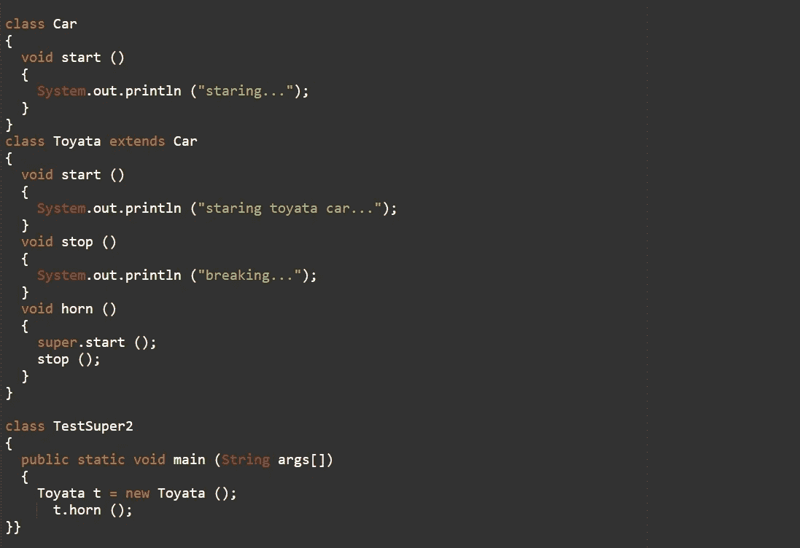
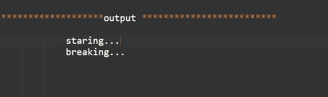
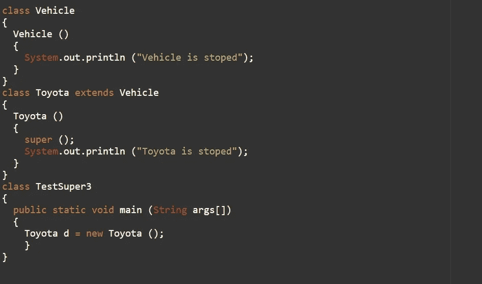
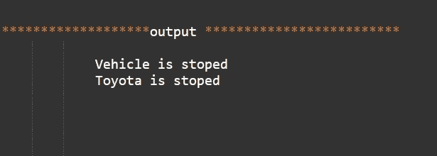
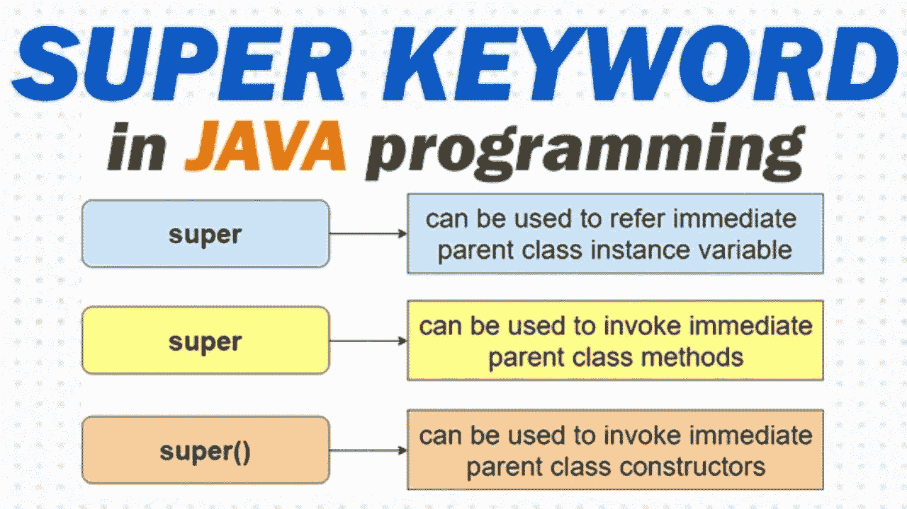

# 面向对象编程

> 原文：<https://medium.com/analytics-vidhya/java-object-oriented-programming-90a890181abe?source=collection_archive---------32----------------------->

## 面向对象编程的基本概念(超级关键字)

你好朋友，在这篇文章中我将和你讨论超级关键词。

## 什么是超级关键词？

java 中的 super 关键字是一个引用变量，用于引用父类对象。因此，超级关键字有 3 个主要用途。

> 1.用于引用直接父类实例变量。
> 2。用于调用直接父类方法。
> 3。用于调用直接父类构造函数

## 1.用于引用直接父类实例变量。

如果父类和子类有相同的字段，我们可以使用 super 关键字来访问父类的数据或字段。

下面是上面代码的输出。

输出

根据上面的例子，我们可以看到，如果我们打印颜色变量，它将正常打印当前类的颜色。但是我们需要使用 super 关键字来访问父属性。

## 2.用于调用直接父类方法。

如果子类包含与父类相同的方法，我们应该被用作超级关键字。

示例 2

下面是上面代码的输出。

输出

使用上面的例子， **Vehicle** 和 **Toyota** 两个类都有 **start()** 方法，如果我们从 **Toyota** 类调用 **start()** 方法，默认情况下它会调用 **Toyota** 类的 **start()** 方法，因为本地优先。因此，当我们需要调用父类时，我们可以使用 super 关键字。

## 3.用于调用直接父类构造函数。

以及 super 关键字也可以用来调用父类构造函数。

例子

## 输出

输出

根据上面的例子，更重要的一点是，' ' **super** '可以根据情况调用参数和非参数构造函数。

# 这里是超级关键词的总结，

# 所以下一章，我希望带给你关于“向上铸造”和“向下铸造”。