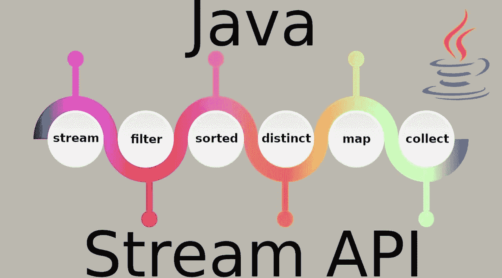
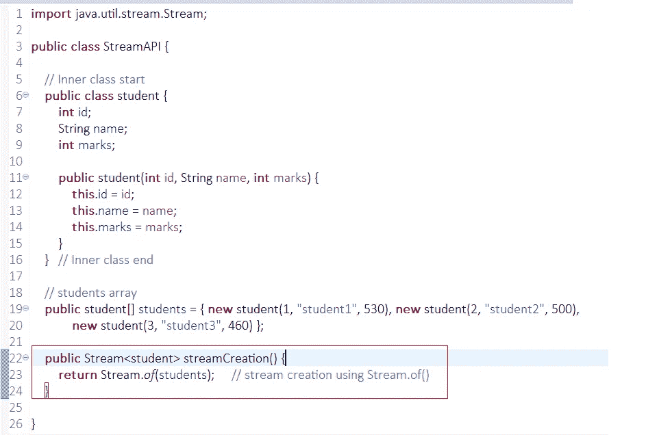
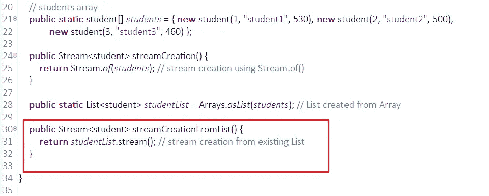
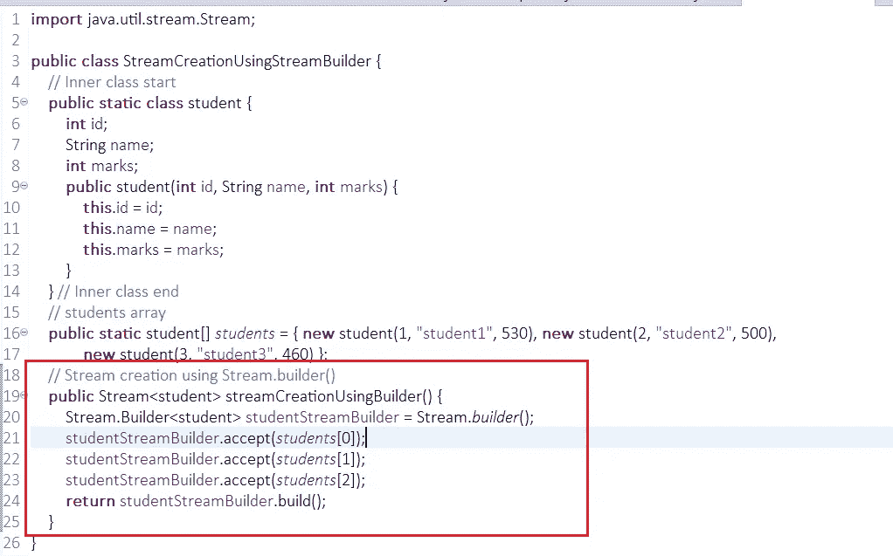

# JAVA 流 API 及其示例——第 1 部分

> 原文：<https://medium.com/analytics-vidhya/java-stream-api-with-examples-part-1-279c8804981f?source=collection_archive---------16----------------------->

流 API 提供了一种处理对象集合的函数方法。Stream API 与 Java I/O 流无关( **FileInputStream** 和 **FileOutputStream** )。

Java I/O 流与字节流相关，而 Stream API 用于处理对象流，而不是字节流。

简而言之，流是数据源的包装器，允许我们操作数据源，并使批量处理变得方便快捷。流不提供直接访问或操作数据源元素的方法。

为了执行计算，流操作被组合成一个 ***流流水线*** 。流管道由一个源(可能是数组、集合、生成器函数、I/O 通道等)、零个或多个*(将一个流转换为另一个流，如`filter(Predicate)`)和一个 ***终端操作*** (产生一个结果或副作用，如`count()`或`forEach(Consumer)`)组成。*

# ***流创建:***

*我们可以使用 **Stream.of()** 、 **Collection.stream()** 和 **Stream.builder()创建一个流。***

*1.从现有数组创建流，*

**

*2.从现有列表创建流，*

**

*3.使用**流创建流。构建器()，***

**