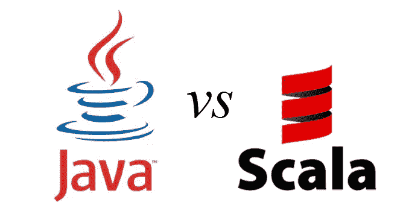

# Java vs Scala！！

> 原文：<https://medium.com/analytics-vidhya/java-vs-scala-7ff9eb50141?source=collection_archive---------5----------------------->

在开始阅读这篇文章之前，如果你真的想从头开始学习 Scala，你也可以参考我在[之前的文章，那是 Scala 系列中的一篇。](/@duke.lavlesh/functional-programming-aspects-in-scala-3de975f9e3f2?source=friends_link&sk=b10332b7f1bc8b03dc7440edaa1cccaa)

**这个帖子的目的:-**

**(许多开发人员正在使用 Java 开发许多应用程序，而 Scala 是 Java 的参考语言，或者你可以说 Scala 的大部分功能都是从 Java 中添加的，具有额外的灵活性，因此我们应该对这两者有更好的理解)**

Scala 编程语言是一种更新的、非常有趣的语言，与 Java 相比有很多新特性。Java 程序员对 Scala 感兴趣的原因是，Scala 被编译成在 Java 虚拟机上运行。换句话说，Scala 被编译成 Java 字节码。这也意味着您可以在 Scala 代码中使用所有的 Java 类。甚至是你自己开发的 Java 类。这使得向 Scala 的过渡更加便宜，因为许多 Java 代码可以重用。

> Scala 中一些有趣的新特性是闭包、作为对象的函数、特征、受 **Erlang** 启发的并发机制，以及对 **DSL(领域特定语言)的支持。**

Scala 被编译成 Java 字节码，由 Java 虚拟机 **(JVM)执行。**这意味着 Scala 和 Java 有了一个共同的运行时平台。Scala 解释器直接运行你的 Scala 代码，不需要你编译它。Scala 解释器作为 Scala 脚本解释器可能会派上用场，有点像 Unix 平台上的 shell 脚本解释器。

## Scala 特性:-

Scala 有一系列不同于 Java 的特性。其中一些是:

1.  所有类型都是对象。
    2。类型推断。
    3。函数是对象。
    4。领域特定语言(DSL)支持。
    5。特质。
    6。关闭。
    7。受 Erlang 启发的并发支持。

我们将在我接下来的帖子中逐一讨论更多内容！！

## Scala 和 Java 的区别:-

**1-** 你会注意到 Scala 和 Java 之间第一个也是主要的区别是简洁明了的代码。Scala 通过巧妙利用类型推断、将所有东西都视为对象、函数传递和其他一些特性，极大地减少了 Java 应用程序的行数。

Scala 旨在以一种优雅、简洁和类型安全的方式表达常见的编程模式。该语言本身鼓励您以不可变风格编写代码，这使得应用并发性和并行性变得容易。

Scala 的一个很酷的特性是内置的惰性评估，它允许将耗时的计算推迟到绝对需要的时候，你可以通过使用一个叫做“惰性”的关键字来实现。

**4-**Scala 和 Java 的另一个区别是 Scala 支持操作符重载。你可以在 Java 中重载任何操作符，也可以为任何类型创建新的操作符，但是正如你已经知道的，Java 不支持操作符重载。

**5-**Java 和 Scala 的另一个主要区别是函数在 Java 中是对象。Scala 将任何方法或函数视为变量。当需要时，你可以像传递物品一样传递它们。您可能已经看过代码，其中一个 Scala 函数接受另一个函数。事实上，这给了语言巨大的力量。

Scala 和 Java 的显著区别是代码简洁紧凑。在 Scala 中，编码更低到各种行，而 Java 不是这样。用 Java 写的代码可以用 Scala 写，只需要一半的行数。Scala 非常聪明地利用“类型推理”来处理所有的对象、传递函数和其他几个函数。

与 java 相比，Scala 与 Java 编程语言的学习曲线更高。由于编码较少，Scala 中的编码很难预测。此外，Scala 的语法比 Java 更复杂。

**8-** Scala 由嵌套编码组成(函数内的函数，对象内的函数，类内的函数)使得代码比 Java 更难理解。有些时候，它提高了清晰度，但如果构图不好，它真的很有挑战性。

这两种编程语言的另一个主要区别是，函数只不过是 java 中的项目，而 Scala 和 Java 中的函数是不同的。

**10-** Scala 不是向后兼容的，这意味着代码只能在当前版本中运行。Java 是向后适合的；它使代码能够在旧版本和新版本上工作，同样不会出错。

## 使用 Scala 的优势

*   Scala 对于面向对象的程序员(Java 开发人员)来说很容易学。近年来，它正在成为流行的语言之一。
*   Scala 为用户提供了一流的功能。
*   Scala 可以在 JVM 上执行，从而为与其他语言的互操作性铺平了道路。
*   它是为并发、分布式、弹性和消息驱动的应用程序而设计的。这是近十年来要求最高的语言之一。
*   它是一种简洁、强大的语言，可以根据用户的需求快速增长。
*   它是面向对象的，具有许多函数式编程特性，为开发人员提供了很大的灵活性，使他们能够以自己喜欢的方式进行编码。
*   Scala 提供了许多鸭子类型。
*   如果您来自 Java，那么样板文件会更少。
*   用 Scala 编写的框架 Lift 和 Play 处于增长曲线中。

## **Java 的优势:-**

*   有详细的文档。
*   大量有经验的开发人员可供使用。
*   允许您形成标准程序和可重用代码。
*   它是一个多线程环境，允许你在一个程序中同时执行许多任务。
*   性能卓越。
*   大量第三方库。
*   轻松浏览图书馆。

## Scala 的缺点:-

*   Scala 提供非常有限的社区存在。
*   它不是一种容易适应的语言。
*   提供非常有限的向后兼容性。

## Java 的缺点:-

*   Java 对内存和处理要求很高。因此，硬件成本增加。
*   不支持指针等低级编程结构。
*   您无法控制垃圾收集，因为 Java 不提供 delete()、free()之类的函数。

# 感谢阅读这篇博客！！

[凯西·波提切罗](https://medium.com/u/ccf1b677570b?source=post_page-----7ff9eb50141--------------------------------) [法维奥·巴斯克斯](https://medium.com/u/e8ec6fa4d7d4?source=post_page-----7ff9eb50141--------------------------------) [瑞安·范](https://medium.com/u/63463afc4a3f?source=post_page-----7ff9eb50141--------------------------------) [何塞·马西亚尔·波尔蒂利亚](https://medium.com/u/703ff67f629f?source=post_page-----7ff9eb50141--------------------------------)