# Javascript 数组隐藏为常规对象

> 原文：<https://medium.com/analytics-vidhya/javascript-arrays-hiding-as-regular-objects-f07f2e1abd87?source=collection_archive---------8----------------------->

在 Javascript 中，所有的数组都是对象，但不是所有的对象都是数组。作为一个类，Array 继承自 Object，这意味着 Array 拥有对象可用的所有方法。但是，Javascript 中有一些特定于数组的方法，这些方法不能用于不是数组的对象。不幸的是，它们可能看起来完全相同，Javascript 不容易知道我们在使用哪一个。当我们询问数组的类型时，Javascript 告诉我们它是一个对象。

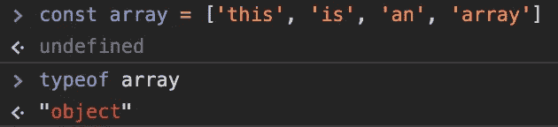

不是谎言…但不是全部的真相

当我们给它一个对象时，我们会看到完全相同的答案，这个对象肯定不是数组。

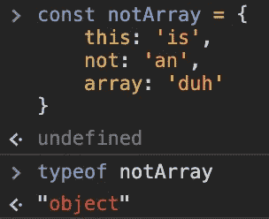

迷惑不？

你可能会觉得这很了不起。他们用同一个名字来称呼这两样东西。数组不喜欢和对象放在一起。假设这两个东西是同一类型的“对象”，但这就是为什么知道哪个是哪个很重要。

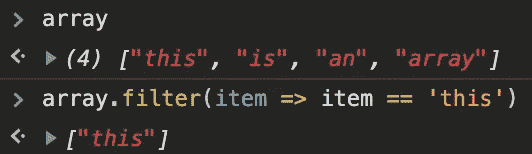

万岁。这个不起眼的物体实际上是一个伪装的阵列

我们可以在这个“对象”上调用 filter，但它在另一个“对象”上失败。

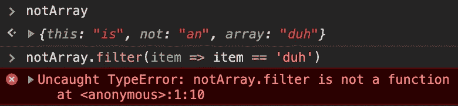

伙计们，这里没什么好看的。只是一个连 filter()都不会调用的可怜的普通对象

我们得到一个错误，但是如果我们不熟悉这种奇怪的关系，数组只是对象而不是真正的对象，这不是一个非常有用的错误。即使我们知道要询问数组的类型，它们也会撒谎说自己是一个“对象”。当被问到时，数组喜欢含糊其辞，假装它们是普通的 ole 对象，但幸运的是，我们可以把它们逼到墙角，强迫它们招供！

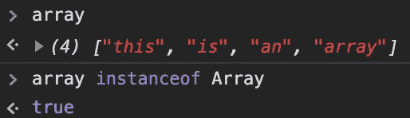

啊哈！我就知道！

只是为了确保我们的另一个对象不是某种不能调用数组方法的失效数组。

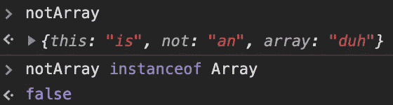

嗯嗯嗯如果它不是数组的失败者哥哥对象

我们终于有办法区分这两个无赖了。如果你认为你有一个数组，但它不能调用数组方法之一，请用“… instanceof Array”仔细检查，以确保它不是你运行的看起来像数组的 mill 对象。

现在我们知道了什么是数组，什么不是，我们有一堆方法可以调用我们特殊的朋友。

 [## 排列

### JavaScript 数组类是一个全局对象，用于构造数组；哪些是高层次的…

developer.mozilla.org](https://developer.mozilla.org/en-US/docs/Web/JavaScript/Reference/Global_Objects/Array) 

我发现这一切的原因是，当我在“document”上调用“getElementsByTagName”时，我假设我已经从我的 DOM 接收了一个列表项数组。

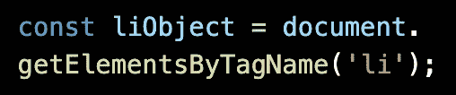

您可以根据变量名猜测这将会如何发展

列表是一个狗的列表，我想拉出一个特定的列表项，它的 innerText 匹配一个特定的品种。让我们来看看当我试图在我假设的“li”元素的数组上运行数组方法时会发生什么。

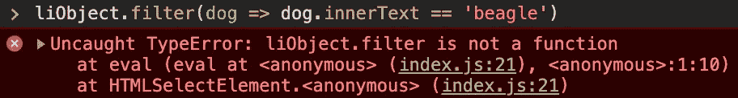

我们知道我们现在所知道的，我们期待这一点

真扫兴。我们可以运行`liObject instanceof Array`，我们会发现它返回 false。幸运的是，我们的列表与一个数组非常相似，我们可以通过编程炼金术使用`Array.from()`将这个简单的对象变成一个黄金数组。

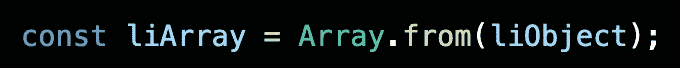

我们可以传递一个类似数组的对象给这个方法，它把它做成一个数组，可以调用我们想要的数组方法。

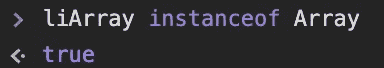

因为它是一个真正的数组，我们应该能够在它上面调用我们的数组方法 filter。

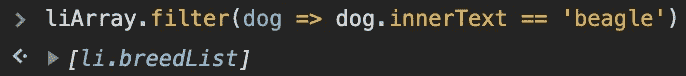

太棒了。它返回带有匹配 innerText 的列表项。

当谈到数组和对象是如何融合在一起的时候，有很多的复杂性。您可以向数组中添加键/值对，以及其他奇怪的东西。还有更多的东西需要探索，但我认为最好留到另一篇博客文章中。