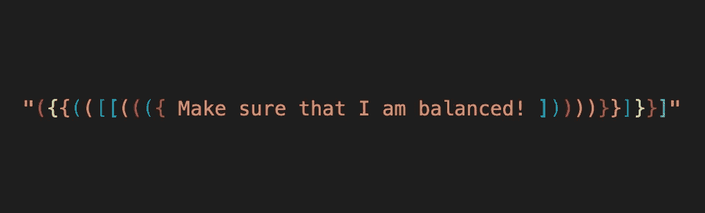
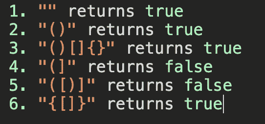
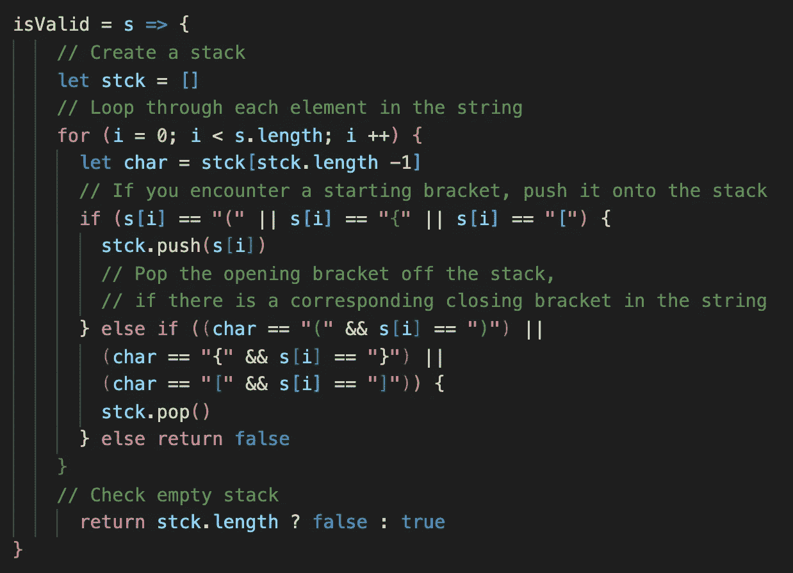
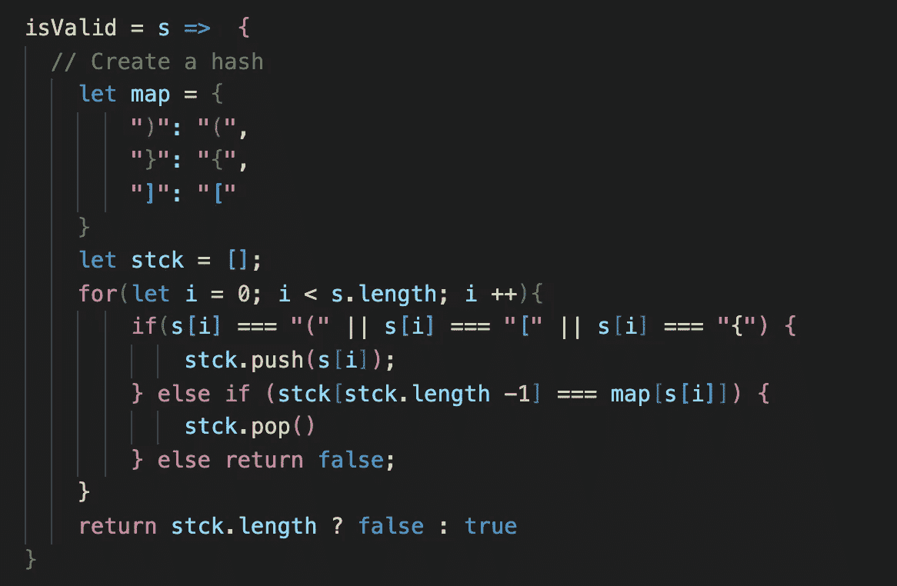

# JavaScript:用堆栈检查有效括号

> 原文：<https://medium.com/analytics-vidhya/javascript-check-valid-parentheses-with-a-stack-bc7b1bab26c2?source=collection_archive---------2----------------------->

我经常访问 LeetCode 网站，练习解决数据结构和算法问题，并提高我的编码技能。[【有效括号】](https://leetcode.com/problems/valid-parentheses/)是经典的面试问题之一，我将在本帖中与你分享我的解决方案。问题是:

*给定一个仅包含字符* `*'('*` *、* `*')'*` *、* `*'{'*` *、* `*'}'*` *、* `*'['*` *和* `*']'*` *的字符串，判断输入的字符串是否有效。*

*在下列情况下，输入字符串有效:*

*开括号必须用相同类型的括号括起来。*

*左括号必须以正确的顺序关闭。*

*注意，空字符串也被认为是有效的。*

有许多方法可以解决这个问题，但我的方法将是实现一个`stack`。`stack`是一个数据结构，通过两个主要操作从外向内处理；`push`将元素添加到集合的顶部，而`pop`将元素从集合的顶部移除。让我们列出解决问题的主要步骤:

1.  定义一个堆栈，它是一个数组。
2.  遍历给定字符串中的每个元素。
3.  如果元素是一个左括号(' **(** '或' **{** '或' **[** ')，则将它推到堆栈上。
4.  如果元素是右括号(' **)** '或' **}** '或' **]** ')，则仅当与遇到的右括号匹配时，才弹出堆栈中的最后一个元素，并继续遍历字符串。如果右括号与堆栈顶部的左括号不匹配，则中断循环并返回`false`，因为字符串中的括号不平衡。
5.  如果在整个字符串迭代后堆栈为空，返回`true`,因为字符串中的括号是平衡的，并且你有一个有效的字符串。

下面是我的 JavaScript 代码:

如果我们想重构这段代码，`hash`将是一个很好的选择。下面，创建“地图”来识别配对；右括号与其对应的左括号相关联。当字符串中遇到的右括号与“map”中的一个标识的`key`匹配时，其对应的`value`将从栈顶移除。如果不匹配，则返回`false`。

这是我找到的解决这个问题的两种方法，但我相信还有更多不同的方法来解决这个挑战。感谢阅读，希望我的帖子对你有所帮助。