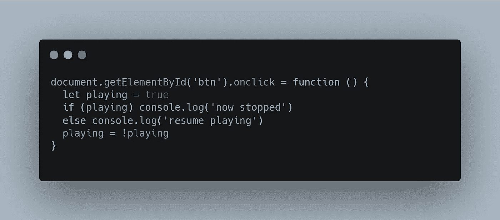

# JavaScript 中的闭包

> 原文：<https://medium.com/analytics-vidhya/javascript-closures-d27700d25c9f?source=collection_archive---------26----------------------->

## 对它们的功能和使用的简单而实用的介绍

奥斯卡·伊尔迪兹在 [Unsplash](https://unsplash.com/s/photos/javascript?utm_source=unsplash&utm_medium=referral&utm_content=creditCopyText) 上拍摄的照片

# 什么是 JavaScript 闭包？

MDN web 文档给出了闭包的伟大定义:

> 一个**闭包**是一个函数与对其周围状态的引用捆绑在一起(封闭)的组合**词法环境**。换句话说，闭包允许您从内部函数访问外部函数的范围。在 JavaScript 中，闭包是在每次创建函数时创建的。

# 实际例子

这个例子来自我做的关于闭包的[这个](https://link.medium.com/v40MQzHqh6)系列，但是使用了更简单的语法，对初学者更友好，并且做了一些改进，因为在系列中你必须简短:

在本例中，toString 函数使用 count 变量，该变量在 makeCounter 函数中定义和初始化。这是因为 toString 可以访问 makeCounter 函数中定义的变量，因为 toString 是在 makeCounter 内部定义的。

makeCounter 函数也有一个返回语句，我们来分析一下:

*   它返回一个[对象文字](https://developer.mozilla.org/en-US/docs/Web/JavaScript/Guide/Working_with_Objects)
*   对象有四个属性，事实证明它们都是函数(在 JS 中，函数是一级对象，所以变量、属性等等可以保存值、数组、对象，也可以保存函数)
*   这个函数还访问它们包含的函数变量 count，最后一个函数访问 makeCounter 中定义的 toString 函数。

需要注意的是**没有人可以在不首先调用 makeCounter】的情况下访问 count 变量和 toString 函数，这是访问它们的唯一方法。**

在上面的例子中，我试图使用对初学者最友好的语法，因为如果你想学习一些关于闭包的知识，但是你是 JavaScript 新手，理解它的一些语法可能会很困难。无论如何，这是一个语法更短的相同示例:

# 播放-点击暂停

有多少次你想让一个按钮*在被点击时暂停某件事的执行，并在再次被点击时继续执行*。这是一个闭包非常有助于实现这一点的例子，因为您可以*在事件处理程序中保存当前的播放状态*，而不必将其公开。

上面的代码实现了这一点:

*   播放状态保存在播放暂停功能中
*   函数实际上**使用播放状态变量返回函数**
*   返回的函数是实际的 onclick 处理程序，它改变播放状态，播放和停止执行
*   当向我们的示例按钮添加 onclick 事件处理程序时，请注意 playPause 函数是被**调用的**，这是因为这些函数为实际的处理程序“设置”了基础(状态)，所以必须调用它才能返回实际的处理程序。

你可能想知道为什么我们不定义播放状态并在 playPause 函数中使用它，而不创建一个返回另一个函数的函数。这的确是个好问题，但如果我们做出这样的东西:

播放暂停按钮不起作用。

在这种情况下，我们每次点击按钮，它每次都会停止执行，并且永远不会恢复，因为每次调用事件处理程序时，播放值都会设置为 true。

# 总结

每当我们需要为某个变量、函数或任何东西创建一个“私有”范围时，当我们想要为一个函数“奠定基础”时(就像在 play-pause 示例中，我们初始化了状态，然后返回了实际的处理程序)，JS 闭包会很有用，在其他许多情况下，我可能会在以后写。关于闭包要记住的重要事情可以总结为:

> JS 闭包允许您创建访问其封闭函数范围的函数。

这篇文章的一个较短的版本可以作为一个中型系列[在这里](https://link.medium.com/v40MQzHqh6)。

## 你可能也会喜欢

 [## JavaScript 中的箭头函数

### 像函数，但是更短…或多或少。让我们来了解一下！

medium.datadriveninvestor.com](https://medium.datadriveninvestor.com/arrow-functions-in-javascript-6817f46ea0c6)