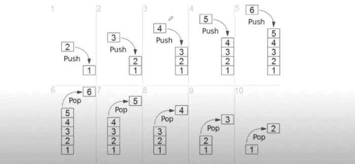
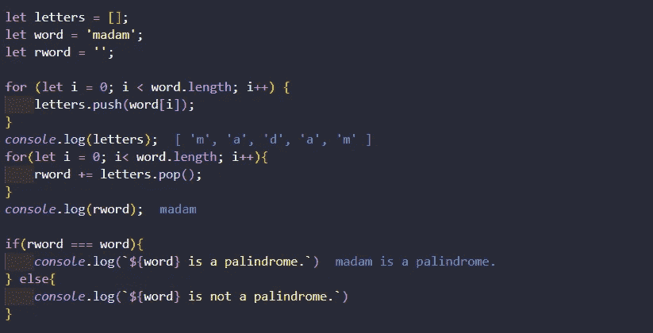
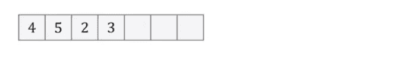
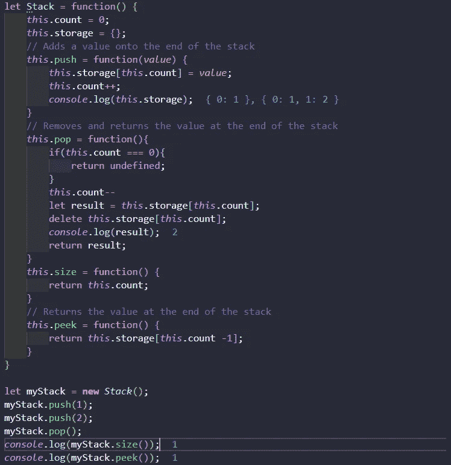

# JavaScript 数据结构——详细的堆栈、队列

> 原文：<https://medium.com/analytics-vidhya/javascript-data-structure-stack-queue-in-detail-eba7c3762fdc?source=collection_archive---------24----------------------->

|与此同时，JavaScript 在 web 技术领域取得了领先地位。所以，这是学习 JavaScript 和它的东西的最好时机。在学习了基本概念之后，你必须计划一些高级主题。


卢克·切瑟在 [Unsplash](https://unsplash.com?utm_source=medium&utm_medium=referral) 上的照片

好吧，让我们试着去理解一些高级的数据结构概念，比如堆栈和队列的细节。

## **为什么需要数据结构？**

数据就是一切。一些专家说，如果你有数据，你可能会领导世界。想象一下科技收益谷歌、脸书、亚马逊实际上引领着科技行业。原因是什么？事实上，他们有很多数据。

嗯，不知何故，你通过你的创业或类似的事情获得了大量的数据。这里，问题来了，你如何管理，整理，或存储你的数据？实际上，在这种情况下，计算机科学专家发明了数据结构概念，并且每天都在更新。所以，如果你想成为编程专家，这是一个必须学习的话题。

## 堆

首先，很重要的一点是要知道，什么是栈？请看例子。


图片:谷歌图片

这里，一些碗被放在一起，形成一堆。因此，在这种状态下，最后一个推入堆栈的项将是第一个被移除的项。这就是“堆栈”采用后进先出( **LIFO** )机制的原因。最好的例子之一是网络浏览器中的后退按钮。您查看的每个页面都会添加到堆栈中，当您单击“后退”时，当前页面(最后添加的页面)会从堆栈中弹出。



图片:[维基百科](http://wikipedia.org/)

好吧，让我们来关注一些编码的例子。从基本堆栈开始。做一个回文代码，基本上就是说像 *madam，* racecar 一样的向前向后读。



看，我们有 3 个变量，比如空字符串的字母，单词和 rword。在这段代码中，我们有两个 for 循环。首先，将单词变量放入字母数组中。现在，字母的值是 **['m '，' a '，' d '，' a '，' m']** 。基本上，second for 循环通过 **pop** 方法使用“rword”变量反转单词。最后，我们只是条件性地检查了——它是不是回文？现在来看一个更深层次的堆栈示例。



让我们用 JavaScript 代码创建这个堆栈。我们必须创建一个函数，函数内部有 push，pop，size，peek 方法来执行堆栈。

```
let Stack = function() {
    this.count = 0;
    this.storage = {};
}
```

这个“堆栈”函数体有两个局部变量，如 count 和 storage。Count 帮助遍历我们的堆栈，storage 帮助我们在堆栈中存储数据。让我们在“堆栈”函数体中创建一个 push 函数。

```
// Adds value to the end of the stack*this*.push = function(*value*) { *this*.storage[*this*.count] = *value*; *this*.count++;}
```

“Push”函数将值添加到堆栈的末尾。在向堆栈添加值之后，count++表示我准备好存储下一个堆栈了。

```
// Removes and returns the value at the end of the stack*this*.pop = function(){ if(*this*.count === 0){ return undefined;}*this*.count--let result = *this*.storage[*this*.count];delete *this*.storage[*this*.count];*console*.log(result);return result;}
```

最初，当堆栈长度为“0”时，它返回“**未定义的**”。否则，下一步将移除堆栈的最后一个元素。

```
*this*.size = function() { return *this*.count;}// Returns the value at the end of the stack*this*.peek = function() { return *this*.storage[*this*.count -1];}
```

这两种方法就是这么简单。第一个是堆栈的总大小，第二个返回堆栈末尾的值。所以，最后的代码是，



## 长队

此处悬疑…

今天不再讨论，稍后将对“队列”数据结构进行简要说明。在那之前，祝你编码愉快。