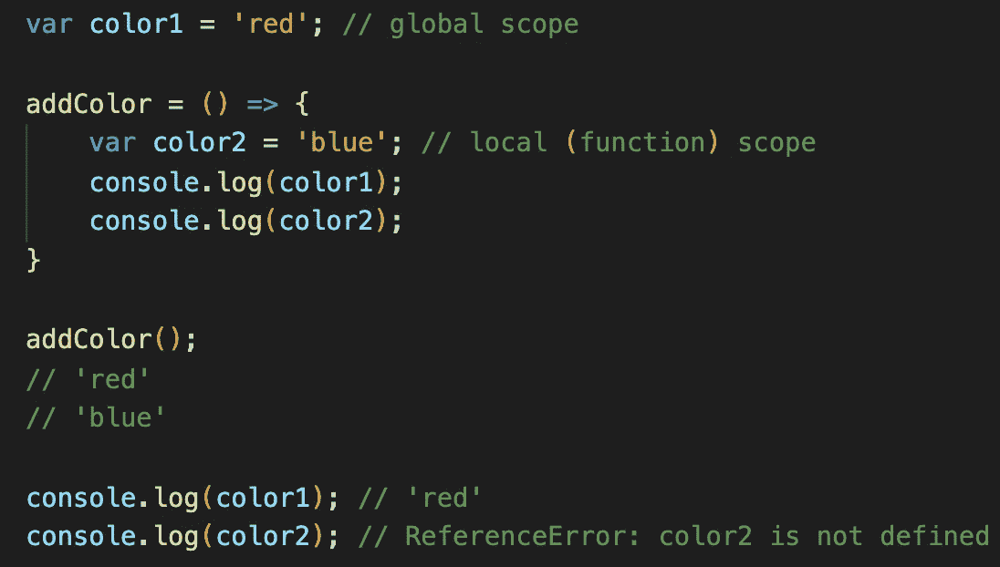
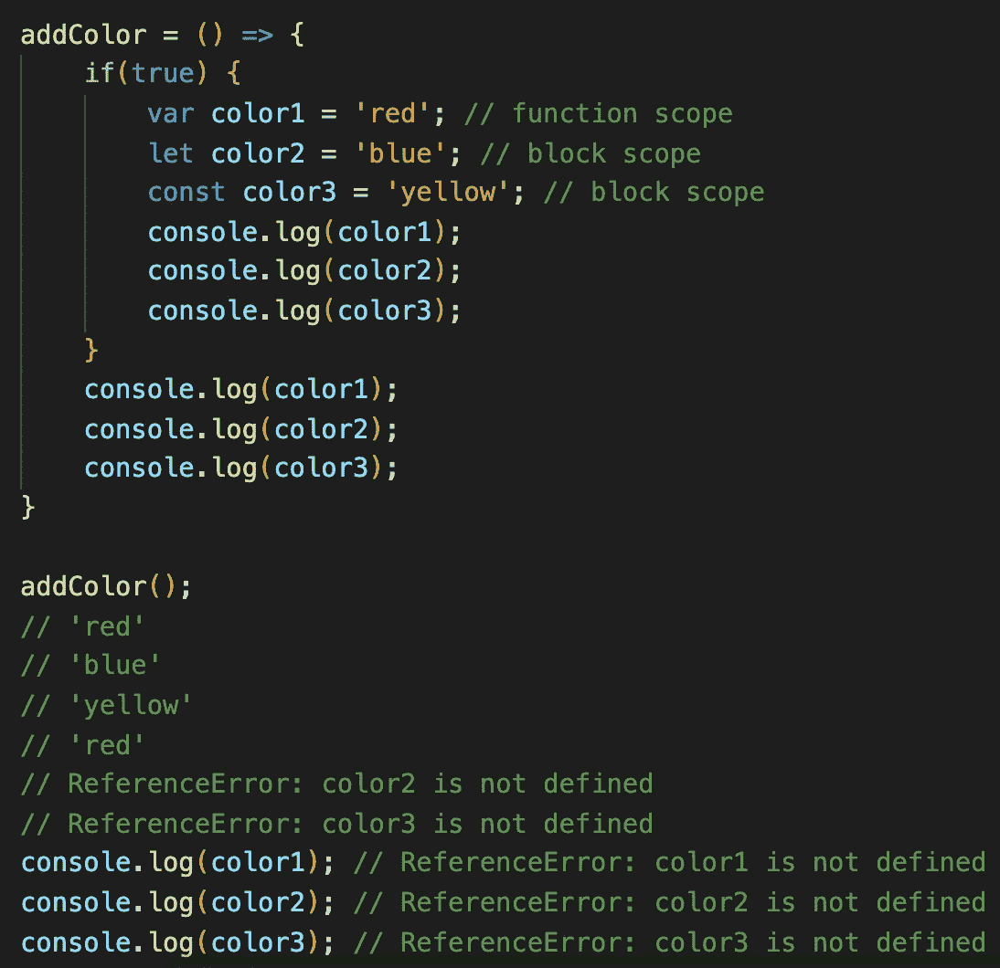
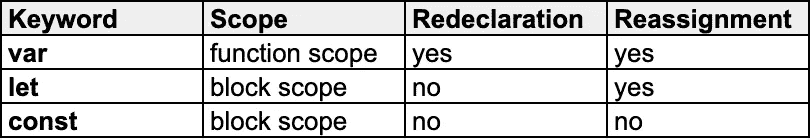

# JavaScript:用 Var、Let 和 Const 声明变量

> 原文：<https://medium.com/analytics-vidhya/javascript-declaring-variables-with-var-let-and-const-1b4f94e5c5e7?source=collection_archive---------13----------------------->

JavaScript 中的变量声明可以用三个关键字以不同的方式执行；**变量**、**让**和**常量**。如果你不清楚这些关键词之间的主要区别，以及什么时候选择一个而不是另一个，这篇文章就是为你准备的。

在我们进入细节之前，让我们先了解什么是范围:

# 变量作用域

作用域是指变量在 JavaScript 中的可见性，这意味着变量在定义它的作用域之外是不可访问的。

**全局范围:**在函数或块外部声明的变量具有*全局范围*，并且可以从代码中的任何地方访问。

**局部作用域:**在一个函数或块内声明的变量有*局部作用域*，它们只能在那个函数或块内访问，不能从全局作用域访问。JavaScript 中有两种类型的局部范围:

1.  **函数作用域:**当一个新函数被声明时，它会创建自己的作用域。函数中定义的变量与它绑定在一起，不能在函数外部访问。
2.  **块范围:**JavaScript 中的代码块可以使用`{curly braces}`和块语句中定义的变量来定义，比如`if`条件或者`for`和`while`循环是块范围的。这意味着块中定义的变量只能在花括号中访问。让我们来看一个例子:

第一个和第二个`console.log(color1)`都记录变量`color1`，因为它是在全局范围内声明的。

第一个`console.log(color2)`成功记录了变量`color2`，因为它可以在函数`addColor`中访问，而第二个`console.log(color2)`抛出了一个错误，因为变量`color2`在其作用域之外不可见。

现在，让我们解释一下关键字 **var** 、 **let** 和 **const** 是什么:

# 定义变量

在最近 **ES6** (ECMAScript 2015)引入 **let** 和 **const** 之前， **Var** 是 JavaScript 中唯一用于声明变量的关键字。 **Var** 声明要么是全局作用域，要么是局部(函数)作用域，但不是块作用域。

**Var** 可以在相同的作用域内更新和重新声明，不会出现错误。用 **var** 声明的第二个变量覆盖了第一个变量。这可能会导致您意外地用相同的名称覆盖现有变量的值，并且在这种情况下调试会变得很困难。

# 让

ES6 在 2015 年引入了新的关键词 **let** 。 **var** 和 **let** 的主要区别在于 **var** 是函数作用域，而 **let** 是块作用域。当在`if`语句或`for`循环中用 **let** 声明一个变量时，它只在那个块中有效，这有助于轻松调试你的代码。

**Let** 可以像 **var** 一样在其作用域内更新，但是 **let** 不能在其作用域内重新声明。这就是为什么最好使用 **let** 的原因，因为它减少了像 **var** 一样在同一个范围内不止一次意外重新声明变量的潜在错误。

# 常数

使用**常量**声明变量类似于 **let** ，并且是块范围的。 **const** 和 **let** 的区别在于，初始值设定后，新值不能赋给带有 **const** 的变量，这意味着 **const** 在其作用域内创建 **const** ant 变量。

让我们看看下面的例子，以了解它们在范围上的区别:

所有变量都可以在同一个`if`语句/块中访问。尽管变量`color1`由于其函数范围在块外仍然可见，但另外两个变量`color2`和`color3`不再有效，因为我们只能在声明它们的花括号内访问这两个变量。最后，不能在函数之外访问任何这些变量，因为它们不是全局范围的。

下表总结了我们所讨论的内容:

一般建议避免使用 **var** 。最佳实践是使用 **const** 作为默认选项，除非您需要在`for`循环或 switch 语句中重新分配变量，在这种情况下， **let** 将是更好的选项。