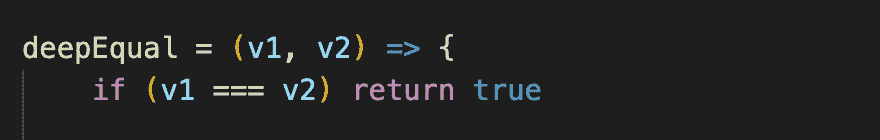
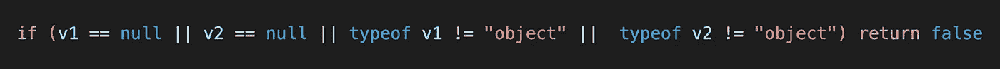
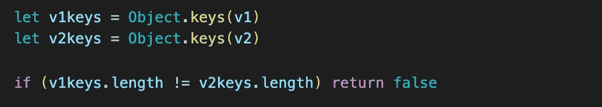
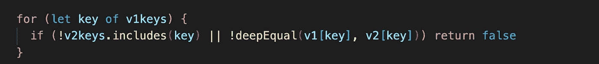
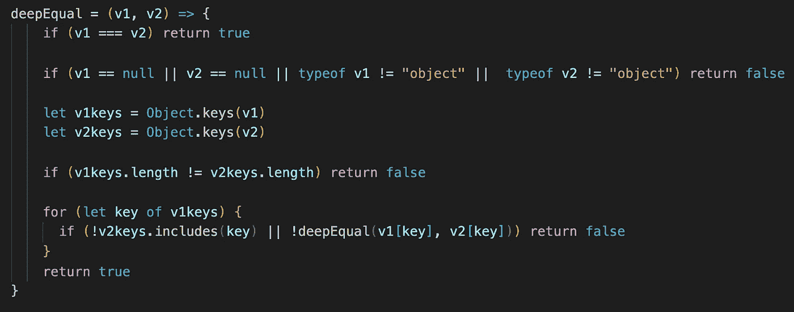

# JavaScript:通过递归调用对对象进行深度比较

> 原文：<https://medium.com/analytics-vidhya/javascript-deep-comparison-of-objects-with-a-recursive-call-f67a8f37a343?source=collection_archive---------3----------------------->

在这篇文章中，我将解释[雄辩 Javascript](https://eloquentjavascript.net/) 书(第 3 版，第 4 章)中*深度比较*练习的解决方案:

*编写一个函数* `*deepEqual*` *，该函数接受两个值，只有当它们是相同的值或者是具有相同属性的对象时才返回 true，其中与对* `*deepEqual*` *的递归调用相比，属性值是相等的。*

让我们将练习分成几个小部分，一步一步地解释:

第一步:

函数`deepEqual`接受两个参数；值 1( `v1`)和值 2( `v2`)。在第一步中，我们将使用严格的等式操作符`(===)`来检查两个参数的类型和值是否相同。

第二步:

接下来，我们需要检查两个参数的类型是否都是`object`而不是`null`。如果两个参数都是`object`，我们将向前移动，用一个*深度比较*来比较它们的属性。

第三步:

在我们确定两个参数都是`object`之后，我们将检查它们是否具有相同的属性和值。比较`object`键的数量是一个好的开始，可以消除属性长度不同的键。我们将使用`Object.keys()`方法返回`object` s 的属性列表，并设置变量`v1keys` & `v2keys`。

第四步:

在最后一步中，我们将用一个`for in`循环遍历`v1`的所有属性，以确保`v1`中的每个属性也存在于`v2`中。如果我们比较的`objects`有相同的属性，检查它们的值将是最后要做的事情。这就是我们需要递归地使用`deepEqual`函数(调用它自己)的地方，通过将每个属性的值传递给它来检查它们是否相等。如果每个对象有不同值的属性，它将退出循环并返回 false。

如果在循环检查每个属性和值后，上述条件都不满足，则在函数结束时将返回 true。以下是包含所有解释步骤的完整功能:

希望这有所帮助，感谢阅读！