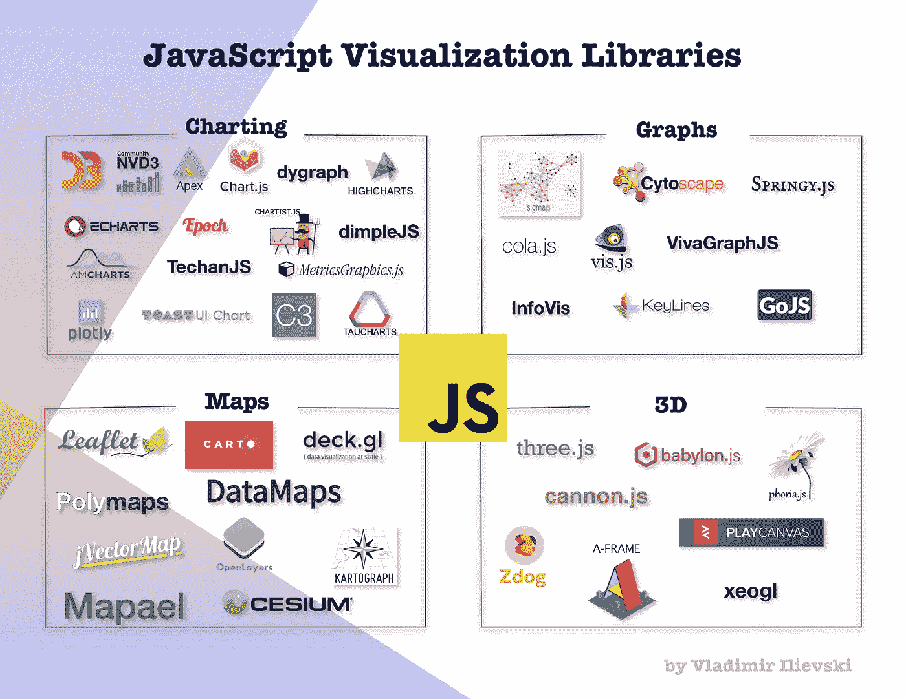

# JavaScript:探索图形可视化生态系统

> 原文：<https://medium.com/analytics-vidhya/javascript-discover-the-graph-visualization-ecosystem-e637936cfeda?source=collection_archive---------2----------------------->

## 图形可视化库、图形数据文件格式、流行的数据存储库和现成的工具

有大量的 *JavaScript* 可视化工具。根据它们的功能，我们可以将它们分为 4 大类:

*   **如数家珍**:制作最普通的…