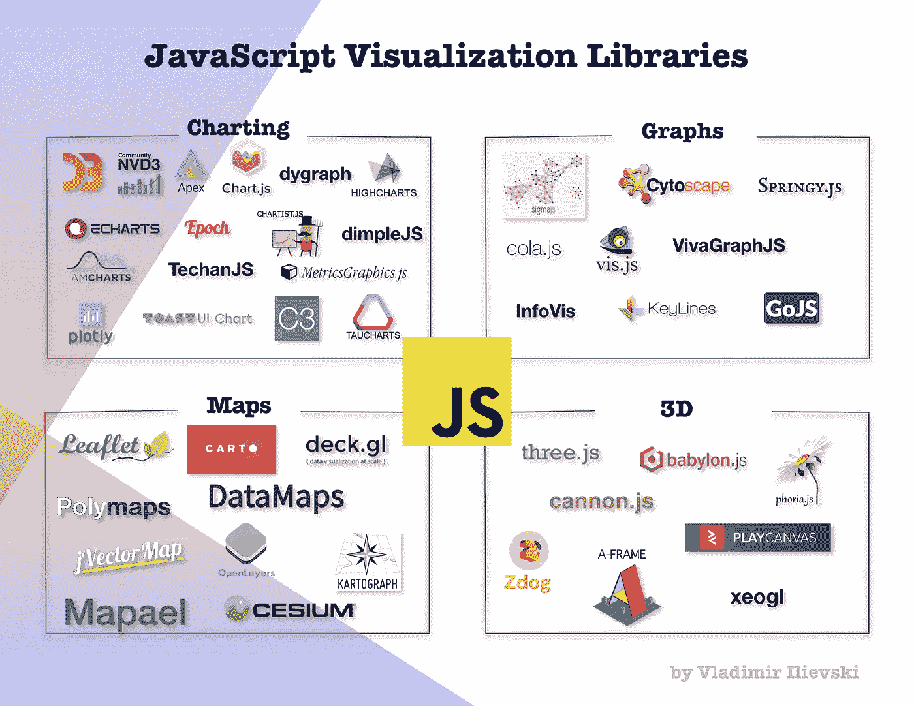

# JavaScript:使用 Cytoscape JS 的图形可视化

> 原文：<https://medium.com/analytics-vidhya/javascript-graph-visualization-using-cytoscape-js-e741556afb96?source=collection_archive---------5----------------------->

## 演示如何创建交互式图形可视化

JavaScript 可视化生态系统

在上一篇[博客文章](https://bit.ly/2yhctKD)中，我们进入了图形可视化生态系统。我们详细阐述了常见的数据格式、现有的和流行的数据存储库、 *JavaScript* 库以及一些基于 GUI 的工具。