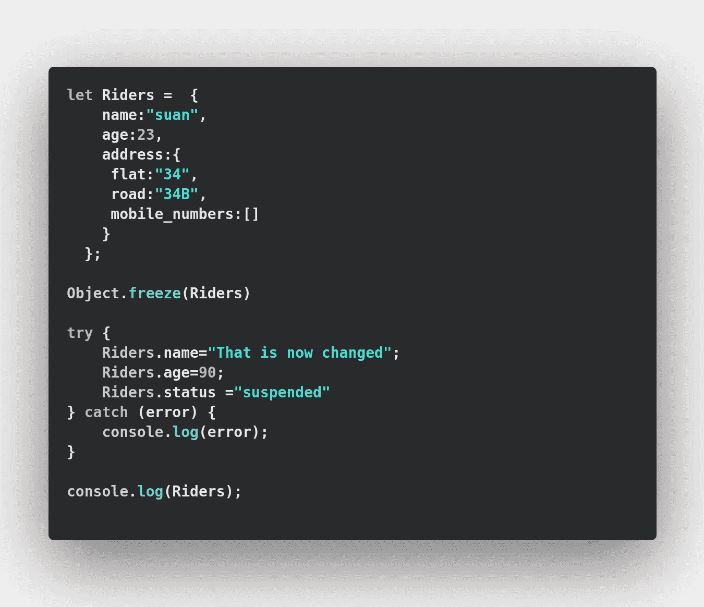
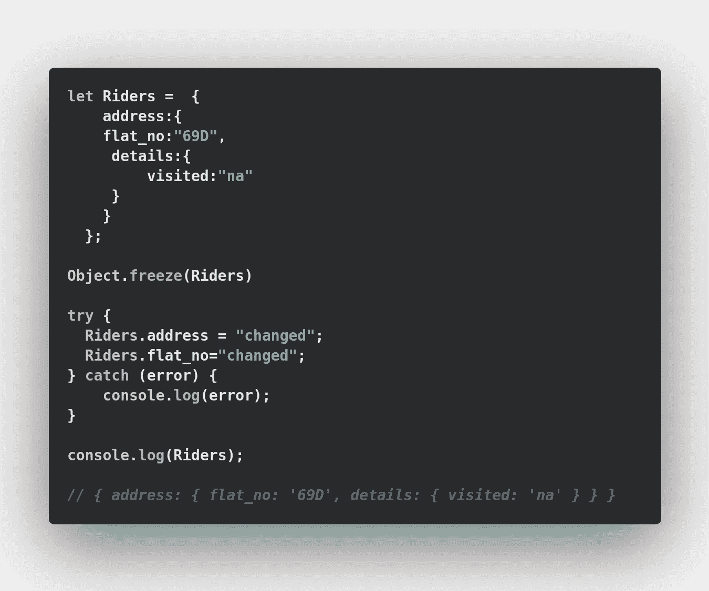
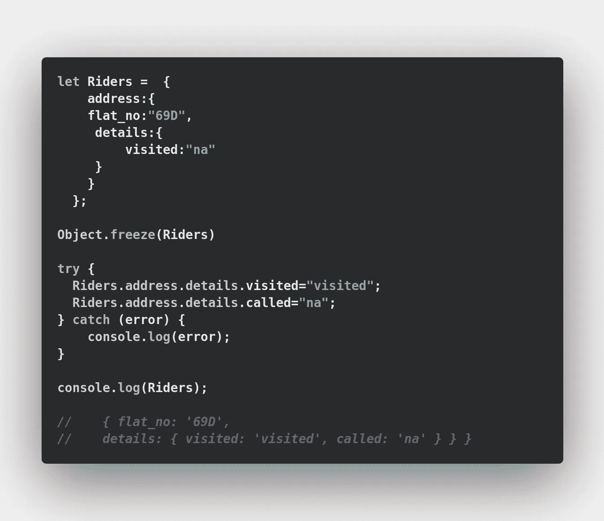
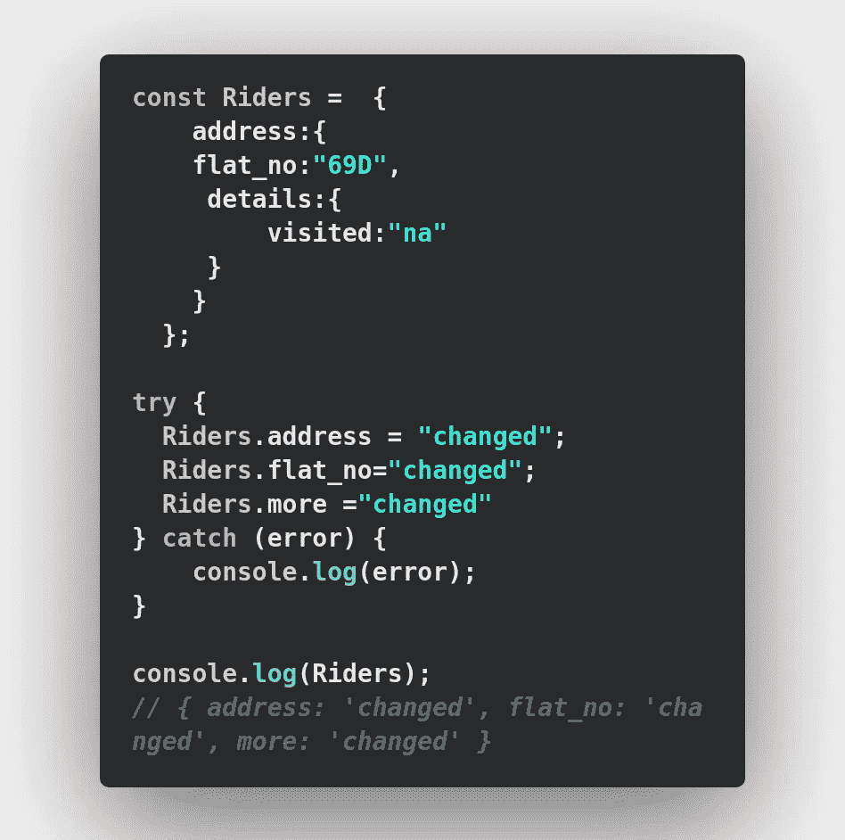
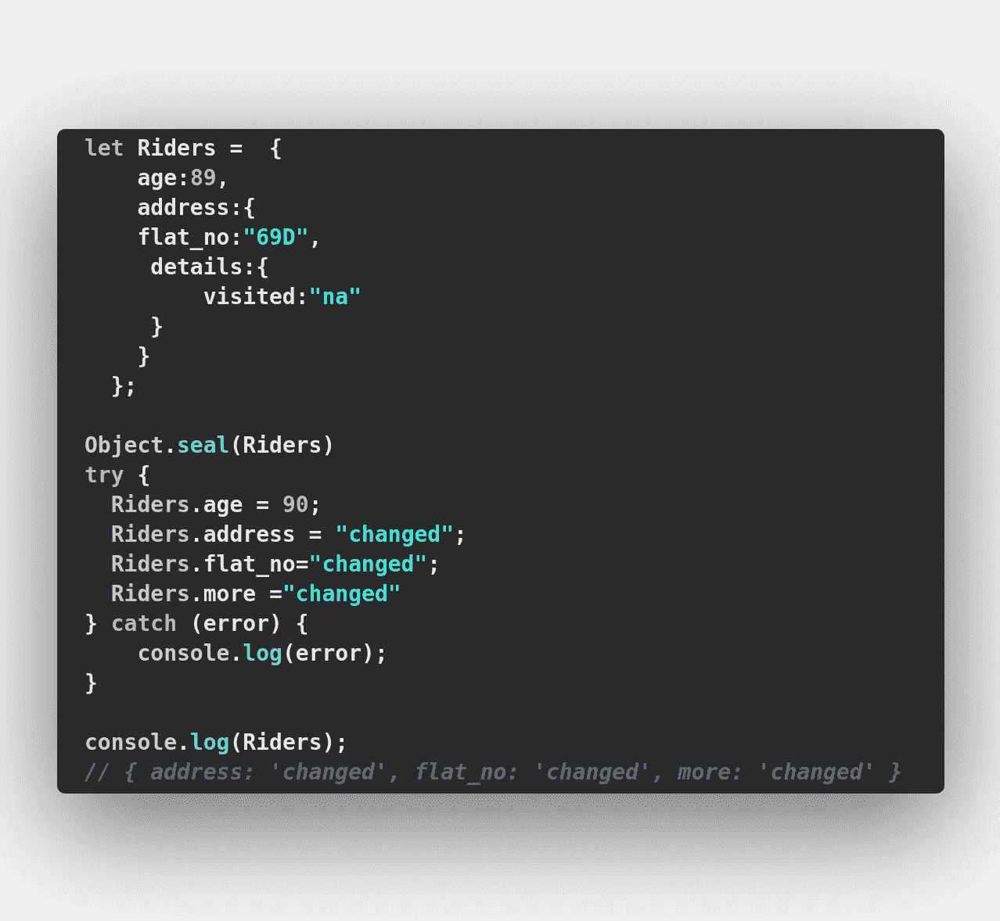
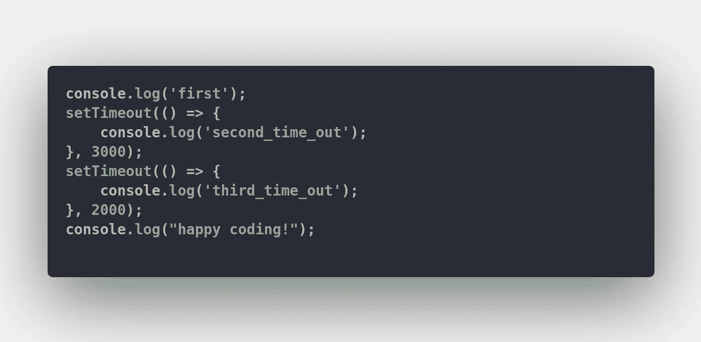

# Javascript 对象冻结

> 原文：<https://medium.com/analytics-vidhya/javascript-objects-freezing-d9c2967df5e8?source=collection_archive---------21----------------------->

来源:[https://www . clearbox SEO . com/WordPress-JavaScript-SEO-Google-search-index/](https://www.clearboxseo.com/wordpress-javascript-seo-google-search-index/)

**Object.freeze()** 是针对 **Objects** 的，它以一个对象作为参数，用不可修改的新行为返回同一个对象。这意味着您不能添加新属性或修改该对象的值。

一旦你冻结了一个对象，你就不能做在 try 块上做的事情，它会让你运行你的代码没有任何错误，但不会对 Riders 对象有任何影响！

现在让我们看看当我们试图改变冻结对象的对象属性时会发生什么(即地址有一个嵌套对象作为值)

对象冻结后的嵌套规则

就像前面的例子一样，当 js 冻结对象的属性值为 Object type，
1。您不能更改内部对象的属性值。
2。无法添加更多属性。

现在，详细情况是什么？第二层，你可以改变任何东西！您可以更改“添加新属性”的值，请参见下面的示例

可变嵌套属性

你可能想用 **const 来实现这一点，** const 将允许改变/修改属性值，并将允许添加一个新的属性，这意味着没有使用声明对象为 const，见下面的代码

有些时候我们只是想阻止客户用现有对象添加新属性，但让他们改变其属性值，以实现我们用来密封的这种行为。当我们密封一个对象时，可以修改其已定义的值，但不能添加或删除新值。参见下面的代码

*   [冻结](https://developer.mozilla.org/en-US/docs/Web/JavaScript/Reference/Global_Objects/Object/freeze):使对象不可变，意味着不允许改变已定义的属性，除非它们是对象。它返回一个新的对象
*   [封存](https://developer.mozilla.org/en-US/docs/Web/JavaScript/Reference/Global_Objects/Object/seal):防止增加属性，但是已经定义的属性仍然可以更改。它返回属性可写值为 true 的同一对象

阅读更多关于[https://developer . Mozilla . org/en-US/docs/Web/JavaScript/Reference/Global _ Objects/Object/freeze](https://developer.mozilla.org/en-US/docs/Web/JavaScript/Reference/Global_Objects/Object/freeze)

> 你能猜出产量吗？

在 https://www.linkedin.com/in/hirahasan/给我打电话