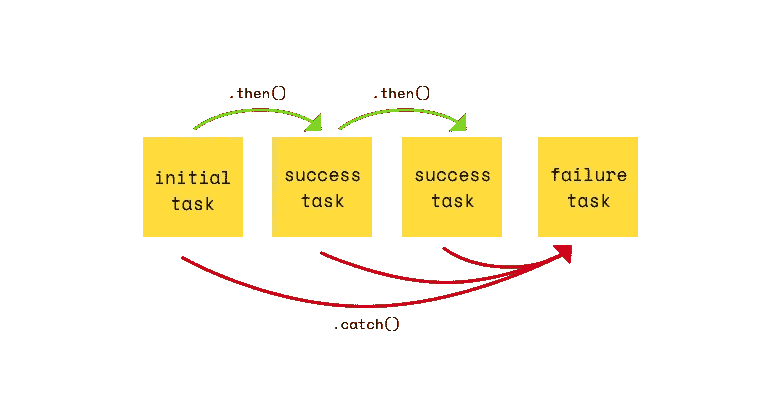

# JavaScript 承诺

> 原文：<https://medium.com/analytics-vidhya/javascript-promises-2bbd50c1ea4a?source=collection_archive---------21----------------------->

在今天的博客中，我们将讨论 JavaScript 中的承诺。在所有这些爆炸和语法之前，我只想给你一些我们这篇文章主角的背景故事，让你关心承诺背后的逻辑，而不是无聊的语法。这篇文章将是一个角色驱动的博客，而不是一个情节驱动的博客。坐下来，拿起你的爆米花，享受博客。

JavaScript 中的承诺就像现实生活中的承诺一样。你承诺了一些事情，它有两个结果，要么完成了承诺，要么失败了。在 Java 脚本中，promise 函数有两个参数，分别是 resolve 和 reject。

承诺处于以下状态之一:

*   *待定*:初始状态，既未履行也未拒绝。
*   *完成*:表示操作成功完成。
*   *拒绝*:表示操作失败。


让我们看看创建承诺的实际语法。

```
var promise = new Promise( function(resolve, reject) {
/* Promise content */
})
```

可以看出，promise 构造函数有一个参数，这个参数是传递两个变量 resolve 和 reject 的函数。这段代码将返回两个可能的结果。如果承诺实现了，那么 resolve 方法将被触发。如果事情出错了，promise 将会触发 reject 方法来允许我们处理这个错误。


**连锁承诺**

谈到 JavaScript 中的承诺，`.then()`和`.catch()`块是非常方便使用的方法。我们可以用`.then()` 方法链接我们的承诺，并且只使用链末端的一个`.catch()`方法来处理在一个`then()`任务执行期间可能发生的所有异常。



让我们把上面提到的所有东西放在一起。

`fetch(‘https://ergast.com/api/f1/2004.json’)
.then(res => res.json())
.then(data => data.MRData)
.then(element => {
console.log(element);
})
.catch(error=>{
console.error(error);
});`

在这个代码示例中，我们从由[ergast.com](https://ergast.com/api/f1/2004.json)提供的 API 中获取一个 JSON 数据，并用`then()`方法链接数据，为了处理可能的异常，我们传递了`then()`链的`catch()`块结尾。现在，我们有了非常简单易读的代码。

这个帖子到此为止。希望你喜欢。

**参考文献**

[](https://developer.mozilla.org/en-US/docs/Web/JavaScript/Reference/Global_Objects/Promise) [## 承诺

### Promise 对象表示异步操作的最终完成(或失败)及其结果…

developer.mozilla.org](https://developer.mozilla.org/en-US/docs/Web/JavaScript/Reference/Global_Objects/Promise) [](https://bitsofco.de/javascript-promises-101/) [## JavaScript 承诺 101

### JavaScript Promise 表示一个尚未完成的操作的结果，但在某个时候会…

比特索夫科](https://bitsofco.de/javascript-promises-101/) [](https://www.freecodecamp.org/news/javascript-es6-promises-for-beginners-resolve-reject-and-chaining-explained/) [## JavaScript Promise 教程:JS 和 ES6 中的解决、拒绝和链接

### 承诺是我们在 JavaScript 中处理异步操作的方式之一。许多人都在与…

www.freecodecamp.org](https://www.freecodecamp.org/news/javascript-es6-promises-for-beginners-resolve-reject-and-chaining-explained/)