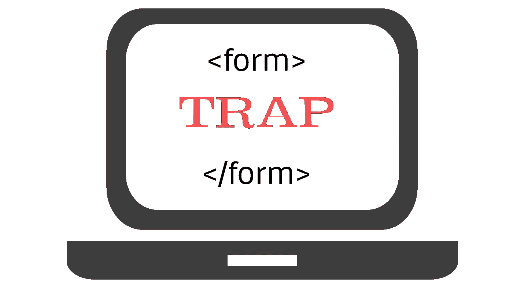

# 表单元素内的 Javascript 变量事件属性

> 原文：<https://medium.com/analytics-vidhya/javascript-variables-inside-form-elements-event-attributes-aa945388a47d?source=collection_archive---------11----------------------->

我想说一下 **javascript 范围**，HTML **id 属性**，HTML **<表单>**-元素和 HTML **事件属性**之间的特殊关系。

今天我有心情在 Stackoverflow 中查看一些与 javascript 相关的问题，以增加我在那里的声望分数——是的，我有点无聊。经过几个小时的搜索和回答，我发现…