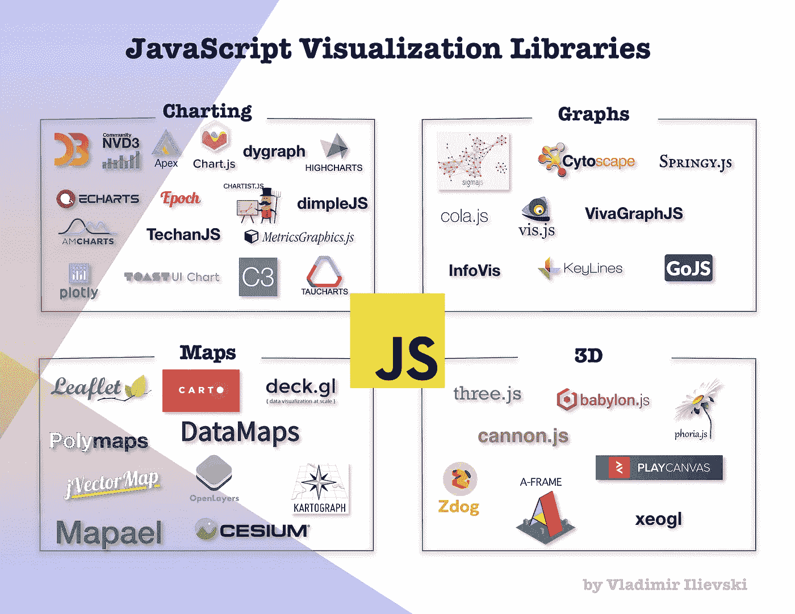

# JavaScript:探索图表可视化生态系统

> 原文：<https://medium.com/analytics-vidhya/javascript-visualization-discover-different-visualization-tools-part-1-e4a77595fb97?source=collection_archive---------14----------------------->

## JavaScript 图表库，提供如何再现最常见图表的实践经验

图书馆的 JavaScript 可视化前景

在接下来的一系列博客文章中，我们按照主要功能对不同的 **JavaScript** 可视化库进行了重新划分。我们涵盖以下可视化类别: