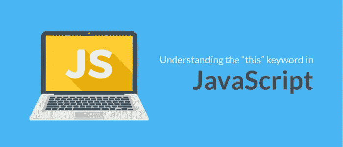

# JavaScript 的“this”关键字(strict，bind()，call()，apply())

> 原文：<https://medium.com/analytics-vidhya/javascripts-this-keyword-strict-bind-call-apply-79fc35039832?source=collection_archive---------16----------------------->

与其他 OOP 语言不同，`this`关键字的行为不同。它的`strict mode`和非严格模式的对应物也有区别。根据 MDN 上的定义，`this`在非严格模式下是指一个对象，在`strict mode`中可以是任意值。例如在 Ruby 中，每一行都是在对象内部执行的。你可以把 Ruby 中的`self`看作当前对象。因此，只要您显式调用另一个对象上的方法，该对象就会变成`self`。

# **全球:**

当在函数外部(全局上下文)调用`this`时，无论是在严格模式还是非严格模式下，它都引用全局对象。如下所示，我们在 whodis()函数中调用了`this`，并返回了`window`对象。对于浏览器来说，全球环境是`window`。

使用 Node 查看浏览器外部的全局上下文，我们可以看到返回的是`global`对象，而不是`window`对象。

这与 Ruby 类似，如果我调出 IRB 并调用`self`，将返回关键字`main`。

# **严格模式:**

在严格模式下使用`**this**`会返回`undefined`。它提供了更好的安全性和错误检查。关于`strict mode`的警告是，如果`this`的值没有在执行上下文中声明，它将总是`undefined`。要启用`strict mode`,我们需要做的就是在函数顶部调用`'use strict'`。

# 绑定、调用、应用:

有三种方法可用于显式设置对象上的`this`的值；`.bind()`、`.call()`和`.apply()`。当使用`.bind()`时，我们可以分别定义一个函数和一个对象，并告诉函数使用其他对象作为它的`this`值。这将产生一个新函数，其中`this`是显式的。然而，当使用`.call()`或`.apply()`时，你不需要创建一个全新的函数。这两种方法的工作方式非常相似——区别在于`.apply()`接受第二个参数(数组),而`.call()`可以传入任何额外的参数。

如果我们看一下上面的代码，我们可以看到一些东西的声明。我们有一个函数`whodis()`，一个对象 foo，和另一个函数 fooBar。为了从我们的`whodis()`函数中获得这个值，我们必须首先调用 whodis 并追加`.call()`或`.apply()`并传入包含 bar 方法的对象的值。它保存表情符号的值，如第 6 行所示。`this`的值是传递给`.call()`和/或`.apply()`方法的第一个参数。一旦我们调用第 14 行或第 15 行，我们将返回值`this` →表情符号。这同样适用于`.bind()`方法。唯一不同的是我们必须创建一个新的函数对象。

# 总结:

*   当调用对象上的方法时，`this`是拥有该方法的对象。
*   全局对象由执行环境决定。在浏览器中，全局对象是`window`对象。在浏览器之外，全局对象是`global`。
*   而在严格模式下`this`是函数中的`undefined`。
*   `this`是作为第一个参数传递给`.call()`或`.apply()`或`bind()`方法的值。

欲了解更多信息，请访问以下链接:

[https://developer . Mozilla . org/enUS/docs/Web/JavaScript/Reference/Operators/this](https://developer.mozilla.org/en-US/docs/Web/JavaScript/Reference/Operators/this)

[https://dmitripavlutin . com/gentle-explain-this-in-JavaScript/](https://dmitripavlutin.com/gentle-explanation-of-this-in-javascript/)