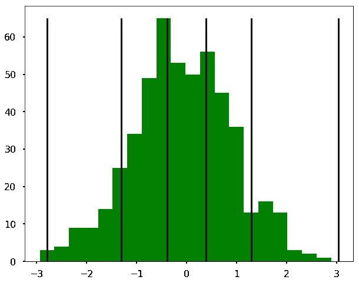

# Jenks 自然间断——最佳测距算法。

> 原文：<https://medium.com/analytics-vidhya/jenks-natural-breaks-best-range-finder-algorithm-8d1907192051?source=collection_archive---------0----------------------->



这篇文章试图给这个晦涩的便捷工具一个清晰的描述。

**Jenks 优化方法**，也称为 **Jenks 自然间断分类方法**，是[数据聚类方法](https://towardsdatascience.com/the-5-clustering-algorithms-data-scientists-need-to-know-a36d136ef68)中的一种，旨在确定不同类中值的最佳排列。但是在继续之前，让我们看看“自然休息”是什么意思。

***自然间断:“*** 自然间断”是分割范围的最佳方式。最佳范围意味着相似区域被组合在一起的范围。这种方法最大限度地减少了每个范围内的变化，因此每个范围内的区域在值上尽可能接近。

***直觉***:Jenks natural breaks 算法，就像 K-means 一样，将数据分配给 K 个组中的一个，使得组内距离最小化。就像 K-means 一样，我们必须在运行算法之前选择 K。

***为什么手动设置不是一个好主意:*** 通常**不切实际**因为会有大量不同的方式来设置范围**不准确**因为它破坏了数据的客观显示**。在用户可以测试的几个图案中，几乎肯定会选择“最漂亮”的图案，但这与数据的正确显示无关。**

## ***遮光罩下的算法:***

让我们看一个例子来理解算法是如何工作的。假设我们的值列表是[4，5，9，10]，我们需要从中找出最佳范围。

***第一步:*** *计算“数组均值的方差之和”(SDAM)。*

```
list = [4, 5, 9, 10]
mean = 7  #(4 + 5 + 9 + 10) / 4
SDAM = (4-7)^2 + (5-7)^2 + (9-7)^2 + (10-7)^2 = 9 + 4 + 4 + 9 = 26
```

***第二步:*** *对于每一个范围组合，计算“类均值的离差平方和”(SDCM _ 全部)，找出最小的一个。SDCM 所有类似于 SDAM，但使用阶级手段和偏差。*

```
"""
For [4][5,9,10]
SDCM_ALL = (4-4)^2+(5-8)^2+(9-8)^2+(10-8)^2 = 0 + 9 + 1 + 4 = 14For [4,5][9,10]
SDCM_ALL = (4-4.5)^2+(5-4.5)^2+(9-9.5)^2+(10-9.5)^2 = 0.25 + 0.25 + 0.25 + 0.25 = 1.For [4,5,9][10]
SDCM_ALL = (4-6)^2+(5-6)^2+(9-6)^2+(10-10)^2 = 4 + 1 + 9 + 0 = 14.
"""
```

注意中间的一个具有最低的 *SDCM，意味着方差最小。*

***第三步:*** *作为最终的汇总度量，计算一个“方差拟合优度”(GVF)，定义为(SDAM — SCDM) / SDAM。GVF 的范围从 1(非常适合)到 0(非常适合)。*

```
"""
GVF for [4,5][9,10] is (26 - 1) / 26 = 25 / 26 = 0.96 
GVF for the other 2 ranges is (26 - 14) / 26 = 12 / 26 = 0.46
"""
```

[4，5][9，10]的 GVF 是最高的，表明该组合是列表[4，5，9，10]的最佳范围，这在直觉上是有意义的。

***要知道的事情*** :是数据密集型算法。以将 254 个项目分成 6 个范围为例。有 8，301，429，675 种可能的范围组合。测试如此多的组合可能要花一点时间。因此，从较小的范围开始通常是更好的做法，只有在需要时才增加到较大的范围。

***代码中的用法*** :

```
pip install jenks
```

下面是一个函数，用于在给定要分类的值数组和所选类数的情况下计算方差拟合优度:

```
from jenks import jenks
import numpy as np
def goodness_of_variance_fit(array, classes):
    # get the break points
    classes = jenks(array, classes)

    # do the actual classification
    classified = np.array([classify(i, classes) for i in array])

    # max value of zones
    maxz = max(classified)

    # nested list of zone indices
    zone_indices = [[idx for idx, val in enumerate(classified) if zone + 1 == val] for zone in range(maxz)]

    # sum of squared deviations from array mean
    sdam = np.sum((array - array.mean()) ** 2)

    # sorted polygon stats
    array_sort = [np.array([array[index] for index in zone]) for zone in zone_indices]

    # sum of squared deviations of class means
    sdcm = sum([np.sum((classified - classified.mean()) ** 2) for classified in array_sort])

    # goodness of variance fit
    gvf = (sdam - sdcm) / sdam

    return gvf

def classify(value, breaks):
    for i in range(1, len(breaks)):
        if value < breaks[i]:
            return i
    return len(breaks) - 1
```

例如，假设您决定 GVF 至少应为 0.8，那么您可以增加类的数量，直到 GVF 满意为止:

```
gvf = 0.0
nclasses = 2
while gvf < .8:
    gvf = goodness_of_variance_fit(array, nclasses)
    nclasses += 1
```

这就把我们带到了文章的结尾。Jenks Natural Breaks 可能是您的工具集中一种方便的静态技术，旨在优化一组值到“自然”类的排列。

> 关于我

我是 [Wavelabs.ai](https://wavelabs.ai/) 的资深机器学习专家。我们 Wavelabs 帮助您利用人工智能(AI)来彻底改变用户体验并降低成本。我们使用人工智能独特地增强您的产品，以达到您的全部市场潜力。我们试图将尖端研究引入您的应用中。

欢迎访问 [Wavelabs.ai](https://wavelabs.ai/) 了解更多信息。

嗯，这些都在这个博客里。感谢阅读:)

保持好奇！

你可以通过 [LinkedIn](https://www.linkedin.com/in/rehan-a-18675296) 联系我。