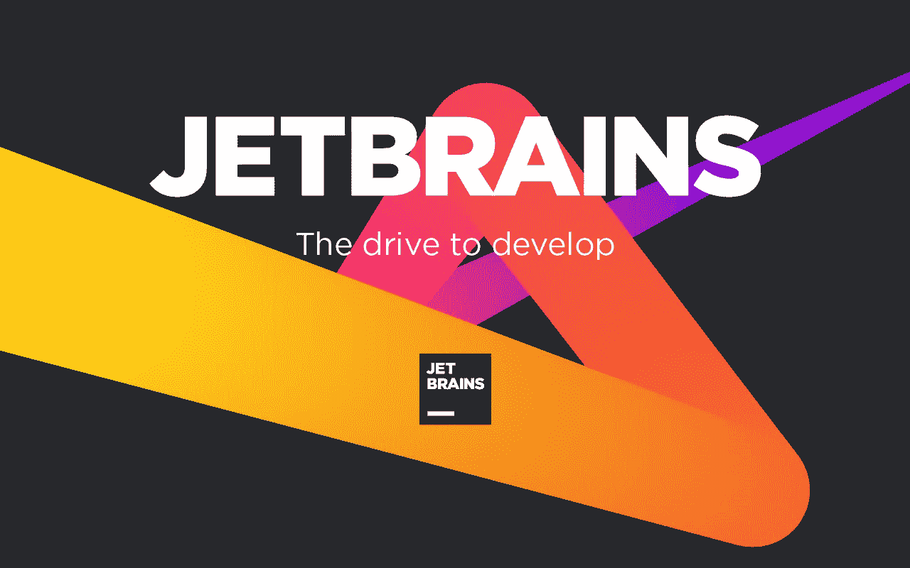
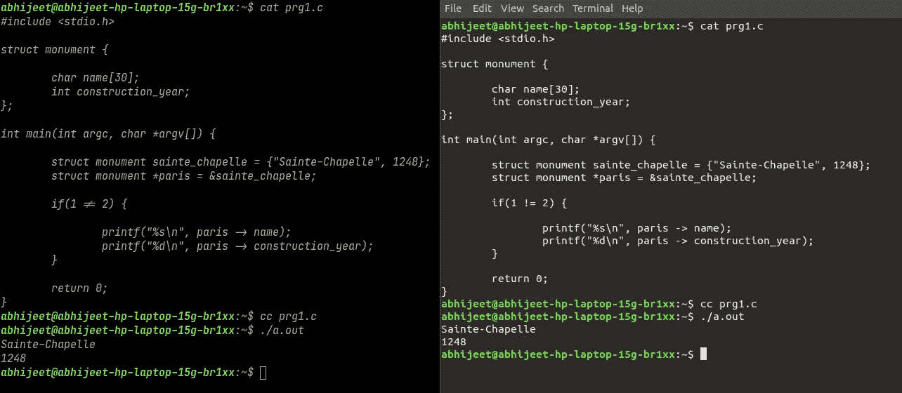

# JetBrains Mono，一种完全为软件工程师设计的字体。

> 原文：<https://medium.com/analytics-vidhya/jetbrains-mono-a-font-designed-totally-for-software-engineers-a7de9f0656b6?source=collection_archive---------21----------------------->

## JetBrains Mono 是程序员为程序员开发的字体。(理解林肯对民主定义的双关语)

我不知道，我正在为自己做一件有点累(或困难)的打字和阅读代码的任务，直到我从组织“ [JetBrains](https://www.jetbrains.com/) ”中看到“ [JetBrains Mono font](https://www.jetbrains.com/lp/mono/#letter) ”(是的，你说得对，Kotlin 语言的设计者)。

一旦你开始使用这种字体，输入代码的任务就变得视觉愉悦和美观。字体的某些特征使得阅读代码时眼睛不那么疲劳。

**特色**

1.  字符的宽度保持标准，但小写字母的高度被最大化。这种方法将代码行保持在开发人员期望的长度，并且有助于改善渲染，因为每个字母占用更多的像素。
2.  椭圆的形状接近矩形符号。这就使得文本的整个模式更加清晰——сut。椭圆形的外侧确保您的眼睛在垂直扫描文本时不会有额外的障碍。
3.  它附带了代码用的连字(连字是由两个或多个连接的符号组成的字符)，确切地说是为了几个目的。a)通过合并符号和去除细节来减少噪声，从而减少眼睛的处理。b)通过在某些情况下移动字形来更有效地平衡空白。
4.  好的斜体的关键是调整好竖排和斜体之间的对比。通常，该角度约为 11–12°。JetBrains Mono 使用 9°角；这样可以保持最佳对比度，最大限度地减少注意力分散和眼睛疲劳。
5.  JetBrains Mono 的字体形式简单，没有不必要的细节。以小尺寸呈现，文本看起来更清晰。表格越简单，眼睛感知它们的速度就越快，大脑处理它们所需的努力也就越少。
6.  JetBrains mono 为您提供了符号的清晰度。“1”、“l”和“I”都很容易相互区分。零里面有一个点。字母“O”没有。逗号的形状不同于句号的形状，使得它们在小尺寸时更容易区分。这同样适用于派生符号。
7.  笔画末端的激进剪裁更适合像素网格，并赋予字体更严格、更“科技”的个性。

> 我们可以看到 **JetBrains Mono(左)**在运行，vs**Ubuntu 的默认字体(右)**。 ***精确查看结构指针的'- >'和"！= "符号的 if 语句*，**在代码两边。在 JetBrains 结扎线的帮助下，左侧变得多么美观。

接下来我们想到的是如何使用 ***JetBrains Mono*** 字体。有两种方法可以做到这一点。

a)从 v2019.3 开始，JetBrains Mono 的最新版本随 JetBrains IDE 一起提供。在 IDE 设置中选择 JetBrains Mono:转到首选项/设置→编辑器→字体，然后从字体下拉列表中选择 JetBrains Mono。

> b) [从他们的网站](https://www.jetbrains.com/lp/mono/#font-family)下载字体，并将内容解压到位置 **"/usr/share/fonts"** (在系统范围内安装字体)。

以及消防命令终端上的"***【fc-cache-f-v】***。你的电脑里已经安装了 JetBrains Mono 字体。现在进入你最喜欢的编辑器，比如 Sublime 或者像 Visual Studio Code 这样的 ide，选择字体，“JetBrains Mono”。将终端的字体明确设置为 JetBrains Mono，并开始粉碎一些代码。