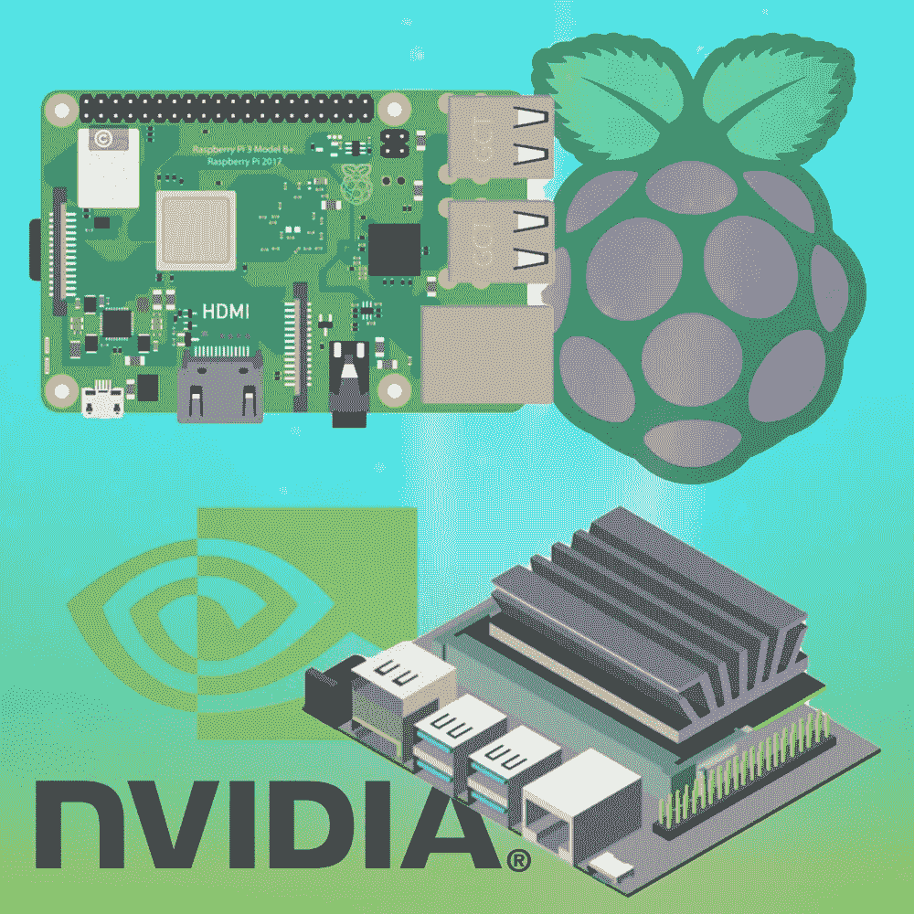

# 杰特森纳米 vs 树莓派

> 原文：<https://medium.com/analytics-vidhya/jetson-nano-vs-raspberry-pi-e84642555adc?source=collection_archive---------1----------------------->

杰特森 vs Pi

Nvidia 最近宣布了其新的 Jetson Nano 2 GB，这是教学、学习和开发人工智能和机器人的理想选择。但是我们将 Jetson 与 Raspberry Pi 进行比较，Raspberry Pi 的目的是促进基础计算机科学的教学，但后来它在开源开发者中变得很有名。
为了进行比较，我们将使用 Nvidia Jetson Nano 和 Raspberry Pi 4 (2 Gb 型号)

**处理器

现在，从手机、消费电子产品到可穿戴设备，数十亿台设备都依赖于 ARM。最近收购 ARM 的交易仍在进行中，尚未最终确定。但如果这笔交易是最终的，它将改变杰特森的未来。
在处理能力方面，最新的树莓 Pi 采用了四核 Arm Cortex-A53，该处理器采用了 1.5 Ghz 64 位四核处理器。在谈论 Jetson Nano 时，四核 ARM Cortex-A57 是 1.43 Ghz 强大的 64 位四核处理器。
在这里，树莓 Pi 4 占据优势，以微弱优势胜出。**

Jetson 使用 4GB LPDDR4 64 位 RAM，提供 25.6 GB/秒的速度。

现在我们来谈谈什么是 LPDDR4，它可以降低功耗，但这是以带宽为代价的。它是移动版的 DDR4。
LPDDR5 具有更灵活的突发，在 16 到 32 的范围内，另一方面，DDR4 被限制为每个周期 8 个突发。
ELI5-什么是突发模式？
突发模式是指设备重复传输数据，而不经过在单独的事务中传输每条数据所需的所有步骤的情况。
在 RAM 中，突发模式基本上是通过在请求之前自动获取下一个存储器内容来实现的。

两者都有相似的 1600 MHz RAM，因此在这种情况下不分胜负。
两块板都可以用 MIPI CSI 端口。

**视频解码**。
Pi4 有硬件加速解码，适用于 H264、MPEG4、H263。它也有单独的 HEVC 模块，由 Linux 内核驱动。

谈杰特森纳米
杰特森纳米支持 H.264 和 H.265 硬件编码。又是一场平局。

**USB 支持** 杰特森有 4x 端口支持 3.0 和 USB 2.0 micro Usb。
而树莓 Pi 有 2 个 2.0 端口和 2 个 4.0 端口。

**负载下的功率和分类比较** 在查阅了许多关于分类模型的基准 Pi 和 jetson 的研究论文后，结果令人印象深刻，Raspberry 的分类时间有所增加，但功耗在 2.56 W 到 7.30 W 之间。
对于 Jetson，范围在 5W-10W 左右。
模型的分类是按时间分析的，可以看出它发生的时间比 GPU (Jetson Nano)更快，并且随着数据集的增加而增加。通过 CPU (Raspberry Pi)在分类模式下达到最高。
数据集规模为 20K 时，Jetson Nano 和 Raspberry PI 出现内存错误。
**获胜者，显然是杰特森**，认为功耗很高，但这解释了分类和训练模型花费的时间较少。
参考论文，参考 DEEP-CNN 对 Jetson TX2、NANO、Raspberry PI 的基准分析。

**存储树莓 Pi 和 Jetson 都可以支持最大 128 GB 的 sd 卡。(非官方证实)。**

**联网和显示**

**结果覆盆子里的花和边为什么会这样？
我们来看看。
对于显示器，树莓有两个高达 4k 的微型 HDMI，每秒 60 帧，更夸张的是，树莓 Pi 可以同时支持两个 4k 的显示器。
杰特森有一个 HDMI 2.0 端口和 eDP 1.4。
因此，圆周率为 1 分。顺便说一下，让我们不要跳过磨 eDP 1.4** Pi 如此成功的一个最重要的原因是软件是最新的。
这两款设备的一般计算性能不相上下，但当其机器学习 Jetson 接管 Raspberry Pi 时，由于其 128 CUDA 核心 GPU，基于 Maxwell 架构。它提供了惊人的 472 GFLOPs。

eDP 代表 Embedded DisplayPort，它是便携式设备和设备的显示面板接口标准。HDMI 是由索尼、飞利浦和东芝等科技公司在 2003 年推出的。这就是 HDMI 成为显示器标准的原因。eDP 是旧的 VGA 和 DVI 标准的后续标准。
电子数据处理支持。
除了音频返回通道为 HDMI 添加了一个额外的功能，将声音从显示器发送回信号源，两者之间没有太大的差异。

Raspberry Pi 有内置 Wi-Fi，而同样的东西可以在 Nano 上买到，可能要多花 10-20 美元。
树莓 Pi 有双频 802.11ac 无线局域网，也有蓝牙 4.2。
Raspberry 还支持以太网供电。
PoE 通常提供 48 DV，但 Jetson Nano 需要 5V
因此，需要一个降压电压来将 48 V 电源转换为 5V。
就以太网而言，有线以太网的速度最高可达 10/100/1000 Base-TX x 5。
而有线以太网在树莓 Pi 4 上最高可达 330 Mbps。

覆盆子 Pi 仍然是开发者、IOT 爱好者和开源爱好者的热门选择。
Raspberry Pi 拥有庞大的社区支持，数字在 reddit 上清晰可见，在 Raspberry Pi subreddit 上超过 210 万。
覆盆子已经在社区中流行开来。
此外，Raspberry 仍然是 Linux 用户的最爱，因为用户有许多选择来安装发行版，从 Ubuntu，Fedora，Raspbian，RISC OS，Windows IOT 核心，RetroPi 等，相信我，我只是触及表面，有许多发行版可以在 Raspberry Pi 上使用，而 Jetson 的官方操作系统是 Linux4Tegra，基于 Ubuntu 18.04，旨在运行 Nvidia 硬件。

对于树莓 Pi 来说，要想真正与 Jetson 竞争，只有在添加了 GPU 之后才有可能。实际上还可以将 GPU 添加到 Pi 中，但这样做成本更高，因为您必须购买价值 10，000 印度卢比或 135 美元的神经计算棒 2，因此与其投资这么多，不如购买 65 美元的 Jetson Nano。

如果你是机器学习爱好者，并且你想让你的迷你板处理数据，Jetson Nano 是完美的选择。
随着 GPU 的加入，Jetson 看起来很有前途，基准测试的结果说明了一切。