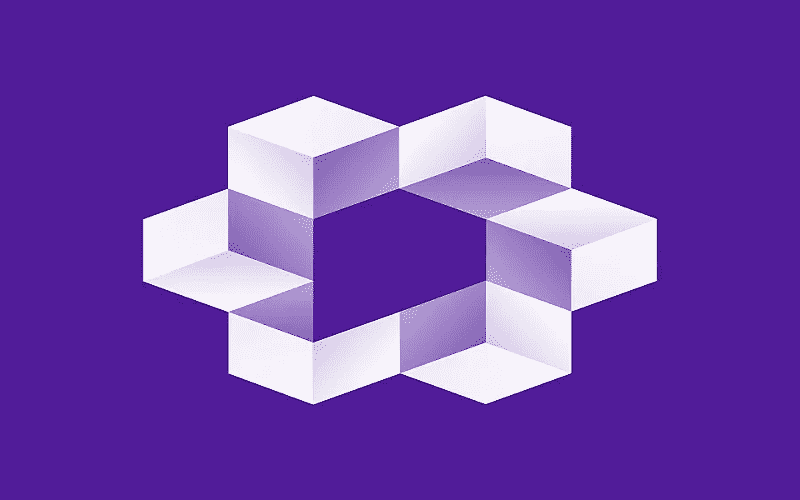
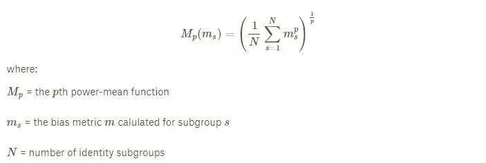
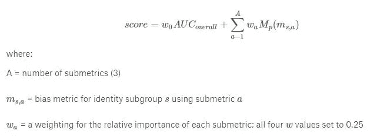
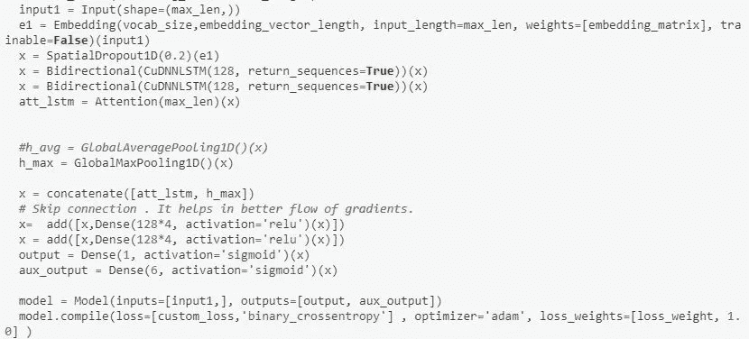

# 拼图无意偏见有毒评论分类。

> 原文：<https://medium.com/analytics-vidhya/jigsaw-unintended-bias-toxic-comment-classification-fa68fe3a27c8?source=collection_archive---------9----------------------->

在这篇博客中，我将总结我自己和通过阅读 kaggle 上其他人的笔记本来解决问题的方法，这个问题是由对话人工智能团队(由 [Jigsaw](https://jigsaw.google.com/) 和谷歌创立的一个研究项目)放到 kaggle 上的。

取自 Kaggle

# 问题陈述:

目标是检测有害评论并减少模型的非预期偏差。

# 背景:

在这次比赛之前，Jigsaw 在前一年也举办过一次比赛，目的是检测有毒的评论。他们建立的模型错误地学会了将毒性与一些**身份词汇**联系起来，例如**(同性恋、黑人、家庭性等。)**。因此，它会将诸如“我是同性恋女性”这样的句子归类为有毒评论。**因此，本次比赛的目的是减少对身份词的偏见。**

# **数据集概述:**

Jigsaw 提供的数据集很大，有 180 万条评论。数据集包含 45 列，但其中只有几列对我们有用。“comment_text”列包含评论,“target”列显示评论的毒性。这是我们的模型在测试时应该预测的值。值≥0.5 表示评论有毒(阳性)。

其他感兴趣的列是 **9 个身份列(子组)**，即**‘男性’、‘女性’、‘黑人’、‘基督徒’、‘犹太人’、‘穆斯林’、‘白人’、‘精神病患者’或‘精神病患者’、‘同性恋者’或‘同性恋者’**。我们将使用这些列来提高模型的性能。在这篇博客的后面部分，你会了解到这一点。

数据集非常不平衡，大约 8%的点属于第 1 类(有毒评论)，92%属于第 0 类(无毒评论)。

# 评估指标:

在这种情况下，我们得到了一个定制的指标，旨在克服模型的意外偏差。这个新度量是各种子度量的加权组合。我将在下面定义每一个。

**总体 AUC:** 这是将在整个测试数据集上计算的 roc-auc。

**偏倚 AUC:** 现在我们将再次计算 roc-auc 以对抗模型的偏倚。我们将计算以下三个测试数据集子集的 roc-auc，每个子集捕获非预期偏倚的不同方面。

1.  ***亚组 auc*** :我们将计算每个亚组的 auc(标识列)。auc 值低意味着如果评论包含身份词，模型会混淆。
2.  ***背景阳性&亚组阴性(bpsn)*** :这里我们将计算测试集的 auc，其中毒性评论未提及身份，而无毒评论提及身份。低 auc 将意味着模型混淆了不提及身份的毒性评论和提及身份的非毒性评论。
3.  ***背景阴性&亚组阳性(bnsp)*** :这里我们将计算提及身份的毒性评论和未提及身份的无毒评论的测试集的 auc。较低的 auc 意味着模型混淆了提及身份的毒性评论和未提及身份的无毒评论。

现在，我们将合并三个有偏差的 AUC，并按如下方式计算它们的平均值。

取自卡格尔。

在这次比赛中，p 取-5。选择这个 p 值是为了提高模型对于性能较差的身份子群的性能。**为了理解这种说法，让我们看看下面的例子**。

让我们选取 auc 为 0.95、0.98、0.97 和 0.70 的四个亚组。如果我们取简单平均值，我们将得到 0.90 的值，这给了我们一个错误的印象，即我们的模型表现良好，但当我们使用上述方法计算平均值时，我们得到 0.84 的值。因此，我们可以看到，如果一个或多个子组表现不佳，我们的指标会给出较低的 auc。

现在我们来看看如何计算最终指标**。下面是公式。**

****

**取自 kaggle**

****数据清理**:我们**从文本数据**中去掉了**所有的**和**停用词**除了**辱骂词**的**如**符*k** 、**迪*k** 、**蒲**y** 等。****

# 方法:

1.  **使用经典机器学习:**在我们的第一种方法中，我们使用了**逻辑** **回归**，并且我们在私有排行榜上获得了**分数**为 **0.89** 。我们已经使用 **tf-idf** 对我们的数据进行了矢量化，以训练我们的模型。然后我们尝试了其他模式，如**天真巴爷的**，但我们的分数没有提高。因此，我们没有在解决方案中保留这一点。我们也尝试将 **char grams** 与 tf-idf 结合使用，但是我们的分数并没有提高。
2.  **使用深度学习**:在使用机器学习模型后，我们尝试了深度学习模型来提高我们的分数。首先，我们使用**爬行 300d** 和**手套** **100d** 作为我们的嵌入来训练所有的深度学习模型。我们从 LSTMs 开始，但我们的分数徘徊在 0.50 到 0.51 之间。如果你想了解 LSTMs 是如何工作的，那么我建议你去看看 Christopher Ola 的博客。这表明我们的模型表现得像一个随机模型。然后，我们训练了 bi-lstm 的各种架构和变体，给出最佳分数 0.93309 的架构如下所述。

第一层是嵌入层，然后是 0.2 的空间落差。然后我们有两层 128 个单元的双 LSTMs，一个接一个。我们对输出分别应用**关注层**和**全局最大值** **池层**。然后，我们将这两层串联起来，并在此基础上使用了两层完全密集连接的层，其中包括跳跃连接。

最终建筑

您可以通过使用 **keras.layers.add.** 跳过连接。这可以通过添加前一层的输出和密集层的输出来实现。这个密集层将前一层的输出作为输入。当网络很深时，这有助于改善梯度的流动。

提高我们分数的最重要的事情是给每个数据点加权。现在在这里你要注意把握这一点。现在我将解释我是如何给一个数据点分配权重的。所有数据点最初都被赋予 0.25 的权重。如果一个数据点属于任何一个子组(9 个身份组)，那么它被分配一个额外的权重 0.25。如果数据点属于 bpsn 组或 bnsp 组，则分配 0.25 的额外权重。该权重用于计算损失，计算损失时，损失乘以数据点的权重。在使用这些重量之前，我的得分是 0.92。使用这种方法后，分数提高到 0.93309。

你可以查看我的 github 账号了解更多细节和更好的理解。Github 链接:[https://github . com/riteshranjan 110/Jigsaw-Unintended-Bias-Toxic-Comment-class ification/blob/master/Jigsaw 4 . ipynb](https://github.com/riteshranjan110/Jigsaw-Unintended-Bias-Toxic-Comment-Classification/blob/master/Jigsaw4.ipynb)