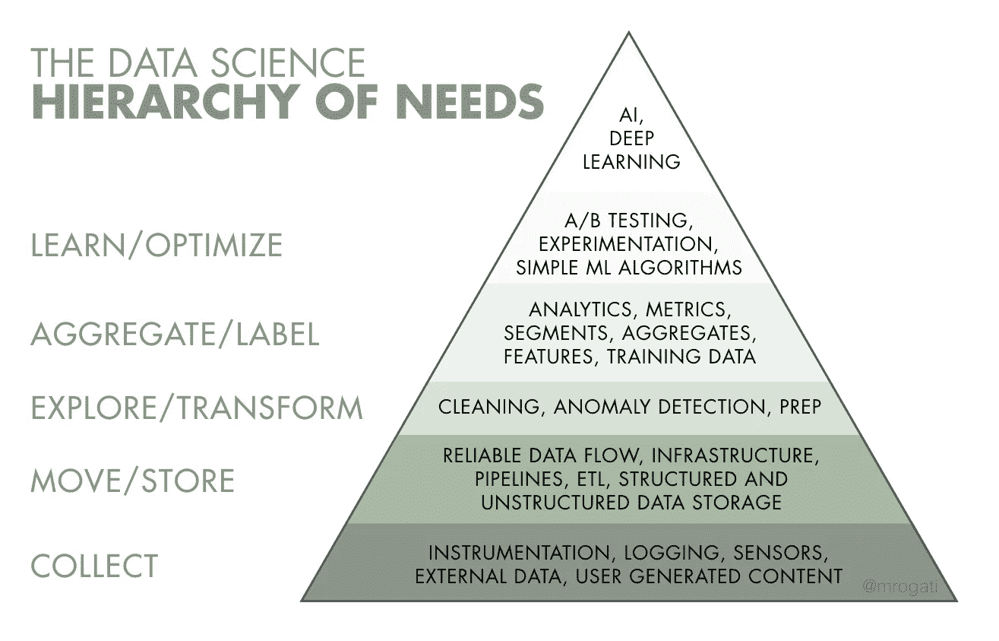
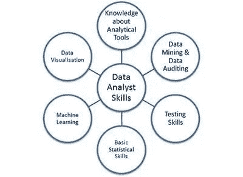
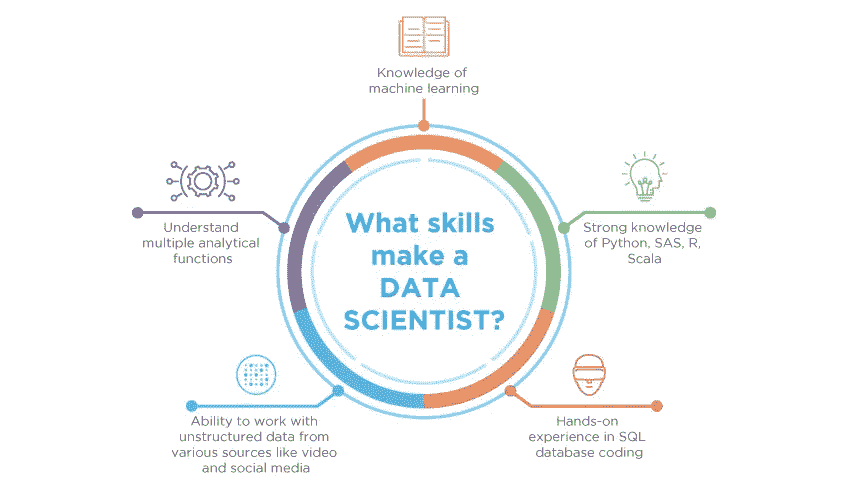
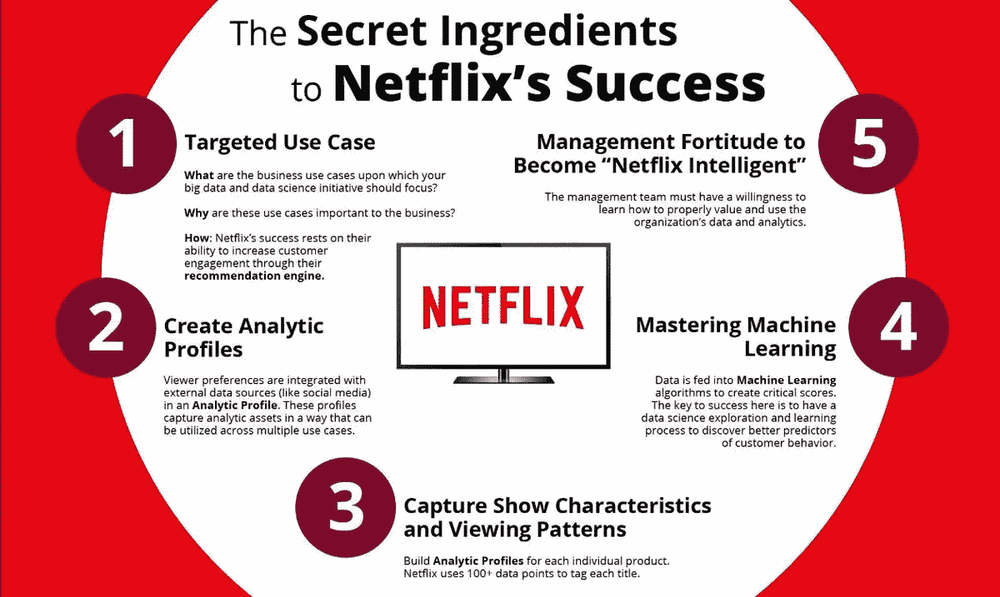
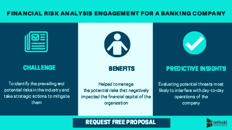
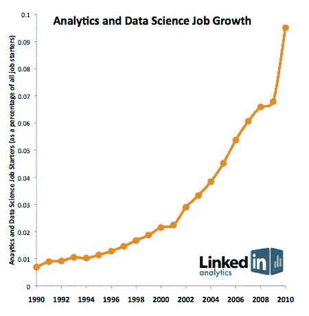
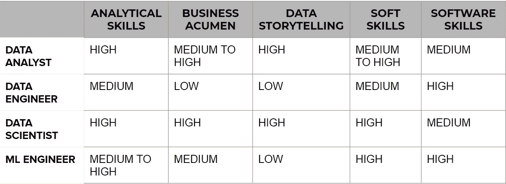

# 各种数据科学相关专业人员的工作定义得到区分和澄清

> 原文：<https://medium.com/analytics-vidhya/job-roles-of-a-data-engineer-data-analyst-data-scientist-and-ml-engineer-demystified-18c93a1787a8?source=collection_archive---------17----------------------->

> 21 世纪的社会是一个数据丰富的环境，企业和技术利用每天从数百万个平台生成和收集的大量数据。
> 
> 脸书每小时上传超过 1000 万张照片，每天大约有 30 亿个“赞”按钮被点击。谷歌每秒处理超过 40，000 次搜索。每分钟有 48 小时的视频上传到 YouTube，每天产生近 8 年的内容。诸如此类的平台大量存在，产生的数据量令人难以置信。这引发了对熟练专业人员的更大需求，这些专业人员能够“处理”这些数据，并有意义地利用这些数据来提供有用的见解和对未来趋势的预测。这为数据科学专业人士提供了工作机会。

数据有助于这些业务和技术做出明智和科学的决策。使用数据科学的一些常见示例如下:

*   ***推荐系统*** 用于电子购物和在线流媒体平台
*   ***图像和语音识别*** 算法
*   ***针对性广告***
*   ***银行等行业的欺诈和风险检测***

开发大量数据供企业广泛使用需要熟练的人力，他们擅长处理可能出现的各种情况。 ***为所需的工作职责选择合适的专业人员可能是正确利用数据科学的关键*** 。同样的情况也适用于在数据科学领域寻求职业发展的人: ***需要对工作角色有适当的了解，以磨练他们的技能组合，从而获得想要的工作角色*** 。

> “公司因为雇佣了一名并非真正数据科学家的数据科学家而受到影响。”安东尼·戈德布卢姆。

数据科学在任何领域的适当应用由所谓的 ***数据科学生命周期*** 来定义。这与任何其他生产生命周期一样，包括

1.  数据采集
2.  数据预处理
3.  构建机器学习模型
4.  测试模型
5.  优化模型
6.  整合模型

***数据工程师*** ， ***数据分析师*** ， ***数据科学家*** ， ***ML 工程师*** 的工作角色都处理数据科学生命周期下出现的各种职责。我们将按照它们通常出现的顺序简要地看一下它们，然后再看它们的实际例子。

# ***数据工程师***

数据工程师是开发、构建、测试和维护架构的人，例如数据库和大规模处理系统。数据工程师处理包含人为、机器或仪器误差的原始数据。数据可能未经验证，并且包含可疑记录；它是无格式的，可以包含特定于系统的代码。

## 数据工程师的工作角色:

*   ***开发、构建、测试和维护架构*** ，如数据库和大规模处理系统
*   ***从给定的源中抓取数据*** 。
*   ***确保架构*** 将支持业务的需求
*   发现 ***数据采集的机会***
*   ***制定数据集流程*** 进行数据建模、挖掘和生产
*   使用各种编程语言和工具(主要是编写查询的脚本语言)将系统结合在一起
*   推荐 ***提高数据可靠性、效率和质量的方法***
*   ***利用来自内部和外部来源的大量数据*** 来回答业务问题
*   ***利用机器人流程自动化等技术实现数据提取自动化***

## 数据工程师的技能:

*   对算法和数据结构有很强的理解
*   编程语言(Java/R/Python/Scala)和脚本编写
*   高级数据库管理系统
*   大数据工具(Apache Spark、Hadoop、Apache Kafka、Apache Hive)
*   云平台(亚马逊网络服务、谷歌云平台)
*   分布式系统
*   数据流水线
*   数据库

## 数据工程师使用的一些工具:

SAP、Oracle、Cassandra、MySQL、Redis、Riak、PostgreSQL、MongoDB、neo4j、Hive 和 Sqoop。

# ***数据分析师***

顾名思义，数据分析师分析由数据工程师提取的数据，以检查数据中的趋势，从而了解其中可能包含的信息。

> 数据分析师从数据中获得洞察力，并帮助回答一些问题，如“一年中哪个月的产品销量最高”或“一天中哪个小时的道路交通拥堵最严重”。

数据分析师通过组合数据的数据类别来理解数据，以从数据中挖掘出为特定应用程序构建机器学习模型可能需要的意义。为了实现这一点，数据分析师采用各种 ***数据挖掘*** 技术。

## 数据分析师的工作角色:

*   ***数据探索*** 是数据分析的初始步骤，用户以非结构化的方式探索大型数据集，以揭示初始模式、特征和兴趣点。这一过程并不意味着揭示一个数据集所包含的每一点信息，而是帮助创建一个重要趋势和主要点的大图，以进行更详细的研究。数据探索可以结合使用手动方法和自动化工具，如数据可视化、图表和初始报告。
*   ***下一步是数据清理*** 。原始形式的数据几乎毫无价值。它很乱，很难阅读，并且有缺失的值。数据分析师的任务是清理数据集，以便团队的其他成员能够理解它以供将来使用。清理数据可能涉及处理数据中丢失的值或过多的不必要的噪声。
*   **数据争论还包括统一各种来源的数据，以便更好地理解数据。**
*   ***数据可视化*** 是可视化表示数据的一种方式。这有助于跨专业领域的组织中的不同团队理解数据。

## 数据分析师的技能

*   Adobe 和谷歌分析
*   脚本语言
*   统计数字
*   报告和数据可视化
*   SQL/数据库
*   试算表

## 数据分析师使用的常用工具:

电子表格，SQL，Tableau，r。

# ***数据科学家***

> "作为一名科学家，你不应该在没有数据的情况下做决定。"弗朗西斯·柯林斯。

数据科学家通过应用统计和机器学习模型来获得数据未来趋势的预测预期，从而将数据分析揭示的见解提升到下一个级别。

> 数据科学家通常会回答诸如“在这个地区开一家餐馆有利可图吗？”或者“明天会下雨吗？”

数据科学家依靠数据的历史趋势来预测这个问题的答案。数据科学家还负责测试将要实现的模型。

## 数据科学家的工作角色:

*   ***建立预测模型******机器学习算法*** 解决问题陈述
*   ***通过集成建模组合模型***
*   使用 ***数据可视化*** 技术呈现信息
*   ***针对业务挑战提出解决方案和策略***
*   ***与工程和产品开发团队合作***
*   对结构化和非结构化数据进行 ***预处理***
*   分析大量信息 ***发现趋势和模式***

## 数据科学家的技能

*   数据挖掘经验
*   理解机器学习和运筹学
*   R、SQL 和 Python 知识；熟悉 Scala、Java 或 C++是一项优势
*   使用商业智能工具(如 Tableau)和数据框架(如 Hadoop)的经验
*   商业头脑
*   强大的数学技能(如统计、代数)

## 数据科学家常用的工具:

r，SQL，Python，Scala，Java，C++，Tableau，Hadoop，MATLAB

# ***ML 工程师***

> “科学家可以发现一颗新星，但他不能制造一颗。他将不得不请一位工程师来为他做这件事。”戈登·林赛·格雷戈。

机器学习工程师的工作是在数据科学家的工作和生产环境之间架起一座桥梁。数据科学家通常没有足够的技能将开发的模型实现到生产中；同样，生产团队可能不了解数据科学，因此无法实现模型。这是 ML 工程师进入场景的地方，因为这个专业人员*将生产环境与数据科学模型*结合在一起。

> ML 工程师与数据科学家就预测模型进行沟通，数据工程师促进数据的传输存储和使用，数据分析师促进从生产端和生产环境接收的数据的分析，以代表数据科学专业人员实施建议的功能。

## 机器学习工程师的工作角色

*   研究和转换数据科学原型
*   设计机器学习系统
*   研究和实现适当的 ML 算法和工具
*   根据需求开发机器学习应用
*   选择合适的数据集和数据表示方法
*   运行机器学习测试和实验
*   使用测试结果执行统计分析和微调
*   必要时对系统进行培训和再培训

## 机器学习工程师的技能

*   理解数据结构、数据建模和软件架构
*   深入了解数学、概率、统计和算法
*   能够用 Python、Java 和 R 编写健壮的代码
*   熟悉机器学习框架(如 Keras 或 PyTorch)和库(如 scikit-learn)
*   优秀的沟通技巧
*   团队工作能力

> 定义属于课堂！让我们看一些现实生活中的例子。

# 1)在线视频流媒体平台

网飞和亚马逊 Prime Video 等在线流媒体平台每天都要处理大量的用户请求，这使其成为应用数据科学来增强服务的理想平台。

> 这些观看平台捕获观看分析，并分析用户的简档，以根据年龄、性别、活动等属性了解哪类用户更喜欢某些类别的内容。发布内容的用户和类型、长度、预算等。这些只是这些平台面临的问题陈述的一些例子。

为了使用各种数据结构并通过在数据库上编写复杂的查询从平台收集这些数据，我们需要一个 ***数据工程师。***

为了理解收集的数据并获得有用的见解，如更受欢迎的电影、最常观看的视频、特定节目吸引的年龄范围等，需要对原始数据进行适当的分析，这由 ***数据分析师完成。***

由 ***数据科学家*** 从经过清洗、角力、统一的数据中，做出基于机器学习、深度学习和统计学的预测模型。正是由于他们的贡献，诸如推荐电影的推荐系统才能工作，或者可以计算服务器上的预期流量。数据科学家还负责测试模型。

最后，数据科学家制作的预测模型在生产环境中实施。为了根据给定平台的规范实施模型并优化模型，对数据科学和生产环境有足够了解的 ***机器学习工程师*** 至关重要。

这就是所有四名数据科学相关专业人员如何适应在线流媒体平台的数据科学生命周期，按照他们的工作定义共存并做出贡献。

# 2)财务风险评估

风险管理是任何金融机构不可或缺的一部分。所有的企业都面临着各种各样的风险，风险管理实践致力于最大限度地提高企业的投资回报并减少其损失。应用数据科学，通过使用机器学习模型分析历史模式，帮助 ***预测*** 可能的金融风险和欺诈性投资。

> 金融风险评估问题的一些例子是预测****洗钱******市场风险*** 和 ***欺诈交易*** 。*

*在这种情况下， ***数据工程师*** 设计用于收集数据和历史数据的数据仓库的架构，这些数据将用于制作预测性机器学习模型。*

*然后， ***数据分析师*** 将给出所收集的数据的哪个方面和属性与手边的问题陈述相关的见解；例如，低账户活动可能提供更大的信用风险。*

*一个 ***数据科学家*** 获取经过清理和争论的数据，并基于历史观察建立一个模型，以便识别在以前的实例中发现的模式。数据科学家还负责使用方差分析测试和假设检验等各种统计方法测试模型是否有效，并使用 t 检验、p 检验和 f 检验等各种评分方案对模型进行分级。在发现一个模型令人满意之后，数据科学家会向其他人推荐这个模型。*

*这类组织的软件界面是由缺乏数据科学经验的团队制作的，这正是一名 ***ML 工程师*** 介入的地方。ML 工程师将数据科学团队的工作融入到生产环境中。该专业人员还根据生产环境的要求优化和维护模型。ML 工程师擅长于此，因为这个专业人员既精通数据科学，也精通生产环境中使用的工具。*

# *结论*

*从我们所举的例子和我们所讨论的四位数据科学专业人员的工作定义来看，很明显他们都不是多余的，他们在数据科学生命周期中都有其重要性。然而，他们的要求和薪资预期是不同的。*

*根据 [Glassdoor](https://www.glassdoor.co.in/index.htm?countryRedirect=true) 的数据，数据工程师、数据分析师、数据科学家和机器学习工程师的平均薪资前景为:*

> *数据工程师₹862,760/yr；*
> 
> *数据分析师₹5,14,000/yr；*
> 
> *数据科学家的₹10,52,000/yr；*
> 
> *机器学习工程师的₹800,000/yr。*

*由于我们这一代人拥有丰富的数据，这类专业人士的工作需求呈指数级突然上升。这使得数据科学成为业内最热门的技能之一。*

**

*对于这些工作角色来说，还有其他一些非学术技能也很重要:*

**

*因此，任何想在数据科学领域工作的人都可以通过清楚地了解该领域的各种工作来获得帮助。类似地，任何雇用数据科学领域专业人员的组织，如果按照他们的要求雇用专业人员，并且雇用受过更好教育的人员，都会做得更好。*