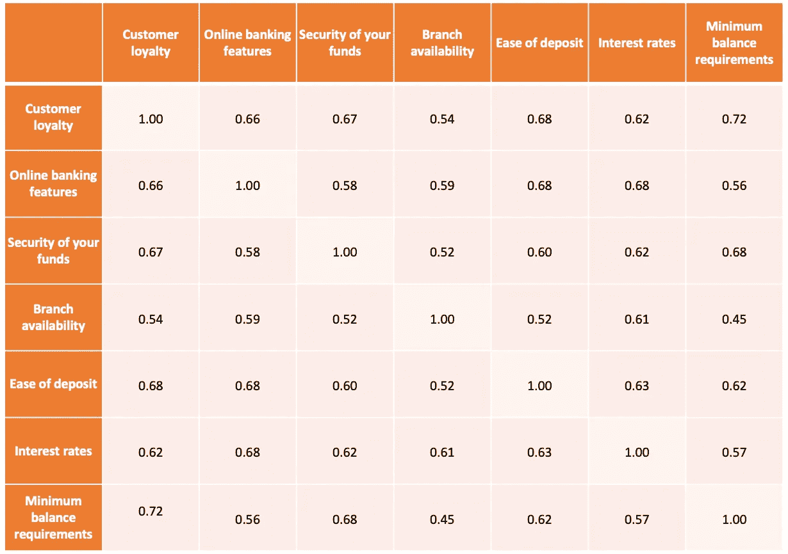
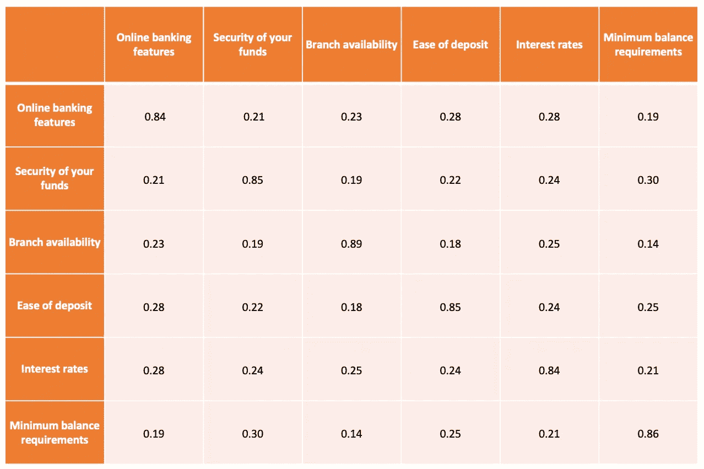
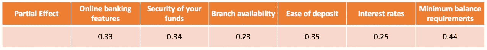
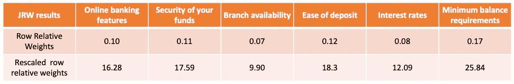

# 约翰逊相对权重分析。用 JavaScript 实现

> 原文：<https://medium.com/analytics-vidhya/johnsons-relative-weights-analysis-implementation-with-javascript-d85393c0bbb4?source=collection_archive---------5----------------------->

现在，你是一家银行机构的经理，想要了解是什么最能驱动客户忠诚度。有许多不同的因素会影响客户忠诚度和统计方法，以确定什么是最相关和最重要的。几年前，研究人员依赖传统的统计数据(例如，相关性；标准化回归权重)，这些权重已知会产生关于变量重要性的错误或误导性信息*(尤其是当预测变量彼此相关时，这在组织研究中经常出现)*。约翰逊的相对权重分析成为传统统计学的一个可行的替代方法，通过将不相关的变量与原始预测因子联系起来，克服了这个问题。它包括**两个一般步骤:**

*1。将预测变量转换成一组与原始独立变量最大相关的正交(不相关)变量。*

*2。因变量对新的转换变量集的回归。*

> 约翰逊相对权重(JRW)分析是一种有用的技术，广泛用于许多科学领域，旨在评估当响应(因变量)与一组预测因子(自变量)相关时，它们之间的关系。因变量是依赖于其他因素的东西，而自变量是独立的变量，不会因您试图测量的其他变量而改变。

所以你雇佣了一家外包公司，对影响客户忠诚度的个人银行偏好进行市场调查。研究人员收集了信息，并概括了六种个人银行偏好:

*   网上银行功能，
*   你的资金安全，
*   分行可用性，
*   易于存放，
*   利率的利息，
*   最低余额要求。

考虑到分析师提供的信息，您将 Johnson 的相对权重分析定义为一种计算相关性重要性的统计技术。

在我们的案例中，客户忠诚度是一个因变量，而银行偏好是对其有影响的自变量。在继续分析分析师提供的信息后，你会得到一个因变量和自变量之间的相关矩阵，如下所示。

**个人银行偏好相关矩阵**

以表格形式显示的相关矩阵，显示变量之间的相关系数，其中表格中的每个单元格显示两个变量之间的相关性。这个信息允许我们用 JRW 分析计算重要性等级。

**约翰逊相对权重计算包含九个计算步骤:**

1.在第一步中，我们检索因变量和自变量之间的相关性。由于客户忠诚度是因变量，矩阵看起来像第一列，不包括它自己。

**独立个人银行偏好相关矩阵**

2.第一步的第二部分是检索独立变量和自变量之间的相关矩阵，以便从初始相关矩阵中排除客户忠诚度。

**独立个人银行偏好相关矩阵**

3.在步骤#2 中，必须计算上述相关矩阵的特征向量和特征值。完成后，我们必须创建一个特征值的对角矩阵，并求它的平方根。这是第三步。

4.在下一步中，我们将特征向量矩阵、来自步骤#3 的矩阵和转置的特征向量矩阵相乘。作为这个计算的结果，我们得到计算的λ。我花了一些时间在这一步得到预期的结果，这就是为什么我在下面添加了中间结果供你参考。

**第 4 步计算的结果**

5.在步骤#5 中，我们对上面的矩阵求平方。

6.为了得到每个自变量对因变量的部分影响，我们将步骤#5 中的逆矩阵乘以步骤#1 中因变量和自变量之间的相关矩阵。部分效应的计算是步骤#6。

**部分效果(步骤#6)**

7.在步骤#7 中，我们通过计算来自步骤#6 的平方值的和来计算 R。

**R 平方(第 7 步)**

8.然后，在下一步中，我们将原始相对权重计算为来自步骤#5 的矩阵与步骤#6 的平方值的乘积。

9.最后一步是以 R 的百分比计算行相对权重。为了做到这一点，您必须将原始相对权重除以 R，然后乘以 100。

**独立变量重要性等级(第 8 步和第 9 步)**

既然我们知道了 JRW 的计算步骤，我们就可以转到编程部分了。

**用 JavaScript 实现 Johnson 的相对权重分析**

约翰逊的相对权重分析包括复杂的数学计算。为了继续，这里的两个 **npm 包**使用了 **:** **ml-matrix** 和 **mathjs。**更多参考，请点击以下链接:

*   ml-matrix:[https://www.npmjs.com/package/ml-matrix](https://www.npmjs.com/package/ml-matrix)
*   https://www.npmjs.com/package/mathjs

**Johnson 的相对权重分析，附有注释计算步骤，供您参考:**

**更多详情，可以关注 GitHub 资源库:**

 [## StepanKovalyshyn/Johnson-s-相对重量

### 在 GitHub 上创建一个帐户，为 StepanKovalyshyn/Johnson-s-Relative-Weights 的发展做出贡献。

github.com](https://github.com/StepanKovalyshyn/Johnson-s-Relative-Weights/blob/master/index.js) 

**你也可以使用 npm 包:**

 [## 约翰逊相对重量

### 这个软件包允许用 JavaScript 语言进行 Johnson 的相对权重算法。它接受两个…

www.npmjs.com](https://www.npmjs.com/package/johnsons-relative-weights) 

为了确定所获得的结果，使用来自 R 编程语言的 SPSS 和 ***rwa*** 包处理不同的数据集，并与***Johnsons-relative-weights***包(JavaScript)进行比较。

# **总结**

经过约翰逊的相对权重分析，我们可以得出结论，个人银行偏好之间最重要的排序是最低余额要求，为 25.84%。第二和第三个重要的偏好是存款方便和资金安全，分别为 18.30%和 17.59%。最不重要的银行偏好是网上银行功能(16.28%)、利率(12.09%)和分行可用性(9.90%)。

使用约翰逊的相对权重分析可以帮助企业更好地理解市场行为，并成为制定战略营销解决方案的中流砥柱。

**来源:**

 [## 用 SPSS 进行相对重要性(权重)分析

### 相对权重(重要性)分析相对权重分析是一种计算相对重要性的有用技术

www.listendata.com](https://www.listendata.com/2015/05/relative-importance-weight-analysis.html)  [## martinctc/rwa

### 用于在 R 相对权重分析(RWA)中运行相对权重分析的包是一种计算相对权重的方法

github.com](https://github.com/martinctc/rwa)