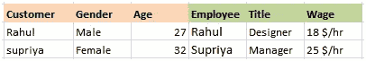

# 在 Tableau 中连接和混合数据

> 原文：<https://medium.com/analytics-vidhya/joining-and-blending-data-in-tableau-dba8f074d8a?source=collection_archive---------8----------------------->

威廉·艾文在 [Unsplash](https://unsplash.com?utm_source=medium&utm_medium=referral) 上的照片

# 连接-合并相同数据源之间的数据。

示例—在同一个 excel 文件中合并两个以上的工作表。

# 有不同类型的连接。

## 1.内部联接—当我们使用内部联接联接两个表时，结果是一个表包含两个表中匹配的值。

例子:这里有两个表，表 A 和表 B

当我们在 A.Customer =B.Employee 上应用 inner join:时，结果将只显示两个表中匹配的行，其余的行将被丢弃。

内部连接后的结果

## 2.左连接:在这个连接中，左表将是主表，所以左表中的行不会被丢弃，而右表中的行将被丢弃。

## 3.右连接:在这个连接中，右表将是主表，所以右表中的行不会被丢弃，而左表中的行将被丢弃。

## 4.完全外连接:完全外连接合并表，结果是一个包含两个表中所有值的表。

# 连接 tableau 中的数据:

# 混合 tableau 中的数据:

**数据混合是一种结合来自两个或更多不同来源的数据的方法。示例—合并两个 excel 文件。**

如果有一个橙色链接图标，则数据源会自动链接。只要至少有一个活动链接，就可以混合数据。橙色链接代表活动链接。

# 让我们用一个问题语句来理解 Tableau 中数据的连接和混合。

我们有一个购物中心的 Excel 数据集。它有 3 个标签:订单列表，订单分解，销售目标。

**订单列表说明:**订单 ID、订单日期、客户名称、城市、国家、地区、部门、发货日期、发货模式和州。

**订单细分:**订单 ID、产品名称、折扣、销售额、利润、销售数量、类别和子类别。

**销售目标:**订单日期、品类、销售目标的月份。

> **问题陈述:我们想比较这些品类是否达到每月销售目标？**

我们将需要一个订单细目表，涵盖所有与销售，类别，子类别等相关的数据，但它没有订单日期。为了检查销售目标是否达到，我们还需要订单日期。Listoforders 表包含与订单日期相关的数据。

**第一步:** **因此我们将通过内部连接来连接订单列表和订单明细表。**

加入这两个之后，我们有类别、销售、订单日期。

现在我们必须将数据与销售目标相匹配，但是如果我们要创建销售目标与(订单列表和订单细分)的连接。它不能解决问题，因为数据的粒度级别不同。

在销售目标表中，粒度级别在类别级别，而在表(订单列表+订单细分)中，粒度级别在项目级别。因此，如果我们加入类别，我们将会丢失数据。

由于数据的粒度不同，我们可以进行数据混合。

**第二步:我们需要不同的数据源，因此，一个数据源将是(订单清单+细分)，其他将是销售目标。**

我们再用数据做一个连接，只会选择“销售目标”。

在这里，您可以看到在“数据”下，我们有两个数据源。

**第三步:我们将编辑两个来源的数据之间的关系。转到菜单上的数据。点击编辑关系。这里，我们将在 2 个数据源的年、月和类别之间建立一个自定义关系。**

**步骤 4:现在我们将从数据源(订单列表和订单细分)中拖动销售，从数据源(销售目标)中拖动目标。**

**我们将把订单日期从数据源—(订单列表和订单明细)拖到行中。向下钻取到几个月。**

**步骤 5:将类别从数据源(订单列表和订单细分)拖到过滤器中。这将使类别的过滤器。因此，我们可以应用过滤器，并查看相应的销售和目标。也将类别拖到颜色，这将对条形图上的不同类别应用不同的颜色。应用起来会比较容易。**

**第 6 步:这里销售和目标显示在一个轴上。我们将把它做成双轴的，这样更容易可视化。现在两个轴的比例将是不同的，所以我们将同步比例。我们还将拖动目标到彩色，并为目标制作一个折线图而不是条形图。我们将更改工作表名称并保存它。**

# 图表读数:

在这里我们可以看到，在 2011 年，1 月份的目标是 24，000。这条线显示目标，而三种不同颜色的条形图显示不同类别的销售额。将鼠标悬停在栏上也会显示每个类别的销售额和目标。这清楚地表明，2011 年 1 月的目标没有实现。

> 这个视频可以帮助你清楚地理解每个步骤。

# 在你走之前

感谢阅读！如果你想和我联系，请随时通过 jsc1534@gmail.com 或我的 LinkedIn 个人资料联系我。