# Pandas 中的连接:掌握 Python 中不同类型的连接

> 原文：<https://medium.com/analytics-vidhya/joins-in-pandas-master-the-different-types-of-joins-in-python-26c1d2509b1e?source=collection_archive---------7----------------------->


# 熊猫加入简介

> “我在 Python 中有两个不同的表，但我不知道如何连接它们。我应该考虑什么标准？我可以用哪些不同的方法来连接这些表？”

听起来熟悉吗？我在网上论坛上多次遇到这个问题。使用一个表相当简单，但是当数据分布在两个或更多的表中时，事情就变得很有挑战性了。


这就是联接概念的由来。我不能强调我在[熊猫](https://courses.analyticsvidhya.com/courses/pandas-for-data-analysis-in-python?utm_source=blog&utm_medium=joins-in-pandas-master-the-different-types-of-joins-in-python)中使用这些连接的次数！在[数据科学黑客马拉松](http://datahack.analyticsvidhya.com/?utm_source=blog&utm_medium=joins-in-pandas-master-the-different-types-of-joins-in-python)期间，当我需要快速连接多个表时，它们特别有用。

我们将在这里了解 Pandas 中不同类型的连接:

*   熊猫的内心世界
*   熊猫的全面加入
*   左边加入熊猫
*   加入熊猫吧

我们还将讨论如何在 Pandas 中使用连接来处理冗余或重复值。我们开始吧！

*注意:如果你是熊猫和 Python 世界的新手，我推荐你参加下面的免费课程:*

*   [*用 Python 进行数据分析的熊猫*](https://courses.analyticsvidhya.com/courses/pandas-for-data-analysis-in-python?utm_source=blog&utm_medium=joins-in-pandas-master-the-different-types-of-joins-in-python)
*   [*用于数据科学的 Python*](https://courses.analyticsvidhya.com/courses/introduction-to-data-science?utm_source=blog&utm_medium=joins-in-pandas-master-the-different-types-of-joins-in-python)

*想学习 SQL 连接吗？我们掩护你！* [*在这里头学习所有关于 SQL 的知识*](https://www.analyticsvidhya.com/blog/2020/02/understanding-sql-joins/?utm_source=blog&utm_medium=joins-in-pandas-master-the-different-types-of-joins-in-python) *。*

# 理解问题陈述

我相信你现在对亚马逊和 Flipkart 这样的电子商务网站非常熟悉。当我们访问不相关的网站时，我们会被他们的广告轰炸——这就是定向营销的力量！

这里我们就拿一个相关营销品牌的简单问题来说。我们有两个表——一个包含关于产品的数据，另一个包含客户级别的信息。

我们将使用这些表来理解不同类型的连接如何使用 Pandas 工作。

# 熊猫的内心世界

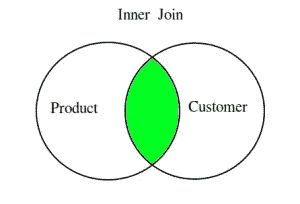

> “内部联接是您将使用的最常见的联接类型。它返回的数据帧只包含那些具有共同特征的行。

内部联接要求两个联接的数据框架中的每一行都具有匹配的列值。这类似于两个集合的**交集**。

先从导入[熊猫馆](https://courses.analyticsvidhya.com/courses/pandas-for-data-analysis-in-python?utm_source=blog&utm_medium=joins-in-pandas-master-the-different-types-of-joins-in-python)开始:

```
import pandas as pd
```

对于本教程，我们有两个数据框架——产品和客户。产品数据框架包含产品细节，如*产品 ID、产品名称、类别、价格和卖家城市*。客户数据帧包含详细信息，如 *id、姓名、年龄、产品 id、购买的产品和城市*。

我们的任务是运用我们的加入技巧，从数据中产生有意义的信息。我鼓励您遵循我们将在本教程中介绍的代码。

```
product=pd.DataFrame({ 'Product_ID':[101,102,103,104,105,106,107], 'Product_name':['Watch','Bag','Shoes','Smartphone','Books','Oil','Laptop'], 'Category':['Fashion','Fashion','Fashion','Electronics','Study','Grocery','Electronics'], 'Price':[299.0,1350.50,2999.0,14999.0,145.0,110.0,79999.0], 'Seller_City':['Delhi','Mumbai','Chennai','Kolkata','Delhi','Chennai','Bengalore'] })
```

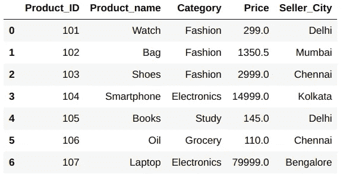

```
customer=pd.DataFrame({ 'id':[1,2,3,4,5,6,7,8,9], 'name':['Olivia','Aditya','Cory','Isabell','Dominic','Tyler','Samuel','Daniel','Jeremy'], 'age':[20,25,15,10,30,65,35,18,23], 'Product_ID':[101,0,106,0,103,104,0,0,107], 'Purchased_Product':['Watch','NA','Oil','NA','Shoes','Smartphone','NA','NA','Laptop'], 'City':['Mumbai','Delhi','Bangalore','Chennai','Chennai','Delhi','Kolkata','Delhi','Mumbai'] })
```

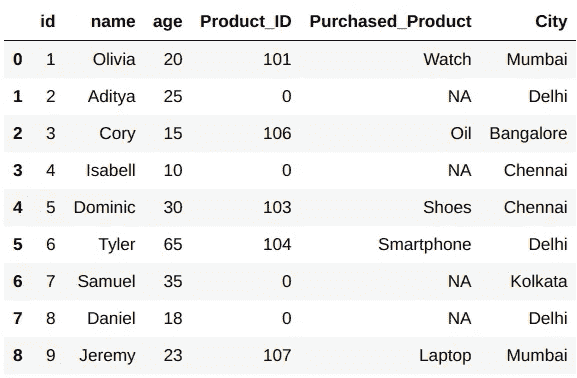

假设我们想知道所有在线销售的产品以及谁购买了它们。我们可以使用内部连接轻松实现这一点。

熊猫里的 **merge()** 函数就是我们这里的朋友。默认情况下，merge 函数执行内部联接。它既接受数据帧作为参数，也接受必须执行连接的列的名称:

```
pd.merge(product,customer,on='Product_ID')
```

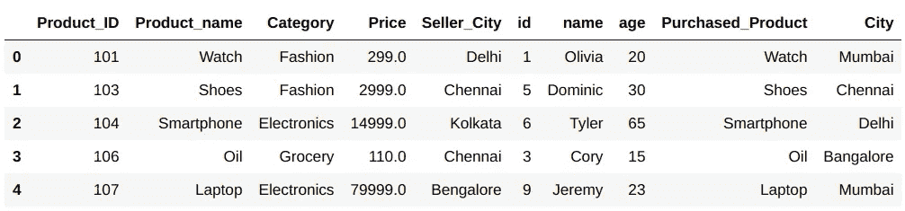

这里，我对“Product_ID”列上的产品和客户数据帧执行了内部连接。

但是，如果两个数据帧中的列名不同呢？然后，我们必须明确地提到这两个列名。

“left_on”和“right_on”是我们可以实现这一点的两个参数。“left_on”是左侧数据帧中的键名，而“right_on”是右侧数据帧中的键名:

```
pd.merge(product,customer,left_on='Product_name',right_on='Purchased_Product')
```

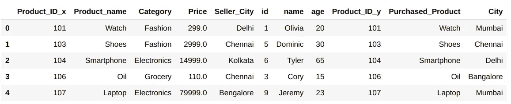

让我们更上一层楼。领导团队现在想要更多关于销售产品的细节。*他们想了解卖家销售给同一城市的所有产品，即卖家和客户都属于同一城市。*

在这种情况下，我们必须对产品的 *Product_ID* 和 *Seller_City* 以及客户数据框架的 *Product_ID* 和 *City* 列执行内部连接。

那么，我们该怎么做呢？


不要挠头！只需将列名数组传递给 **left_on** 和 **right_on** 参数:

```
pd.merge(product,customer,how='inner',left_on=['Product_ID','Seller_City'],right_on=['Product_ID','City'])
```


# 熊猫的全面加入

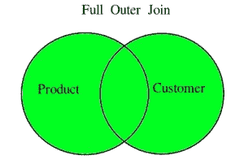

这是给你的另一个有趣的任务。我们必须将两个数据框架结合起来，这样我们就可以找到所有未售出的产品和所有没有从我们这里购买任何东西的客户。

为此，我们可以使用完全连接。

> "全联接，也称为全外联接，返回在左数据帧或右数据帧中匹配的所有记录。"

当两个数据帧中的行不匹配时，对于缺少匹配行的数据帧的每一列，结果数据帧将具有 NaN。

我们可以通过将 **how** 参数作为**‘外部’**传递给 **merge()** 函数来执行完全连接:

```
pd.merge(product,customer,on='Product_ID',how='outer')
```

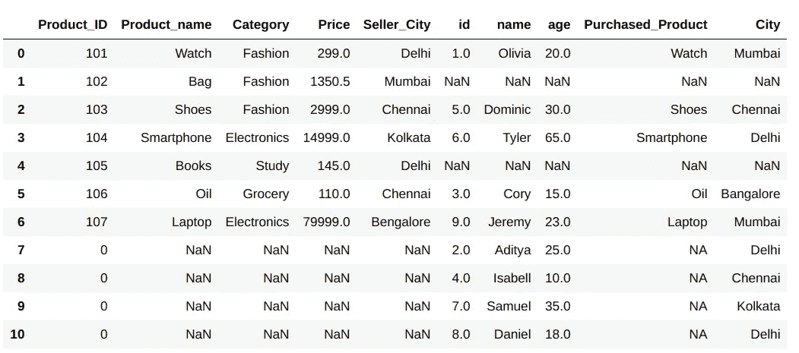

你注意到这里发生了什么吗？两个数据帧的所有不匹配的行对于其他数据帧的列都具有 NaN 值。但是等等——我们仍然不知道哪一行属于哪一个数据帧。

对此，熊猫为我们提供了一个绝妙的解决方案。我们只需在函数中将**指示符**参数作为 **True** 来提及，一个名为 **_merge** 的新列将在结果数据帧中创建:

```
pd.merge(product,customer,on='Product_ID',how='outer',indicator=True)
```

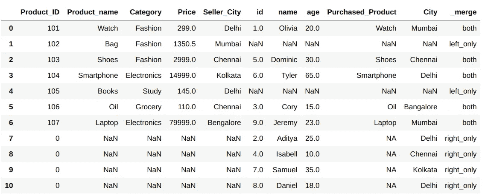

如您所见， **_merge** 列提到了哪一行属于哪一个数据帧。

# 左边加入熊猫

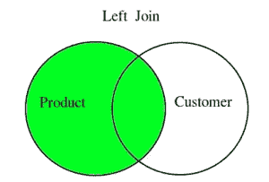

现在，假设领导团队只想要那些从我们这里买东西的客户的信息。你猜对了——我们可以在这里使用左连接的概念。

> *“左连接，也称为左外连接，返回包含左数据帧所有行的数据帧。”*

左侧数据帧的所有非匹配行都包含用于右侧数据帧中的列的 NaN。它只是一个内部连接，加上左数据帧中所有不匹配的行，用 NaN 填充右数据帧的列。

执行左连接实际上与全连接非常相似。只需将**如何**论证改为**‘左’**:

```
pd.merge(product,customer,on='Product_ID',how='left')
```

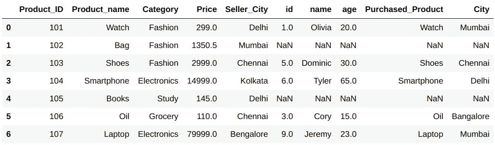

在这里，您可以清楚地看到，对于属于客户数据框架的列，所有未售出的产品都包含 NaN。

# 加入熊猫吧

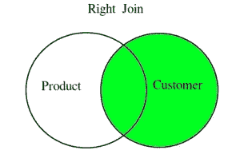

类似地，如果我们想要创建一个客户表，其中包含他们购买的产品的信息，我们可以使用 right join。

> *“右连接，也称为右外连接，类似于左外连接。唯一的区别是，右侧数据帧的所有行都按原样获取，只有左侧数据帧的那些行在两者中是共有的。”*

与其他联接类似，我们可以通过将 **how** 参数更改为**‘right’**来执行右联接:

```
pd.merge(product,customer,on='Product_ID',how='right')
```

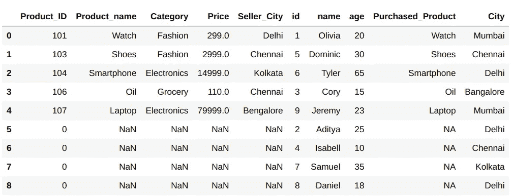

仔细看看上面的数据框架——对于产品数据框架的列，我们有 NaN 值。很简单，对吧？

# 处理连接中的冗余/重复

重复值可能是棘手的障碍。它们会在执行连接时导致问题。这些值不会产生错误，只会在我们得到的数据帧中产生冗余。我相信你可以想象那有多有害！

这里，我们有一个数据框架 **product_dup** ，其中包含关于产品的重复细节:

```
product_dup=pd.DataFrame({ 'Product_ID':[101,102,103,104,105,106,107,103,107], 'Product_name':['Watch','Bag','Shoes','Smartphone','Books','Oil','Laptop','Shoes','Laptop', 'Category':['Fashion','Fashion','Fashion','Electronics','Study','Grocery','Electronics','Fashion','Electronics'], 'Price':[299.0,1350.50,2999.0,14999.0,145.0,110.0,79999.0,2999.0,79999.0], 'Seller_City':['Delhi','Mumbai','Chennai','Kolkata','Delhi','Chennai','Bengalore','Chennai','Bengalore'] })
```

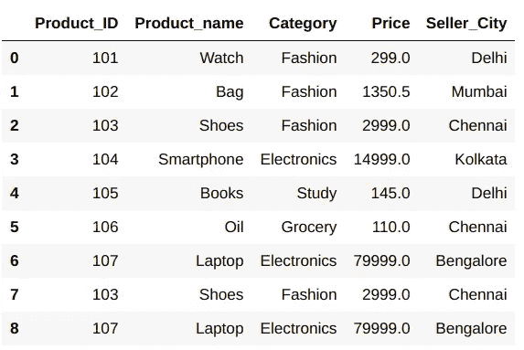

让我们看看，如果对该数据帧执行内部连接会发生什么:

```
pd.merge(product_dup,customer,how='inner',on='Product_ID')
```

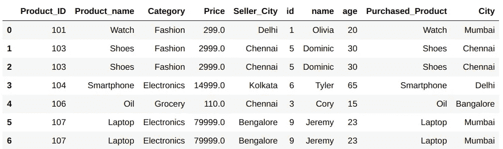

如您所见，我们在结果数据集中也有重复的行。为了解决这个问题，在 **merge()** 函数中有一个 **validate** 参数，我们可以设置为**'一对一'，【一对多'，【多对一'，**和**'多对多'**。

这确保了在两个数据帧之间只存在特定的映射。如果不满足映射条件，那么它抛出一个 **MergeError** 。为了解决这个问题，我们可以在应用 join 之前删除重复项:

```
pd.merge(product_dup.drop_duplicates(),customer,how='inner',on='Product_ID')
```

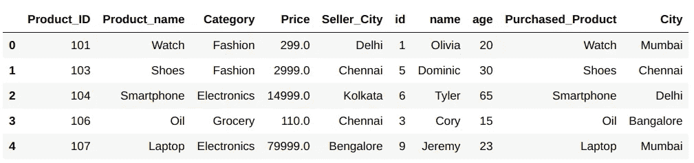

但是，如果您想保留这些副本，那么您可以根据您的要求给 **validate** 值，它不会抛出错误:

```
pd.merge(product_dup,customer,how='inner',on='Product_ID',validate='many_to_many')
```

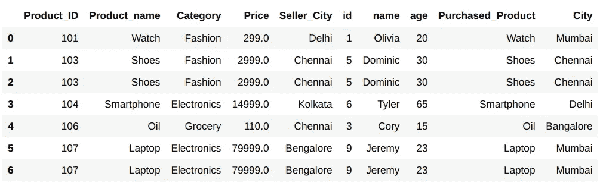

现在，你可以说:


# 下一步是什么？

Pandas 中还有一个 **concat()** 函数，我们可以用它来连接两个数据帧。我鼓励你探索这一点，并在你的下一个项目中应用它，以及你在本教程中学到的关于连接的知识。

如果您对本文有任何疑问或反馈，请在下面的评论区分享。我在下面列出了一些与数据科学和 Python 相关的见解深刻、内容全面的文章和课程。

**课程:**

*   [面向数据科学的 Python](https://courses.analyticsvidhya.com/courses/introduction-to-data-science?utm_source=blog&utm_medium=joins-in-pandas-master-the-different-types-of-joins-in-python)
*   [用 Python 进行数据分析的熊猫](https://courses.analyticsvidhya.com/courses/pandas-for-data-analysis-in-python?utm_source=blog&utm_medium=joins-in-pandas-master-the-different-types-of-joins-in-python)
*   [数据科学的诀窍、技巧和诀窍](https://courses.analyticsvidhya.com/courses/data-science-hacks-tips-and-tricks?utm_source=blog&utm_medium=joins-in-pandas-master-the-different-types-of-joins-in-python)
*   [数据科学简介](https://courses.analyticsvidhya.com/courses/introduction-to-data-science-2?utm_source=blog&utm_medium=joins-in-pandas-master-the-different-types-of-joins-in-python)
*   [2020 年成为数据科学家的综合学习路径](https://courses.analyticsvidhya.com/courses/a-comprehensive-learning-path-to-become-a-data-scientist-in-2020?utm_source=blog&utm_medium=joins-in-pandas-master-the-different-types-of-joins-in-python)

**教程:**

*   [Python 中用于数据操作的 12 种有用的 Pandas 技术](https://www.analyticsvidhya.com/blog/2016/01/12-pandas-techniques-python-data-manipulation/?utm_source=blog&utm_medium=joins-in-pandas-master-the-different-types-of-joins-in-python)

你也可以在分析 Vidhya 的 Android 应用上阅读这篇文章

*原载于 2020 年 2 月 27 日*[*【https://www.analyticsvidhya.com】*](https://www.analyticsvidhya.com/blog/2020/02/joins-in-pandas-master-the-different-types-of-joins-in-python/)*。*