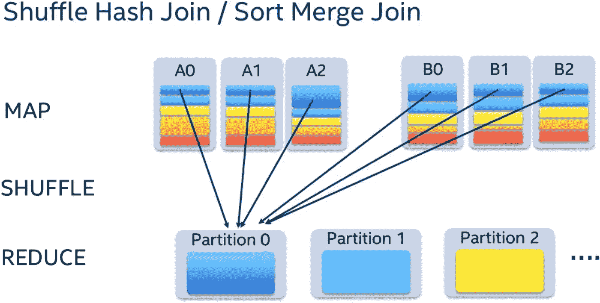

# 加入 Spark —第二部分

> 原文：<https://medium.com/analytics-vidhya/joins-in-spark-7594d0027031?source=collection_archive---------10----------------------->

本文解释了 spark 应用程序中发生的连接类型。

**排序合并连接**

排序合并连接是最基本的连接类型，可以追溯到 Map Reduce 基础。

混洗散列连接的第一步是 Spark 将**通过两个表映射**，并创建一个**输出键**。输出键是连接表的字段。使用输出键，Spark 将对数据进行混洗。

Spark 将挑选每个键并在其上创建一个散列，决定该键应该放入哪个分区，然后排序、**洗牌**并将数据加载到各自的分区。

排序合并联接

在**减少**阶段，具有相同关键字的两个表的任何一行都在同一台机器上并被排序。Reduce 阶段是连接实际发生的阶段，因为一个键的两个表中的数据在同一台机器上，所以连接可以并行运行。

**性能:**

当您拥有的数据是以下情况时，排序合并联接效果最佳

*   与要连接的键均匀分布。
*   拥有足够数量的并行键。

**广播哈希连接**

当其中一个数据帧小到足以容纳单个执行器的工作内存时，您可以强制 Spark 广播该数据。10mb 是`spark.sql.autoBroadcastJoinThreshold`的默认值

您仍然可以根据您的执行者大小来增加这个阈值。

广播加入

在小数据集被广播之后，连接并行运行，然后结果被传递给驱动程序。这成倍地增加了火花处理，因为它消除了洗牌阶段。

> 有关广播的更多信息，请参考本文[文章](/analytics-vidhya/persistence-vs-broadcast-625265320bf9)。