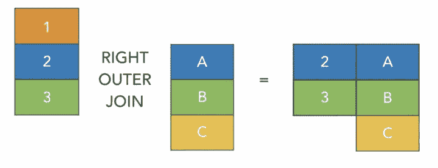

# 加入 Spark —第 1 部分

> 原文：<https://medium.com/analytics-vidhya/joins-in-spark-part-1-efb08a405bf9?source=collection_archive---------9----------------------->

连接基本上是将两个或更多不同的表组合起来，根据某种标准得到一组结果。数据连接是任何 ETL 应用程序最常见的用法，但也是最棘手和计算量最大的操作。

目前，Spark 提供了
1)内连接
2)外连接
3)左连接
4)右连接
5)交叉连接
6)左反连接
7)左半连接

火花连接类型

**内部连接**

内部连接是 Spark 中的默认连接，也是最常用的连接，它连接键列上的两个数据集，键不匹配的行从两个数据集中删除

**外部连接**

外部联接返回两个数据集中的所有行，如果联接表达式不匹配，则在各自的记录列上返回 null。

**左外连接**

左外连接返回左数据集中的所有行，而不考虑在右数据集中找到的匹配项。当连接表达式不匹配时，它为该记录赋值 null，并从右侧删除未找到匹配项的记录。

**右外连接**

右外连接与左连接相反，它返回右数据集中的所有行，而不管在左数据集中找到的数学表达式，当连接表达式不匹配时，它为该记录分配 null，并从左侧删除未找到匹配的记录。

**左半连接**

左半连接类似于内连接，不同之处在于左半连接返回左数据集中的所有列，而忽略右数据集中的所有列。换句话说，对于右数据集中符合连接表达式的记录，该连接只返回左数据集中的列，左和右数据集中不符合连接表达式的记录都被忽略。

对内部连接的结果使用 select 可以获得相同的结果，但是使用该连接会更有效。

**左反连接**

左反连接与左半连接完全相反。对于不匹配的记录，它只返回左边数据集中的列。

*要了解 Spark 中 Join 是如何执行的，请访问* [*文章*](/analytics-vidhya/joins-in-spark-7594d0027031) *。*

如果你喜欢这篇文章，请点击👏所以其他人会在媒体上看到它。