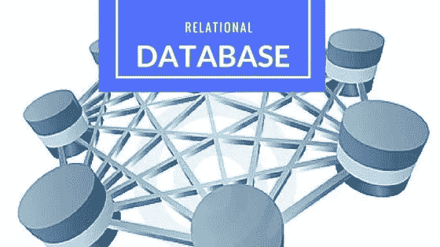

# 从 PCA 到自动编码器的旅程，用 Python 进行数据库编程，以及更多机器学习资源！

> 原文：<https://medium.com/analytics-vidhya/journey-from-pca-to-autoencoders-programming-with-databases-in-python-and-more-machine-learning-302fda21c9d3?source=collection_archive---------4----------------------->

大家好，

希望你会喜欢通过我们的媒体出版物阅读和学习。我们的社区成员一直在解释尽可能多的新的和有趣的主题，以确保您每次都有一些令人兴奋的话题可以探索！你看了' [**终极数据科学&机器学习博客**](/analytics-vidhya/ultimate-machine-learning-blogathon-amazing-prizes-ee518d2b72f4) '吗？如果没有，请抓住这个机会学习，向社区展示您的想法，出名并有机会赢得价值 2500 美元的奖品:)

本周，我们有许多有趣的内容供您学习和探索，请看下文。

以下是我们上周发表的文章的概述:

# Python 和机器学习

1.  [使用 SQLite 在 Python 中对数据库进行编程](/analytics-vidhya/programming-with-databases-in-python-using-sqlite-4cecbef51ab9)——Parul Pandey 让您通过本教程探索 SQLite。
2.  Arindam Baidya 使用 Keras ImageDataGenerator 进行图像增强
3.  [吴恩达机器学习教程的 Python 实现(第 2.2 部分)](/analytics-vidhya/python-implementation-of-andrew-ngs-machine-learning-course-part-2-2-dceff1a12a12)由斯里卡
4.  [随机森林——一种旨在提供混沌结构的模型](/analytics-vidhya/random-forest-a-model-designed-to-provide-structure-in-chaos-e267d559ca04)——Pranov Mishra 的一篇文章！
5.  [Python 中的线性回归从零开始](/analytics-vidhya/linear-regression-in-python-from-scratch-24db98184276)—ni mish khu Rana 让线性回归入门变得非常容易。
6.  [理解 XGBoost 背后的数学原理的端到端指南](/analytics-vidhya/an-end-to-end-guide-to-understand-the-math-behind-xgboost-72c07acb4afb) — Ramya Bhaskar 从第 1 步开始解释 XGBoost。
7.  [网络数据集入门](/analytics-vidhya/getting-started-with-network-datasets-92ec54958c07)Ashish Rana

# 深度学习和神经网络

1.  [深度学习教程计算任意视频中演员的屏幕时间(附 Python 代码)](/analytics-vidhya/deep-learning-tutorial-to-calculate-the-screen-time-of-actors-in-any-video-with-python-codes-a26e12daba0c)—pul kit Sharma 分享的一个有趣的案例。
2.  [从主成分分析到自动编码器的旅程](/analytics-vidhya/journey-from-principle-component-analysis-to-autoencoders-e60d066f191a)—Ashish Rana 解释得很好
3.  快照集成:利用神经网络中的集成。

探索，探索&探索！我们很兴奋有这么多的概念被触及和很好地解释。而且肯定不是封闭的论坛！我们所有的社区成员都可以写作、贡献和参与分享知识。你有什么有趣的话题可以分享吗？一定要让我们知道！我们会非常乐意阅读。

请将它分享给那些有兴趣探索、学习和写作的朋友吧！