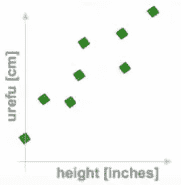
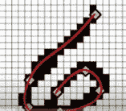
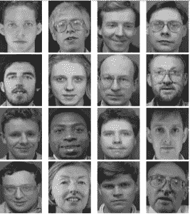
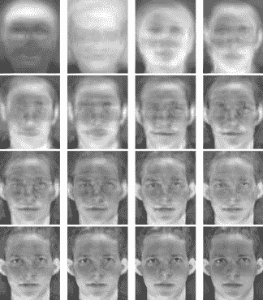
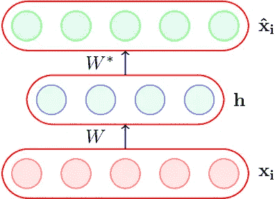
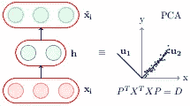
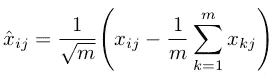

# 从主成分分析到自动编码器的旅程

> 原文：<https://medium.com/analytics-vidhya/journey-from-principle-component-analysis-to-autoencoders-e60d066f191a?source=collection_archive---------0----------------------->

# 介绍

我们知道 PCA 的力量，以及图像压缩、数据分析和监督机器学习等 it 领域取得的奇迹。PCA 用较少数量的线性不相关变量解释相关的多元数据，这些变量是原始变量的线性组合。简而言之，它通过首先捕捉最重要的特征(即具有最高方差的特征)来移除冗余信息。这里有一些有趣的例子，是由 [Victor](https://www.youtube.com/watch?v=IbE0tbjy6JQ&list=PLBv09BD7ez_5_yapAg86Od6JeeypkS4YM) 提供的。要开始学习 PCA 的重要性，你可以阅读他的 PCA 背后的数学系列。首先看两张图片，回答问题，然后看解释。



对于某些群体，测量两个属性。数据的维度是什么？



比方说 20x20 图像数字数据集，导致 400 个网格框。数据的维度是什么？

*解释:*比方说第一个例子，我们知道 *urefu* 在斯瓦希里语中是身高的意思。显然不需要两个独立的维度，一个特征就可以了。同样，对于包含 400 个维度的图像的第二种情况。对于 2⁴⁰⁰的位图图像来说，只有很少的可能性是捕捉类似于数字的图像。显然，在这种情况下，维度必须小于 400(仅限于少数几个维度)才能捕获有关数字的所有信息。像，只有特定的曲线，一个数字的线存在或不存在。

PCA 及其基于方差和协方差计算的统计线性变换在检测这种冗余方面非常成功。从上面的例子中，我们可以清楚地看到需要**一般化机制**，以便在数据集中以特征的形式表达信息。让我们看看 PCA 在这种归纳中有多成功，导致最重要的特征被首先捕获，以及是否需要更好的机制。

# 解释了 PCA 的威力

假设您有一个包含大量要处理的要素的数据集。图像、视频或音频数据大多如此。你不能将我们的常规机器学习模型直接应用于它，你肯定会寻找一些有意义的预处理步骤，这将减少你的训练时间，但仍不会降低数据的表示能力，即准确性/误差权衡必须更少。



100 x 100 图像[10K 尺寸]。数据将具有 m x 10k 维矩阵

与图像相关的数据的特殊之处在于，每个像素都与其相邻像素相关，我们应该利用这一事实。图像、音频和视频数据集通常就是这种情况。这种关系迫使我们得出结论，更高维度没有太多的信息存储在其中，我们可能不需要它们。如果某些维度是稀疏的，我们可以丢弃它们而不会丢失太多信息。现在的问题是选择哪个维度？输入 PCA。它选取维度，使得数据在这些维度上呈现出**高方差**，从而获得更多的表示能力。它确保新维度之间的协方差最小化。这将确保可以使用更少的维度来表示数据。



来自前 16 个特征向量结果。

以上结果令人难以置信。在没有任何明显损失的情况下，以原始维数的 **0.16%** 重建图像。上面的图像是用构成基础的特征向量的线性组合重建的。想象一下，使用这种简化形式的数据，我们可以在存储和训练模型时分别节省多少空间和时间。但是这和自动编码器有什么关系呢？

# 自动编码器如何链接到 PCA？

嗯，自动编码器是一种特殊类型的前馈神经网络，它将输入 *x* 编码到隐藏层 *h* 中，然后从其隐藏表示中解码回来。该模型被训练以最小化输入和输出层的损耗。



一个自动编码器，其中 dim(h) < dim(xi) is called an under complete autoencoder

Now, let’s say with the help of hidden layer *h，*你能够完美地重构 *xhat* ， *h* 是 *xi 的无损编码。它囊括了 xi 的所有重要特征。*与 PCA 的相似性很明显，h 的行为类似于 PCA 的降维矩阵，从该降维矩阵重构输出，但在值上有一些损失。因此，编码器部分与 PCA 相似。



如何实现这种对等？这种等价能有任何用处吗？

# **哪些条件使 autoencoder 成为 PCA？**

如果使用线性编码器、线性解码器、具有归一化输入的平方误差损失函数，编码器部分将等同于 PCA。这意味着 PCA 仅限于线性映射，而自动编码器则不然。



由于这些线性约束，我们转向了具有类 sigmoid 非线性函数的编码器，这在数据重建中给出了更高的精度。参见与之相关的插图。

# 对比说明

这里是 PCA 和自动编码器的比较代码，用于以*均方误差*作为损失函数来训练 MNIST 数据集。下图中使用了自动编码器的以下架构 784→512→128→2→128→512→784。*在 Python 3.x 中，您需要安装 TensorFlow 和 Keras 来实现这个代码演示。*

**设置**

```
import numpy as np
import keras
from keras.datasets import mnist
from keras.models import Sequential, Model
from keras.layers import Dense
from keras.optimizers import Adam

(x_train, y_train), (x_test, y_test) = mnist.load_data()
x_train = x_train.reshape(60000, 784) / 255
x_test = x_test.reshape(10000, 784) / 255
```

**PCA**

```
mu = x_train.mean(axis=0)
U,s,V = np.linalg.svd(x_train - mu, full_matrices=False)
Zpca = np.dot(x_train - mu, V.transpose())

Rpca = np.dot(Zpca[:,:2], V[:2,:]) + mu    # reconstruction
err = np.sum((x_train-Rpca)**2)/Rpca.shape[0]/Rpca.shape[1]
print('PCA reconstruction error with 2 PCs: ' + str(round(err,3)));
```

**自动编码器**

```
m = Sequential()
m.add(Dense(512,  activation='elu', input_shape=(784,)))
m.add(Dense(128,  activation='elu'))
m.add(Dense(2,    activation='linear', name="bottleneck"))
m.add(Dense(128,  activation='elu'))
m.add(Dense(512,  activation='elu'))
m.add(Dense(784,  activation='sigmoid'))
m.compile(loss='mean_squared_error', optimizer = Adam())
history = m.fit(x_train, x_train, batch_size=128, epochs=5, verbose=1, validation_data=(x_test, x_test))encoder = Model(m.input, m.get_layer('bottleneck').output)
Zenc = encoder.predict(x_train)  # bottleneck representation
Renc = m.predict(x_train)        # reconstruction
```

将所有激活函数改为`activation='linear'`，观察损耗如何精确收敛到 PCA 损耗。这是因为如上所述，线性自动编码器等效于 PCA。

# 结论

上面的理论和例子给出了为什么需要从 PCA 转移到自动编码器的想法。提出了与 PCA 中的线性变换相比的非线性函数的情况。就其功能而言，普通编码器毫无疑问是原始的，即使在 MNIST 这样的数据集上，稀疏或去噪的自动编码器也会在过度完整的自动编码器的情况下占上风。但是，非线性激活函数的基础仍然为深度学习模型超越其他常规 ML 模型铺平了道路。谢谢！！

# 承认

我只是触及了表面&试图解释这个概念的基础，要深入了解理论，请参考 CS7015(DL，IITM)，要了解实现的细节，请参考[下面由](https://stats.stackexchange.com/questions/190148/building-an-autoencoder-in-tensorflow-to-surpass-pca) [amoeba](https://stats.stackexchange.com/users/28666/amoeba) 编写的线程。