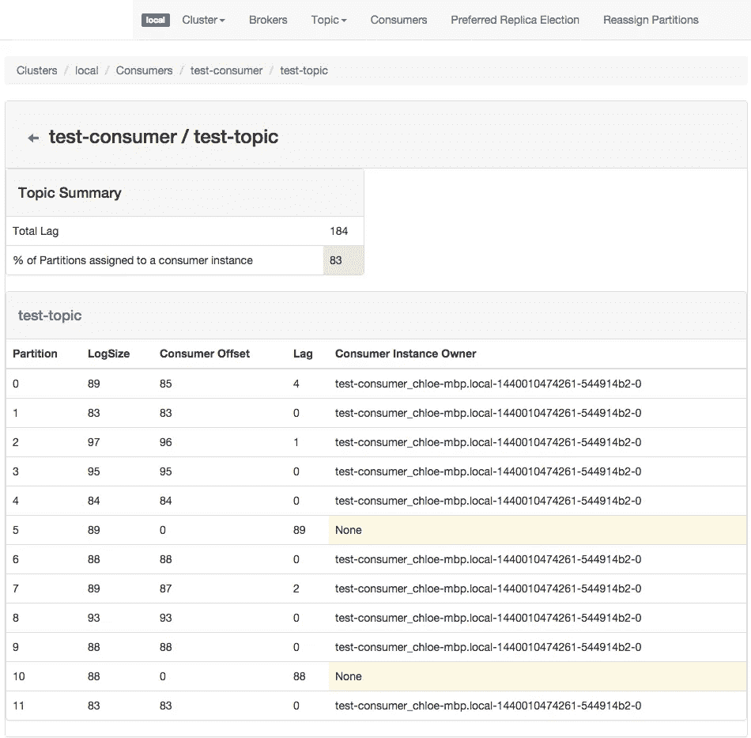
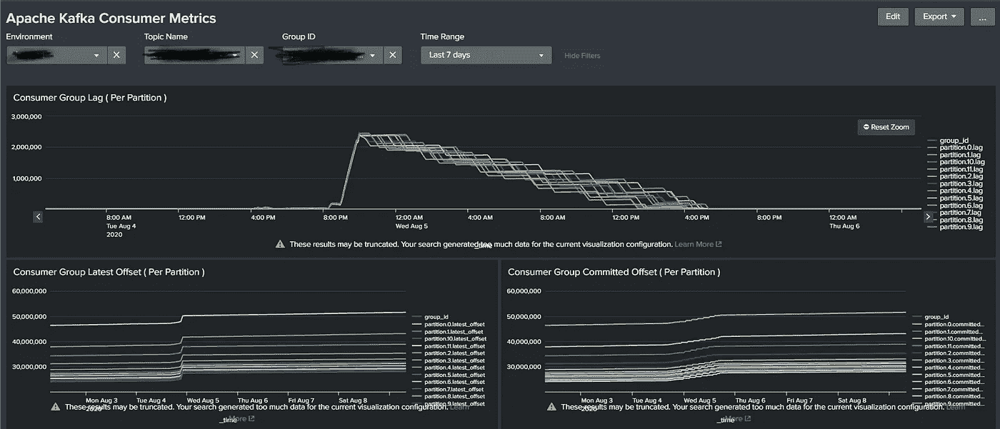

# 阿帕奇·卡夫卡与动物园管理员之旅(14)

> 原文：<https://medium.com/analytics-vidhya/journey-of-apache-kafka-zookeeper-administrator-part-14-e4648ad33232?source=collection_archive---------21----------------------->

2020 年 7 月(卡夫卡消费群监测)


消费者群体监控非常重要，因为它提供了关于消费者应用程序的统计数据，以及应用程序与实际数据流的差距。

**第一:** [雅虎卡夫卡经理](https://github.com/yahoo/CMAK)又名 [CMAK](https://github.com/yahoo/CMAK)



> CMAK 有一个小问题，它只会显示最新的统计数据，你永远无法比较历史结果。如果你只想知道关于消费者的最新统计数据，那么这是 Apache Kafka 消费者群体监控的最佳工具之一。

**第二:**自定义监控脚本(基于 Python 3)

有了这个工具，我的监控架构变得非常一致， **Python 脚本用于指标提取+ Splunk 用于索引&仪表盘**。

我们需要一个名为 [**kafka-python**](https://pypi.org/project/kafka-python/) 的 python 包，因为当我们使用上面的库创建消费者时，它也允许消费者获取其统计数据，但目前 [Confluent-Kafka-python](https://github.com/confluentinc/confluent-kafka-python) 包不支持同样的东西。

# 现在让我们检查代码。

```
from kafka import KafkaConsumer, TopicPartition, KafkaAdminClient
import json
import sys
from datetime import datetime
import threadingclass KCMetric:
    def __init__(self,topic,group_id,logDir,env):self.TOPIC = topic
        self.GROUP = group_id
        self.BOOTSTRAP_SERVERS = ['localhost']
        self.ENV = env
        self.LOGDIR = logDir
        self.CTIMENOW = datetime.now()self.metricJsonDict = {
            "topic": self.TOPIC,
            "group_id": self.GROUP,
            "env": self.ENV,
            "[@timestamp](http://twitter.com/timestamp)": str(self.CTIMENOW),
            "partition": {}
        }def checkConsumerGroupName(self):
        __kc = KafkaAdminClient(bootstrap_servers=self.BOOTSTRAP_SERVERS)
        cgnTuple = (self.GROUP, 'consumer')
        for i in __kc.list_consumer_groups():
            if cgnTuple == i:
                return True
        return Falsedef getMetric(self):
        consumer = KafkaConsumer(
            bootstrap_servers=self.BOOTSTRAP_SERVERS,
            group_id=self.GROUP,
            enable_auto_commit=False
        )for p in consumer.partitions_for_topic(self.TOPIC):
            tp = TopicPartition(self.TOPIC, p)
            consumer.assign([tp])
            committed_offset = consumer.committed(tp)
            if committed_offset is None:
                committed_offset = 0
            for _, v in consumer.end_offsets([tp]).items():
                latest_offset = v
            self.metricJsonDict["partition"][p] = {}
            self.metricJsonDict["partition"][p]["committed_offset"] = committed_offset
            self.metricJsonDict["partition"][p]["latest_offset"] = latest_offset
            self.metricJsonDict["partition"][p]["lag"] = latest_offset - committed_offsetwith open(self.LOGDIR + "kafka-consumer-group-metrics.log", 'a+') as logFile:
            logFile.write("\n")
            logFile.write(json.dumps(self.metricJsonDict))
            logFile.write("\n")
        consumer.close(autocommit=False)def main():
    inputFile = sys.argv[1]
    logDir = sys.argv[2]
    env = sys.argv[3]# clean up log file before writing new data
    open(logDir + "/kafka-consumer-group-metrics.log", 'w').close()for line in open(inputFile):
        line = line.strip()
        if not line.startswith("#") and len(line) > 0:
            topic = line.split()[0] + "." + env.split("-kafka")[0]
            group_id = line.split()[1]
            try:
                kc = KCMetric(topic.strip(), group_id.strip(), logDir, env)
                if kc.checkConsumerGroupName():
                    _t = threading.Thread(
                        target=kc.getMetric
                    ).start()
            except:
                print("something failed")main()
```

**最重要的功能是**

```
def getMetric(self):
        consumer = KafkaConsumer(
            bootstrap_servers=self.BOOTSTRAP_SERVERS,
            group_id=self.GROUP,
            enable_auto_commit=False
        )for p in consumer.partitions_for_topic(self.TOPIC):
            tp = TopicPartition(self.TOPIC, p)
            consumer.assign([tp])
            committed_offset = consumer.committed(tp)
            if committed_offset is None:
                committed_offset = 0
            for _, v in consumer.end_offsets([tp]).items():
                latest_offset = v
            self.metricJsonDict["partition"][p] = {}
            self.metricJsonDict["partition"][p]["committed_offset"] = committed_offset
            self.metricJsonDict["partition"][p]["latest_offset"] = latest_offset
            self.metricJsonDict["partition"][p]["lag"] = latest_offset - committed_offset
        consumer.close(autocommit=False)
```

如果你仔细检查我的代码，我正在做的是

1.  创造消费者。
2.  列出给定主题的分区总数。
3.  创建主题分区对象。
4.  将使用者分配给 TopicPartition 对象。
5.  读取 TopicPartition 对象的两个度量(consumer . committed & consumer . end _ offsets)。
6.  将指标附加到 Python Dict / JSON 对象。
7.  对所有分区重复步骤 3–6。
8.  关闭消费者而不提交任何东西&另存为 JSON。

这个需要两个重要的输入

1.  主题名称
2.  消费者组名称

我可以为所有消费者群体这样做，但我只需要监控和提醒**在线交易主题&消费者**。

其余的主题可以由 CMAK 监控，我已经在我的设置。

[卡夫卡-消费者-群体-度量-输入. txt](https://github.com/116davinder/kafka-cluster-ansible/blob/master/roles/jmxMonitor/files/kafka-consumer-group-metric-input.txt)

```
#######################################################################
# This file is input file for consumer group metric collection script.
# Usage: <topic name without environment>[space]<group_id>
#
# Note:
# 1\. if you same consumer reading from mulitple topics then
#    add multiple lines with each topicName and same group_id.
# 2\. group_id is case sensitive.
# 3\. if you have a typo in topicName or group_id, metric won't be collected.
# 4\. group_id should be same across environments.
# 5\. all group_id/topic stats can't be collected as those will be too much
#    so only In Line Transaction Topic/group_id data should be collected.
#######################################################################
topic1 consumer_group_id1
.....
```

**样本输出**

```
{
	"topic": "topic1",
	"group_id": "group_id1",
	"env": "dev-env-kafka",
	"@timestamp": "2020-05-18 15:36:01.191032",
	"partition": {
		"0": {
			"committed_offset": 13626733,
			"latest_offset": 13626733,
			"lag": 0
		},
		"1": {
			"committed_offset": 13623397,
			"latest_offset": 13623397,
			"lag": 0
		},
		"2": {
			"committed_offset": 13615804,
			"latest_offset": 13615804,
			"lag": 0
		}
	}
}
....
```

我将在 cron 中运行这个脚本，所以我在 ansible 中添加了一个任务来覆盖这个脚本。

```
- name: creating folder for jmx monitor
  file:
    path: "{{ kafkaInstallDir }}/jmxMonitor"
    state: directory- name: copying script and input files
  copy:
    src: "{{ item }}"
    dest: "{{ kafkaInstallDir }}/jmxMonitor/{{ item }}"
  loop:
    - kafka-consumer-group-metric.py
    - kafka-consumer-group-metric-input.txt- name: creating kafka consumer group metric collector cron
  cron:
    name: "kafka consumer group metric collector cron task"
    minute: "*"
    hour: "*"
    weekday: "*"
    user: root
    job: 'python3 {{ kafkaInstallDir }}/jmxMonitor/kafka-consumer-group-metric.py {{ kafkaInstallDir }}/jmxMonitor/kafka-consumer-group-metric-input.txt {{ kafkaLogDir }}/ {{ kafkaClusterName }}'
```

Ansible 剧本:[116 dav inder/Kafka-cluster-ansi ble/clusterconsumermetricsetup . yml](https://github.com/116davinder/kafka-cluster-ansible/blob/master/clusterConsumerMetricSetup.yml)

最后，我们可以用它来制作 Splunk 仪表盘。

**Splunk 代码:**[116 davinder/Kafka-cluster-ansi ble/Splunk-dashboards/Apache-Kafka-consumer-group-metrics . XML](https://github.com/116davinder/kafka-cluster-ansible/blob/master/files/splunk-dashboards/apache-kafka-consumer-group-metrics.xml)

**Splunk 示例仪表板:**[116 davinder/Kafka-cluster-ansi ble/Splunk-dashboards/Kafka-Consumer-Splunk-Metric-Dashboard . png](https://github.com/116davinder/kafka-cluster-ansible/blob/master/files/splunk-dashboards/Kafka-Consumer-Splunk-Metric-Dashboard.png)



**为什么要定制监控脚本？**

1.  作为一个宽容的消费者，我需要了解过去六个月的历史趋势。
2.  它应该是可扩展的和易于理解的。

LinkedIn 还有一个很棒的工具叫做 [Burrow](https://github.com/linkedin/Burrow) ，但是我从来没有机会去探索它。

这个旅程将在下一篇文章中继续(对容器的初始支持)