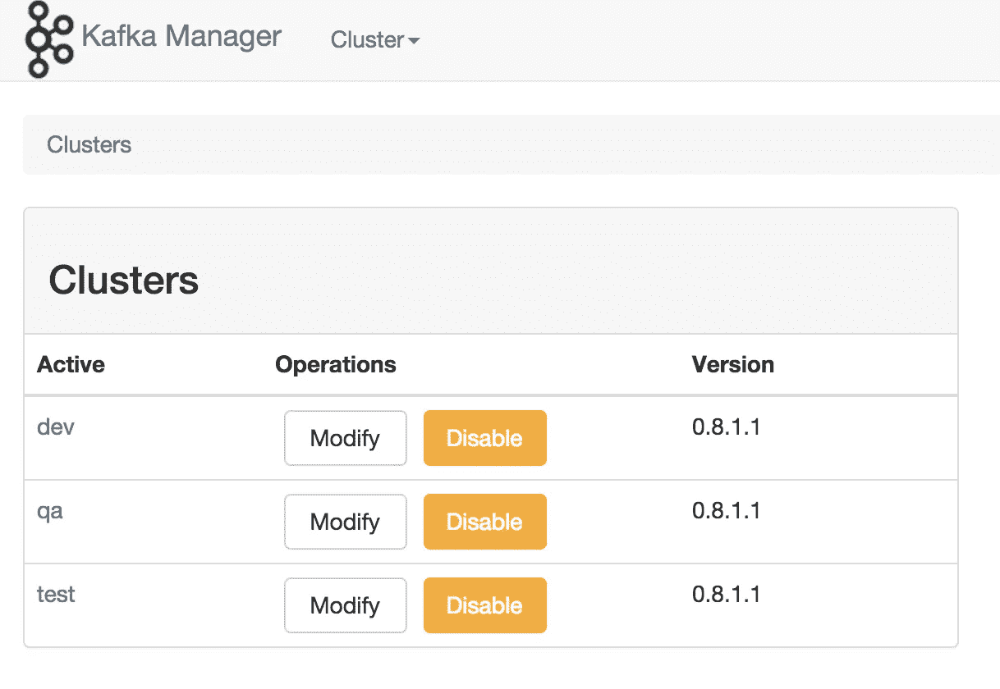

# 阿帕奇卡夫卡与动物园管理员之旅(十五)

> 原文：<https://medium.com/analytics-vidhya/journey-of-apache-kafka-zookeeper-administrator-part-15-fdc2e043e3a2?source=collection_archive---------16----------------------->

2020 年 8 月(Docker 容器的初始支持)



CMAK 的随机图片

在这篇文章中，我将分享关于# **CMAK** 在# **容器**中运行的事情。

我使用 **Docker 运行时**作为起点，但同样的东西可以扩展到 **CoreOS** / **LXC** /等。

因为 **CMAK** 是一个独立的应用程序，并且不在本地机器中存储它的状态。这是集装箱的最佳选择。

有两种方法可以制作 CMAK 的形象。

1.  从零开始建设 CMAK。
2.  使用预制的 CMAK 罐。

我将分享关于从零开始建设 CMAK 的细节。

让我们检查一下[文档文件](https://github.com/116davinder/kafka-cluster-ansible/blob/master/docker/cmak/Dockerfile)

```
FROM openjdk:11LABEL AUTHOR="Davinder Pal"
LABEL AUTHOR_EMAIL="[dpsangwal@gmail.com](mailto:dpsangwal@gmail.com)"
LABEL GITHUB="[https://github.com/116davinder](https://github.com/116davinder)"
LABEL GITHUB_CMAK="[https://github.com/yahoo/CMAK](https://github.com/yahoo/CMAK)"ENV ZK_HOSTS=localhost:2181
ENV CMAK_VERSION=3.0.0.5RUN cd /tmp && wget [https://github.com/yahoo/CMAK/archive/${CMAK_VERSION}.tar.gz](https://github.com/yahoo/CMAK/archive/${CMAK_VERSION}.tar.gz) && \
    tar -xzvf ${CMAK_VERSION}.tar.gzRUN cd /tmp/CMAK-${CMAK_VERSION} && \
    ./sbt clean distRUN unzip -d / /tmp/CMAK-${CMAK_VERSION}/target/universal/cmak-${CMAK_VERSION}.zipRUN rm -fr /tmp/CMAK-${CMAK_VERSION} /tmp/${CMAK_VERSION}.tar.gzWORKDIR /cmak-${CMAK_VERSION}EXPOSE 9000
ENTRYPOINT ["./bin/cmak","-Dconfig.file=conf/application.conf"]
```

*   我使用 **OpenJDK 11** 作为基础映像，因为 CMAK 建议使用 **Java 11** 。
*   Zookeeper 主机在运行时作为环境变量传递给容器。
*   不需要安装 www.scala-sbt.org 的 SBT，因为 CMAK 已经在代码中包含了 SBT 二进制。
*   它目前不支持任何认证方法 **Basic / LDAP** 。

旅程需要在这里休息一下，因为我还没有做下一部分的研究，所以很抱歉。(接下来是对 Kubernetes 或类似工具的支持)