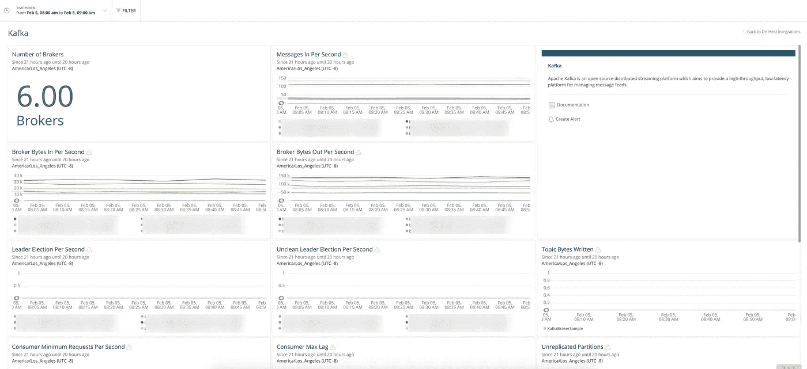

# 阿帕奇卡夫卡与动物园管理员之旅(三)

> 原文：<https://medium.com/analytics-vidhya/journey-of-apache-kafka-zookeeper-administrator-part-3-e31c2f330895?source=collection_archive---------17----------------------->

【2019 年 6 月(续)

[在之前的文章](/@116davinder/journey-of-apache-kafka-zookeeper-administrator-part-2-38db736d3163)中，我已经解释了**阿帕奇动物园管理员**的不同方面，而在这篇文章中，我将涵盖最初的**阿帕奇卡夫卡**方面。 **Ansible 闪耀魔力。**



主机集成仪表板上的新遗迹

**GitHub 代码库:**[116 dav inder/Kafka-cluster-ansi ble](https://github.com/116davinder/kafka-cluster-ansible)

可翻译的剧本和角色的结构与**阿帕奇动物园管理员**相同，以确保我的一致性，并在需要时易于他人理解。
以下是为**阿帕奇卡夫卡增加的额外角色。**

[**crons**](https://github.com/116davinder/kafka-cluster-ansible/tree/master/roles/crons)**:**该角色将在 root 用户下添加一个清理 cron 任务，以便我们可以清理 Apache Kafka 服务器日志。
[**nri-Kafka**](https://github.com/116davinder/kafka-cluster-ansible/tree/master/roles/nri-kafka)**:**这个角色将加入 JMX 基础的新遗迹整合。

**其他角色:**[116 da vinder/Kafka-cluster-ansi ble/Roles](https://github.com/116davinder/kafka-cluster-ansible/tree/master/roles)

以下是为阿帕奇卡夫卡增加的额外剧本。

[**【clusteraddnodes . yml**](https://github.com/116davinder/kafka-cluster-ansible/blob/master/clusterAddNodes.yml)**:**这个剧本会给给定的 Apache Kafka 集群添加更多的代理节点。

**伐木** 和**阿帕奇动物园管理员**一样，只是位置变了。

```
[default]
host = $HOSTNAME

[monitor:///kafka/kafka-logs/*.log]
disabled = false
index = kafka
sourcetype = kafka
crcSalt = <SOURCE>
```

**监控过山车** 因为我们有 Splunk，所以我发现基于 Splunk 的监控可以做得和 [Kafka 智能监控](https://splunkbase.splunk.com/app/4268/)一样好。经过研究我意识到它需要 **Splunk Hec 模块、** [**Telegraf**](https://www.influxdata.com/time-series-platform/telegraf/) 和**Jolokia****JMX 出口商这些组件对于**阿帕奇卡夫卡监听**来说相当难以消化。**

**我们也有新遗迹，所以我决定寻找新遗迹选项。
在他们的网站上，他们已经批准了阿帕奇卡夫卡**的整合，我决定试一试。
**新遗物整合:**[docs.newrelic.com/kafka-monitoring-integration](https://docs.newrelic.com/docs/integrations/host-integrations/host-integrations-list/kafka-monitoring-integration)
实施后他们提到了什么，*我很失望*😞*当我检查 Apache Kafka 的 New Relic 预定义仪表板时，他们的结果。他们的大多数仪表板图表都不起作用，许多指标都被排除在外。* 所以我决定，我必须为它找到另一个解决方案，当前的解决方案可以工作，但如果出了问题，我将无法调试与 Apache Kafka 相关的生产问题，我真的不想至少在这个项目中，我不知道发生了什么，在哪里发生了什么？在谷歌上研究定制解决方案后，我知道所有的阿帕奇卡夫卡指标都可以通过 JMX 获得，现在，我只需要一种方法来读取它们并将它们导出到某个地方。*幸运的是，我发现 New Relic 也支持 JMX**，它可以读取并导出 JMX 指标到 **New Relic Insights** ，在那里我可以使用 **NRQL** 来创建仪表板。*****

*****老实说**，这是一项艰巨的工作，2019 年 6 月几乎过去了一半，组织中的一些人开始询问 Apache Kafka 的准备情况。***

*****新遗迹 JMX 集成:**
几天之内，我就能够破解上面提到的集成方法，并开始向**新遗迹洞察导出指标。上面的集成支持 JMX 查询，所以我必须为 Apache Kafka 构建相当多的查询。甚至在此之前，我必须知道我需要收集什么该死的指标，所以我开始再次研究，并在关于监控的汇合文件上结束:[docs.confluent.io/kafka/monitoring.html](https://docs.confluent.io/current/kafka/monitoring.html)。*****

***我想感谢你的汇合真正伟大的文件。甚至他们也提到了应该用于度量提取的 JMX 查询。***

***我还必须安装集成所需的两个插件。[nri-JMX-2 . 4 . 4–1 . x86 _ 64 . rpm](https://download.newrelic.com/infrastructure_agent/linux/yum/el/7/x86_64/nri-jmx-2.4.4-1.x86_64.rpm)
2 .[nrjmx-1 . 5 . 2–1 . x86 _ 64 . rpm](https://download.newrelic.com/infrastructure_agent/linux/yum/el/7/x86_64/nrjmx-1.5.2-1.x86_64.rpm)***

*****最后，**我准备好了所有的监控组件，并且迫不及待地想要尝试一下，
下面是一个关于 **JVM 指标**的例子***

```
*collect:
# Standard JVM Metrics
    - domain: java.lang
      event_type: kafkaMonitoring
      beans:
          - query: type=GarbageCollector,name=*
            attributes:
                - CollectionCount
                - CollectionTime
          - query: type=Memory
            attributes:
                - HeapMemoryUsage.Max
                - HeapMemoryUsage.Used
                - NonHeapMemoryUsage.Used
          - query: type=Threading
            attributes:
                - ThreadCount
                - PeakThreadCount
          - query: type=ClassLoading
            attributes:
                - LoadedClassCount*
```

***下面是一个关于**阿帕奇卡夫卡指标**的例子***

```
*collect:
# source: https://docs.confluent.io/current/kafka/monitoring.html

    - domain: kafka.controller
      event_type: kafkaMonitoring
      beans:
          - query: type=KafkaController,name=*
          - query: type=ControllerStats,name=*
....
    - domain: kafka.log
      event_type: kafkaMonitoring
      beans:
          - query: type=LogFlushStats,name=LogFlushRateAndTimeMs
....
    - domain: kafka.network
      event_type: kafkaMonitoring
      beans:
          - query: type=RequestChannel,name=RequestQueueSize
          - query: type=RequestMetrics,name=TotalTimeMs,request=*
          - query: type=RequestMetrics,name=*,request=*
.... - domain: kafka.server
      event_type: kafkaMonitoring
      beans:
          - query: type=*,name=*

    - domain: kafka.utils
      event_type: kafkaMonitoring
      beans:
          - query: type=*,name=**
```

***根据文档，我将这些 YAML 格式的查询添加到 New Relic Infra Agent 中,“瞧”,它工作了，但我没有意识到有几个指标丢失了。有点令人沮丧的是，我做了文档中所说的一切，只有一半的指标被导出到 New Relic，所以我决定我必须调试这个问题，经过一天的调试，我发现 New Relic 插件有限制，它不能处理超过数百个事件，但我对我的配置生成的事件数量并不感到惊讶。对我来说，启用 New Relic 的调试模式也很有趣。无论如何，我设法启用了调试模式，并震惊地发现我的配置正在生成 4-5k 事件/秒，这他妈的高于默认情况下允许的新遗物插件，所以现在我必须找出地狱，我可以增加新遗物 JMX 插件的限制，并诚实地说，新遗物关于这些基于社区的插件的文档非常糟糕，幸运的是这些插件是由新遗物开源的(✌️ Kudos！)我开始检查这些插件的实际代码库，发现插件确实有默认限制，并且可以被一个名为“metric_limit”的参数覆盖，现在问题开始了，我他妈的应该把这个参数放在哪里，像哪个他妈的文件。在做了 5-10 次以上的尝试后，我发现它应该被添加到主 [**jmx-config.yml**](https://github.com/116davinder/kafka-cluster-ansible/blob/master/roles/nri-kafka/templates/jmx-config.yml) 文件的 arguments 下。***

***我还删除了额外的指标以减少指标总数，并添加了标签，因为我从 10 多个不同的集群中导出了指标，标签是区分它们的唯一方式。***

*****仅供参考:**不要向 New Relic 发布太多指标，因为他们会向你收取每项指标的费用，对我的公司来说，这是免费的，因为💰💰💰它还会占用大量的网络带宽，而 Apache Kafka 应该将这些带宽用于实际工作。***

*****终于！**所有指标都进入了 **New Relic Insights** 并开始开发基于 NRQL(又名 New Relic 查询语言)的 Insights Dashboard。这很简单，但我意识到所有的 JMX 数据都被添加到 New Relic Insights 的默认数据库中，我有点担心如果其他人开始使用 JMX 集成，这个数据库会变得一团糟，所以我也找到了一个小技巧，那就是你可以在 New Relic Insights 中通过向 JMX 查询添加一个参数来创建自己的数据库。***

```
*event_type: kafkaMonitoring*
```

***一旦添加了上面的“event _ type ”, NRQL 查询就只对我的用例是唯一的了。
**之前事件 _ 类型:*****

```
*SELECT latest(Value) from **JMXSample** TIMESERIES FACET host,`key:name`  where bean like 'type=KafkaController,name=%'*
```

*****事件类型之后:*****

```
*SELECT latest(Value) from **kafkaMonitoring** TIMESERIES FACET host,`key:name`  where bean like 'type=KafkaController,name=%'*
```

***【docs.newrelic.com/nrql-new-relic-query-language】NRQL 文档:T4***

*****手动步骤😠** 创建新遗迹洞察仪表板。***

******需要记住的几件事是，New Relic Infra Agent 将指标发布到 New Relic Insights 中的另一个数据库。***
**系统示例:**用于存储 CPU 指标。
**StorageSample:** 用于存储磁盘规格。
**NetworkSample:** 用于存储网络度量。
**kafkaMonitoring:** 用于存储实际的 Kafka 指标。***

***使用 [New Relic API Explorer](https://docs.newrelic.com/docs/apis/rest-api-v2/api-explorer-v2/use-api-explorer) 导入下面的 dashboard JSON 代码。
**新遗迹仪表盘代码:** [新遗迹-仪表盘-kafka.json](https://github.com/116davinder/kafka-cluster-ansible/blob/master/files/newrelic-dashboards/kafka.json)
**新遗迹仪表盘示例:**[Apache-Kafka.pdf](https://github.com/116davinder/kafka-cluster-ansible/blob/master/files/newrelic-dashboards/Apache%20Kafka.pdf)***

***当我从 **New Relic Insights** 创建仪表板时，New Relic 宣布 **Insights** 将被 **New Relic One** 弃用，所以我也开始将我的仪表板迁移到 **New Relic One** 。***

***我的 GitHub 库也有其他剧本/角色，但我会在以后的文章中介绍它们，因为这是我的故事，而这篇文章不适合它们。***

***阿帕奇卡夫卡优化之旅将在下篇开始！***