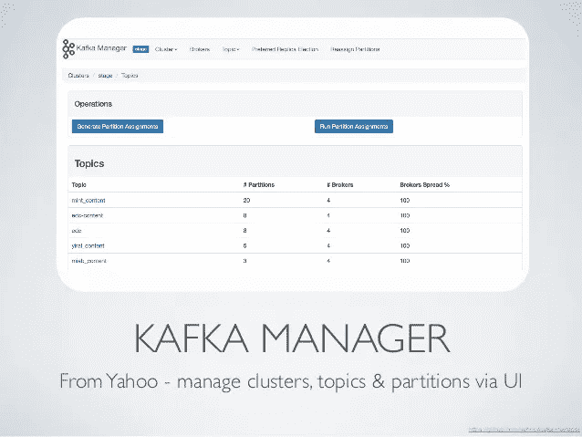

# 阿帕奇卡夫卡与动物园管理员之旅(五)

> 原文：<https://medium.com/analytics-vidhya/journey-of-apache-kafka-zookeeper-administrator-part-5-c8bce2b2dd7d?source=collection_archive---------6----------------------->



【2019 年 6 月(续 6 月下旬)

今天，我们需要谈谈另一个运营方面，一旦你安装了 Apache Kafka，如何管理 Apache Kafka 的主题和其他基本内容，这就是我了解[雅虎 Kafka 经理](https://github.com/yahoo/CMAK)(又名 [CMAK](https://github.com/yahoo/CMAK) )的地方。

我想感谢#yahoo 提供了一个非常棒的工具。

**先说说这个工具为什么这么棒。**

它支持多个集群，可以非常容易地完成许多操作，如主题创建、主题配置更新、代理概述、实时代理统计(消息数/分区数/活动分区数),并且只需几次点击就可以完成**超级重要的任务**又名**分区重新分配**。

这是非常容易安装，甚至更容易板载其他管理员谁刚刚启动 Kafka。

我尝试了另一个很好的工具，叫做 [Kafdrop](https://github.com/HomeAdvisor/Kafdrop) 。这真的很棒，因为如果你需要的话，你可以实时看到来自任何主题的消息，这在 **CMAK** 中仍然缺乏。不管怎样，我决定和 CMAK 一起前进，而不是 Kafdrop，它有点成熟，有一个可以长期支持它的社区。

**如何手动安装 CMAK？**

我建议你自己构建这个工具，下载最新版本:[github.com/yahoo/CMAK/releases](https://github.com/yahoo/CMAK/releases/)。

**步骤 1:**
安装 Open Java 11，使用简单的命令或者按照 GitHub 库中的步骤进行编译。

```
./sbt clean dist
```

上面的命令将生成一个包含 cmak.xx.zip 的 zip 文件，其中包含启动 cmak 的所有库+二进制文件。

**第二步:** 把上面的 zip 复制到 cmak 服务器，解压到你给定的分区/位置。更新**应用程序。确认**包括

*   用户名和密码等基本身份验证信息。
*   `cmak.zkhosts="10.0.0.1:2181,10.0.0.2:2181,10.0.0.3:2181"`

**第三步:** 创建一个 SystemD 文件，这样就可以将其作为服务启动。

```
[Unit]
Description=Apache Kafka Manager ( CMAK )
After=syslog.target network.target[Service]
Type=simple
User={{ kafkaUser }}
Group={{ kafkaGroup }}
ExecStart={{ kafkaManagerInstallDir }}/kafka-manager/bin/cmak[Install]
WantedBy=multi-user.target
```

**第 4 步:** 用下面的命令启动服务

```
**service kafka-manager start**
```

如何用 Ansible 安装 CMAK？

[116 dav inder/Kafka-cluster-ansi ble/clusterKafkaManager](https://github.com/116davinder/kafka-cluster-ansible/blob/master/clusterKafkaManager.yml):
本剧本将按照上述步骤安装 Kafka Manager aka CMAK。现在我们几乎在任何地方都在使用 ansible，这是配置管理的完美范例。

我再次遵循相同的文件夹结构，这是指向使用符号链接又名软链接的最新版本。

```
davinderpal@Davinder:~$ tree -L 1 kafka-manager/
kafka-manager/
├── cmak-3.0.0.4
├── cmak-3.0.0.5
└── kafka-manager -> cmak-3.0.0.53 directories, 0 files
```

**注意*** 我使用的是基本认证，因为只有 DevOps 团队需要访问这个 UI，而且基本认证远比实现 LDAP 简单，但是如果需要，您也可以使用 LDAP。

**接下来的步骤**

一旦通过 Ansible 或手动完成安装，我们需要将集群添加到 CMAK，以便它可以开始监控/管理它们。

使用您的凭据在端口 9000 上登录 CMAK GUI。

单击“添加集群”,然后单击“添加集群”,只需填写关于集群的详细信息

*   集群名称
*   给定 Kafka 集群的 zookeeper 节点
*   其他参数，如 CMAK 线程+ JMX 设置+ JMX 认证，如果实施

一旦您提交表单，它将显示您的集群中的集群链接，如下所示。


CMAK 多集群视图

如果还需要什么，请阅读 https://github.com/yahoo/CMAK 的 CMAK 文档。

以上是我当时的要求。

旅程将在下一个话题继续**阿帕奇卡夫卡镜制造商 V1。**