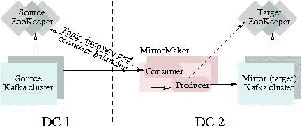
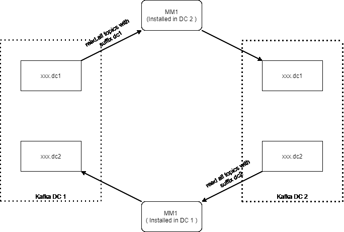

# 阿帕奇卡夫卡与动物园管理员之旅(六)

> 原文：<https://medium.com/analytics-vidhya/journey-of-apache-kafka-zookeeper-administrator-part-6-2e0c0afd1ae2?source=collection_archive---------21----------------------->

2019 年 7 月



官方图片来自阿帕奇卡夫卡网站

在上一篇文章中，我们谈到了雅虎卡夫卡经理又名 CMAK。

让我们转到下一个有趣的话题，那就是使用 MM1 的**阿帕奇卡夫卡的**跨 dc 复制**。**

请问自己一个问题，你真的需要它吗？如果不是，那就不要做。

当我开始这个项目时，时间镜像制作人 2(又名 MM2)还没有正式发布，所以我只能用 MM1 进行设计，并诚实地说“MM1 适合我的用例”，我只需要确保数据被快速可靠地复制(不是 100%)。

我已经在 5 月和 6 月对 MM1 做了相当多的研究，但没有实现它。这只是在我的脑海中，这就是我需要如何实现它。

**为什么不用任何第三方复制器比如**[**u 复制器**](https://github.com/uber/uReplicator) **？**
当我检查它的设计时，它相当复杂，不需要那些功能，如偏移同步、配置同步& 100%可靠。即使它使用 **RDBMS** 作为源，这也是另一个问题，我必须为它管理数据库，然后对我的用例进行监控，这是非常复杂且不容易的解决方案。

我在我的过程中加入了一个非常重要的东西，来完美的利用 MM1。**由于 MM1 是单向的，** **我不得不引入主题后缀**，这样 MM1 就可以在复制过程中使用它们。主题后缀提供了不同 dc 环境之间的分隔。

**MM1 架构(远程读取和本地写入模式)**

*   安装在 DC 2 中的 MM1 将从 DC 1 卡夫卡获取远程数据，并在本地写入 DC 2 卡夫卡。
*   安装在 DC 1 中的 MM1 将从 DC 2 卡夫卡获取远程数据，并在本地写入 DC 1 卡夫卡。



基于 MM1 的架构。

**上述架构的优势**

*   每个 DC 的主题+数据的分离。
*   支持 MM1。
*   主题之间没有数据的循环/无限复制。
*   很好理解。
*   如果需要，很容易扩展/缩小 MM1 的容量。

我的架构已经完成，我必须在安装过程+测试阶段工作。

所有的东西都已经在 Apache Kafka 包中，我必须为它生成两个配置，消费者和生产者配置，这样它就可以在某个地方读取和写入，以模拟跨 DC 复制。

[消费者配置](https://github.com/116davinder/kafka-cluster-ansible/blob/master/roles/configure/templates/kafka-mirror-maker-consumer.properties)

```
bootstrap.servers={{ kafkaMirrorMakerSourceDcClusterAddressString }}# consumer group id
group.id={{ kafkaMirrorMakerGroupId }}
auto.offset.reset={{ kafkaMirrorMakerAutoOffsetReset }}
partition.assignment.strategy={{ kafkaMirrorMakerPartitionAssignmentStrategy }}
fetch.max.bytes={{ kafkaMirrorMakerFetchMaxBytes }}
fetch.min.bytes={{ kafkaMirrorMakerFetchMinBytes }}
fetch.max.wait.ms={{ kafkaMirrorMakerFetchMaxWaitMs }}
exclude.internal.topics=true
allow.auto.create.topics=false
```

[生产商配置](https://github.com/116davinder/kafka-cluster-ansible/blob/master/roles/configure/templates/kafka-mirror-maker-producer.properties)

```
bootstrap.servers={{ kafkaMirrorMakerDestinationDcClusterAddress }}
compression.type={{ kafkaMirrorMakerCompressionType }}
partitioner.class={{ kafkaMirrorMakerPartitionerClass }}
request.timeout.ms={{ kafkaMirrorMakerRequestTimeoutMs }}
max.block.ms={{ kafkaMirrorMakerMaxBlockMs }}
linger.ms={{ kafkaMirrorMakerLingerMs }}# the maximum size of a request in bytes
max.request.size={{ kafkaMirrorMakerMaxRequestSize }}
batch.size={{ kafkaMirrorMakerBatchSize }}
buffer.memory={{ kafkaMirrorMakerBufferMemory }}max.in.flight.requests.per.connection={{ MaxInFlightRequests }}client.id={{ kafkaMirrorMakerClientId }}acks={{ kafkaMirrorMakerAcks }}
```

更新 M [irror-Maker-Start.sh](https://github.com/116davinder/kafka-cluster-ansible/blob/master/roles/configure/templates/kafka-mirror-maker.sh)

```
export JMX_PORT={{ kafkaMirrorMakerJmxInitialPort + item }}
export KAFKA_HEAP_OPTS="-Xmx{{ MakerHeapSize }} -Xms{{ HeapSize }}"
export KAFKA_LOG4J_OPTS="-Dlog4j.configuration=file:log4j.properties"exec $(dirname $0)/kafka-run-class.sh kafka.tools.MirrorMaker "$@"
```

**手动启动卡夫卡 MM 1**

```
bin/kafka-mirror-maker.sh --consumer.config kafka-mirror-maker-consumer.properties --producer.config kafka-mirror-maker-producer.properties --whitelist '.*dc1' --abort.on.send.failure false
```

一旦开始正常工作，我就开始考虑如何扩展 MM1，这是 MM1 真正出色的地方，我必须添加更多具有相同消费者和生产者配置的 MM1 实例，因为 MM1 基于 Kafka 消费者和生产者，而 Kafka 消费者被设计为在集群模式下工作。

如何运行 MM1 的多个实例？现在是施展魔法的时候了。我创建了配置模板，Ansible 将为我生成配置。

我取了一个初始变量，表示每个实例应该运行多少 MM1？我可以为每个实例使用 1 个，但这是一种非常低效的方式，因此我必须在每个实例上移动到多个 MM1 实例，现在我可以有 3 个虚拟机，但我可以运行 6/9/12 个 MM1 实例，并平均分布在所有 3 个虚拟机上。

kafkamirormakerprocesscountpernode:2

[可执行任务代码](https://github.com/116davinder/kafka-cluster-ansible/blob/master/roles/configure/tasks/mirrorMaker.yml)
所有变量取自:[**group _ vars/Kafka-mirror-maker . yml**](https://github.com/116davinder/kafka-cluster-ansible/blob/master/inventory/development/group_vars/kafka-mirror-maker.yml)

现在，当我生成像 consumer/producer 这样的配置时，因为它们对于 MM1 的所有实例都应该是相同的，所以我需要为每个服务器生成一次它们，并且 MM1 的所有实例都将使用它们。

由于日志和启动脚本的原因，我必须为每个 MM1 实例生成两个以上的文件。

*   [log4j.properties](https://github.com/116davinder/kafka-cluster-ansible/blob/master/roles/configure/templates/tools-log4j.properties)
*   [mirror-maker-start.sh](https://github.com/116davinder/kafka-cluster-ansible/blob/master/roles/configure/templates/kafka-mirror-maker.sh)

现在 Ansible 拿着上面的模板，基于“kafkamirormakerprocesscountpernode”为我生成不同的日志和启动脚本。

```
- name: Creating kafka Mirror Maker configurations | properties files
  template:
    src: "tools-log4j.properties"
    dest: "{{ kafkaInstallDir }}/kafka_{{ kafkaScalaVersion }}-{{ kafkaVersion }}/config/kafka-mirror-log4j-{{ item }}.properties"
    owner: "{{ kafkaUser }}"
    group: "{{ kafkaGroup }}"
    mode: 0775
  loop: "{{ range(1, kafkaMirrorMakerProcessCountPerNode + 1, 1) | list }}"- name: Creating kafka Mirror Maker configurations | kafka-mirror-maker.sh
  template:
    src: kafka-mirror-maker.sh
    dest: "{{ kafkaInstallDir }}/kafka_{{ kafkaScalaVersion }}-{{ kafkaVersion }}/bin/kafka-mirror-maker-{{ item }}.sh"
    owner: "{{ kafkaUser }}"
    group: "{{ kafkaGroup }}"
    mode: 0775
  loop: "{{ range(1, kafkaMirrorMakerProcessCountPerNode + 1, 1) | list }}"
```

需要生成的最后一个文件是 SystemD 文件，因此该流程可以由 SystemD 启动和管理，而不是由 **Nohup** 或 **PM2** 或其他流程管理系统启动和管理。

[**MM2 SystemD 模板**](https://github.com/116davinder/kafka-cluster-ansible/blob/master/roles/service/templates/kafka-mirror-maker-service.j2)

```
[Unit]
Description=Apache Kafka Mirror Maker Process {{ item }}
After=syslog.target network.target[Service]
Type=simple
User={{ kafkaUser }}
Group={{ kafkaGroup }}ExecStart={{ kafkaInstallDir }}/kafka/bin/kafka-mirror-maker-{{ item }}.sh \
--consumer.config {{ kafkaInstallDir }}/kafka/config/kafka-mirror-maker-consumer.properties \
--producer.config {{ kafkaInstallDir }}/kafka/config/kafka-mirror-maker-producer.properties \
--whitelist '{{ kafkaMirrorMakerReplicateTopicWhiteListPattern }}'\
--abort.on.send.failure falseTimeoutStopSec=180
Restart=no[Install]
WantedBy=multi-user.target
```

每个 Configuration + SystemD 进程都附加了进程号，这样以后我就可以区分它们了。

**我相信，到目前为止你还没有想过要监测&记录 MM1。**

**日志记录也非常简单，**日志是基于每个进程号在 Kafka Log Dir 下生成的，因此相同的 Splunk 配置也能正常工作。

```
{{ kafkaLogDir }}/kafka-mirror-maker-1.log
{{ kafkaLogDir }}/kafka-mirror-maker-2.log
```

**监控** 这就像日志记录一样简单，因为现在我需要了解我需要监控哪些指标，以及从哪里获取这些指标。老实说，我已经知道我要怎么做，这是基于 JMX，因为 MM1 已经在做，我只需要一个刮刀和时间序列数据库(又名新遗迹)。我有新遗迹与卡夫卡的集成，我只需要为 MM1 扩展它。

如果你仔细检查过我之前的模板，你会在[**Kafka-mirror-maker . sh**](https://github.com/116davinder/kafka-cluster-ansible/blob/master/roles/configure/templates/kafka-mirror-maker.sh)中看到我还添加了另一个小魔术，为每个 MM1 实例动态生成 JMX 端口。

```
**kafkaMirrorMakerJmxInitialPort**: 9980
```

现在，每当我生成[**Kafka-mirror-maker . sh**](https://github.com/116davinder/kafka-cluster-ansible/blob/master/roles/configure/templates/kafka-mirror-maker.sh)**，**时，我在模板中做如下操作

```
export JMX_PORT={{ kafkaMirrorMakerJmxInitialPort + item }}
```

上面的代码/模板将为每个 MM1 实例生成 start.sh，并且每个实例都有一个唯一的 JMX 端口。

由于我熟悉新的遗迹 JMX 集成，我只需要为它生成配置。

**重要提示:**Kafka 和 MM1 的监控不能安装在同一台虚拟机上，这意味着您不应该在同一台机器上安装 Kafka 和 MM1。

[新遗迹 JMX 配置模板](https://github.com/116davinder/kafka-cluster-ansible/blob/master/roles/nri-kafka/templates/kafka-mirror-maker-jmx-config.yml)

```
integration_name: com.newrelic.jmxinstances:
- name: jmx
    command: all_data
    arguments:
      jmx_host: {{ ansible_fqdn }}
      jmx_port: {{ kafkaMirrorMakerJmxInitialPort + processCount + 1 }}
      collection_files: "/etc/newrelic-infra/integrations.d/kafka-mirror-maker-jvm-metrics.yml,/etc/newrelic-infra/integrations.d/kafka-mirror-maker-metrics.yml"
      metric_limit: 0
    labels:
      env: {{ kafkaClusterName }}
      mirrorMakerProcessName: kafka-mirror-maker-{{ processCount + 1 }}

```

[JVM 度量模板](https://github.com/116davinder/kafka-cluster-ansible/blob/master/roles/nri-kafka/templates/kafka-mirror-maker-jvm-metrics.yml)

```
collect:
# Standard JVM Metrics
    - domain: java.lang
      event_type: kafkaMirrorMakerMonitoring
      beans:
          - query: type=GarbageCollector,name=*
            attributes:
                - CollectionCount
                - CollectionTime
          - query: type=Memory
            attributes:
                - HeapMemoryUsage.Max
                - HeapMemoryUsage.Used
                - NonHeapMemoryUsage.Used
          - query: type=Threading
            attributes:
                - ThreadCount
                - PeakThreadCount
          - query: type=ClassLoading
            attributes:
                - LoadedClassCount
```

[MM1 公制模板](https://github.com/116davinder/kafka-cluster-ansible/blob/master/roles/nri-kafka/templates/kafka-mirror-maker-metrics.yml)

```
collect:- domain: kafka.consumer
      event_type: kafkaMirrorMakerMonitoring
      beans:
          - query: type=consumer-coordinator-metrics,client-id=*
          - query: type=consumer-fetch-manager-metrics,client-id=*
          - query: type=consumer-fetch-manager-metrics,client-id=*,topic=*,partition=*
          - query: type=consumer-metrics,client-id=*- domain: kafka.producer
      event_type: kafkaMirrorMakerMonitoring
      beans:
          - query: type=producer-metrics,client-id=*
          - query: type=producer-node-metrics,client-id=*,node-id=*- domain: kafka.tools
      event_type: kafkaMirrorMakerMonitoring
      beans:
          - query: type=MirrorMaker,name=MirrorMaker-numDroppedMessages
```

**关于新遗迹模板需要知道的几件事**

*   我将指标放入新的 insights 数据库“**kafkaMirrorMakerMonitoring**”中，而不是“ **kafkaMonitoring** ”中，这样我就可以分开了。
*   如果你记得 MM1 是基于 Kafka 消费者和生产者的，这意味着它将导出他们的所有指标，你可以在汇合页面上找到:【https://docs.confluent.io/current/kafka/monitoring.html
*   如果您找不到 MM1 指标的文档，那么使用 **Jconsole** 进行探索。
*   使用标签区分[新遗迹 JMX 配置模板](https://github.com/116davinder/kafka-cluster-ansible/blob/master/roles/nri-kafka/templates/kafka-mirror-maker-jmx-config.yml)中的流程。

```
labels:
   env: {{ kafkaClusterName }}
   mirrorMakerProcessName: kafka-mirror-maker-{{ processCount + 1 }}
```

[**clusternewrelicsetup . yml**](https://github.com/116davinder/kafka-cluster-ansible/blob/master/clusterNewRelicSetup.yml)**:**扩展用于 MM1 新遗迹设置。
如果你还记得的话，我提到过 New Relic Insights 被弃用，所以开始在 **New Relic One** 中创建一个仪表板。

**手动步骤😠** 创造新的遗迹一仪表板。

***需要记住的几件事是，New Relic Infra Agent 将指标发布到 New Relic Insights 中的另一个数据库。***
**系统示例:**用于存储 CPU 指标。
**StorageSample:** 用于存储磁盘规格。
**网络示例:**用于存储网络度量。
**kafkamirormakermonitoring:**用于存储实际的 Kafka MM1 指标。

使用 [New Relic API Explorer](https://docs.newrelic.com/docs/apis/rest-api-v2/api-explorer-v2/use-api-explorer) 导入下面的 dashboard JSON 代码。
**新遗物仪表盘代码:**[Kafka-Mirror-maker-v1 . JSON](https://github.com/116davinder/kafka-cluster-ansible/blob/master/files/newrelic-dashboards/kafka-mirror-maker-v1.json)
**新遗物仪表盘示例:** [阿帕奇卡夫卡镜 Maker.pdf](https://github.com/116davinder/kafka-cluster-ansible/blob/master/files/newrelic-dashboards/Apache%20Kafka%20Mirror%20Maker.pdf)

旅程将在下一个话题继续！