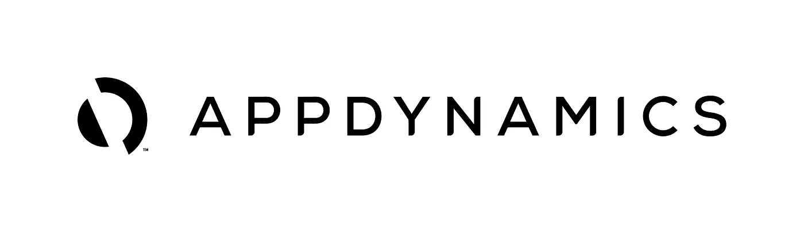

# 阿帕奇卡夫卡与动物园管理员之旅(七)

> 原文：<https://medium.com/analytics-vidhya/journey-of-apache-kafka-zookeeper-administrator-part-7-ddcf6c28a8c6?source=collection_archive---------21----------------------->

2020 年 3 月(卡夫卡与 Appdynamics 的痛苦整合)

另一个让我大吃一惊的是,**新遗迹**合同将被取消，一个名为 **Appdynamics、**的新产品将取而代之。我已经在**新遗迹集成**上花了大约一个月的时间，现在我不得不再次用 **Appdynamics** 做这件事。



我知道这是必须要做的，我对这个决定无能为力。我决定让我寻求帮助，这样其他队友也能学到东西。我让我的同事检查一下，让我知道如何做，我给了他新遗迹经验的例子，但他太天真了，老实说，他对做这件事没多大兴趣。总之他找到了[app dynamics Kafka Integration](https://www.appdynamics.com/community/exchange/kafka-monitoring-extension/)。在我看来没问题，我让我的同事在一台机器上实现它，让我们看看它将如何出现在 Appdynamics 门户中。我对 Appdynamics 抱有很高的期望，但它失败了。

**app dynamics bumper**列表

*   多么令人困惑的 Appdynamics 门户:(。
*   Appdynamics 没有简单的文档？
*   不支持标签或类似的东西。
*   旧式的定制仪表板，所有的东西都应该是静态的。
*   集成非常难以配置和检查？
*   不支持 API，我可以下载和上传自定义仪表板。
*   配置文件应该很小，以便于更新。

不管怎样，我的同事在一台机器上完成了集成，并向我展示了一个关于安装和其他方面的小演示。因为他不感兴趣，所以我不得不这样做，我对自己说，这他妈的有多难，我会给它一个合适的镜头。如果它不起作用，那么我将在没有监控的情况下运行当前的生产卡夫卡(已经有了 CMAK，所以并不担心)。

**集成文档:**

[](https://www.appdynamics.com/community/exchange/kafka-monitoring-extension/) [## 用于 AppDynamics 的 Kafka 监控扩展

### 用于 AppDynamics 用例的 Kafka 监控扩展 Apache Kafka 是一个分布式容错流平台…

www.appdynamics.com](https://www.appdynamics.com/community/exchange/kafka-monitoring-extension/) [](https://www.appdynamics.com/community/exchange/extension/zookeeper-monitoring-extension/) [## 动物园管理员-监控扩展

### 在安装扩展之前，需要满足这里提到的先决条件。请不要继续…

www.appdynamics.com](https://www.appdynamics.com/community/exchange/extension/zookeeper-monitoring-extension/) 

文档中非常奇怪的部分是，我需要定义我需要收集的每个指标，这将使我的配置很长，以后很难更新。

**配置层级**

在这种情况下需要报告指标。这可以通过改变
`metricPrefix: "Server|Component:<Component-ID>|Custom Metrics|Kafka"`中`<Component-ID>`的值来实现。< br/ >请参考此[链接](https://community.appdynamics.com/t5/Knowledge-Base/How-to-troubleshoot-missing-custom-metrics-or-extensions-metrics/ta-p/28695)以找到您所在层级的组件 ID。
例如，

```
metricPrefix: "Server|Component:19|Custom Metrics|Kafka"
```

**Config.yml**

```
- objectName: "kafka.server:type=BrokerTopicMetrics,*"
          metrics:
              - Count:
                 alias: "Count"
                 multiplier: ""
                 delta: false
                 aggregationType: "OBSERVATION"
                 timeRollUpType: "AVERAGE"
                 clusterRollUpType: "INDIVIDUAL"

              - MeanRate:
                 alias: "Mean Rate"
                 multiplier: ""
                 delta: false
                 aggregationType: "AVERAGE"
                 timeRollUpType: "AVERAGE"
                 clusterRollUpType: "INDIVIDUAL"
```

我不明白为什么他妈的我需要加上这些“计数”/“平均率”和更多？

如果你还记得 New Relic 正在监控 200 多个 JMX 对象，那么上面的 config.yml 就太长了。

**定制仪表板**

每台 Kafka 服务器都单独报告其指标，因此您必须在“指标浏览器”中找到每台服务器，然后将每个指标导出到自定义仪表板。如果只是做小计算

> 36 台 Kafka 服务器* 10 个指标= 360(仅 NewRelic 仪表板的一小部分)

以上步骤我需要做 360 次，这是太多的手工工作，即使我没有任何初级 DevOps，所以我不能把它们交给别人:(。

**终于！**

我决定不管发生什么，我都不会去做，因为有太多关于 Appdynamics 集成的工作，这给我自己也就是 **Kafka 管理员提供了很少的见解。**

旅程将继续实际自定义监控！