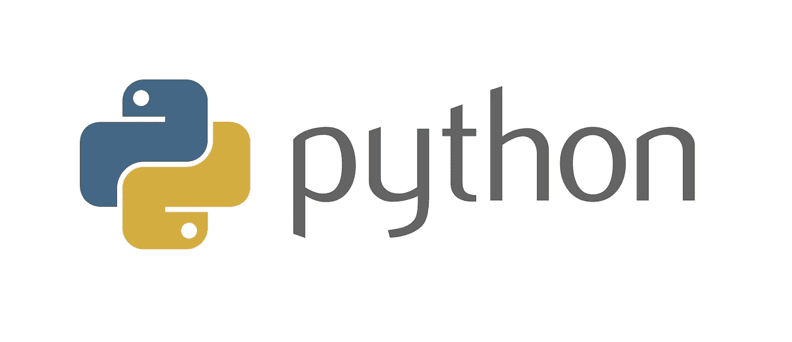

# 阿帕奇卡夫卡与动物园管理员之旅(八)

> 原文：<https://medium.com/analytics-vidhya/journey-of-apache-kafka-zookeeper-administrator-part-8-acdc030302ba?source=collection_archive---------16----------------------->

2020 年 4 月(Python 作为救世主第 1 部分)

如果你还记得，在我的上一篇文章中，我决定不使用 Appdynamics。我有点担心，因为我没有任何历史监测系统，可以比较阿帕奇卡夫卡指标，直到 6 个月。

> **幸运**，偶遇 [Python JMX 查询模块](https://pypi.org/project/jmxquery/)。
> 居功至“ [**大卫·吉尔德**](https://github.com/dgildeh) ”。