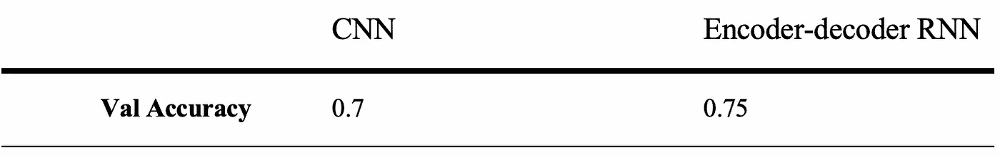

# 通过 NLP 和时间序列预测黄金价格

> 原文：<https://medium.com/analytics-vidhya/journey-through-nlp-and-time-series-to-predict-gold-price-a14e34edb19c?source=collection_archive---------0----------------------->

图片由[琳达·汉密尔顿](https://pixabay.com/users/hamiltonleen-5703179/?utm_source=link-attribution&utm_medium=referral&utm_campaign=image&utm_content=2430051)来自 [Pixabay](https://pixabay.com/?utm_source=link-attribution&utm_medium=referral&utm_campaign=image&utm_content=2430051)

预测金融资产变动的能力是如此有利可图，以至于许多组织都在投资研究，通过采用最先进的技术和技巧来获得这种优势。有了这种兴趣，也就不足为奇了，也有许多关于预测股票市场价格的研究论文。尝试范围从特征工程、事件驱动的方法、具有分层注意机制的新闻序列、主题和情感学习等等。出于对金融市场的浓厚兴趣，我决定将预测黄金价格作为我的第四个 Metis 训练营项目。

这个数据科学项目旨在利用市场信息，包括分析信息和技术信息，来预测给定时期内随机的黄金价格波动。分析信息是利用黄金或商品市场相关的金融新闻获取的。技术特征是多种资产的历史价格，包括标准普尔 500 指数、道琼斯指数、原油等等。

我使用 Event Registry API 从多个主要新闻提供商处获取黄金相关新闻，包括彭博商业、华尔街日报、路透社、金融时报、雅虎财经。由于 Event Registry 存档了 2014 年以来的新闻，所以我选择了同期的金融数据。

在这篇文章中，我将介绍项目的工作流程，从数据探索、数据预处理、机器学习模型，以及我在这个过程中的学习。如果你对递归神经网络和卷积神经网络的工作原理感兴趣，请阅读本文末尾。

# 数据探索

每个数据科学项目都需要数据。我收集了哪些数据？

*   2014 年 1 月至 2019 年 8 月 1900+条新闻
*   同期选择的六个资产类别中的每一个都有 1400 多个价格点

为了准备预处理，我将文章从 JSON 格式转换到 Pandas 数据框架。然后对于我的目标，我计算一个交易日之间的金价波动。我将两个数据框合并，使新闻与价格一致。

# 数据洞察

当我处理这两种类型的数据时，我发现了一些有趣的点。

从所有新闻的文字云里，我做三点观察。

*   关键在于谁说了什么。
*   央行是老大。
*   “看不见的手”:市场力量同样重要。

而且金价分布和消息量也有一定的关系。当消息量较低时，金价波动也相对较小，这意味着 2 月至 11 月期间，消息量与金价波动之间存在正相关关系。唯一的例外是在 12 月至 1 月期间，此时消息量达到峰值，但黄金价格波动没有 8 月那么高。

以上是我，一个人类的观察。那么机器能告诉我们什么呢？

# 数据预处理

在这个阶段，我正在处理三组数据:新闻、资产价格和我的目标。

*   新闻:在词汇化之前，我删除了数字、标点符号、末尾的空格和停用词，并将所有文本都改为小写。在查看了所有文档的长度后，我选择用零填充所有语料库，使其长度统一为 24100 个单词。选择这个截止值是因为 1900 个文档中只有 5 个超出了这个长度。
*   资产价格:当我合并两个数据框架时，非交易日的新闻没有相应的价格。因此，我用前一个交易日的价格填充 nan 单元格。
*   目标:基于一个交易日的波动，我将绝对 1%以内的变化划分为“保持”，1%以上为“上升”，1%以下为“下降”。对于未来的工作，我可能会将“停留”带宽缩小到绝对的 0.5%，以创建更平衡的类。

# 深度学习模型

在深入研究我使用的深度学习模型之前，我想分享一下我使用多输入神经网络模型的决策过程。我最初的计划是在两种方法中选择一种。一种是使用多输入神经网络模型。另一种方法是对文本使用递归神经网络，对金融数据使用多变量时间序列，然后将结果与特定规则相结合。我首先尝试第二种方法。由于使用时间序列 VAR 模型的结果并不令人印象深刻，我求助于更复杂的替代方法。

在训练模型之前还有几个步骤:对金融数据进行标准缩放，对目标进行一次热编码，对文本进行标记，使用 Stanford GloVe.6B.100d 准备嵌入矩阵，最后训练、验证、测试数据分割。

多输入神经网络的结构如下所示。我比较了卷积神经网络(CNN)和序列到序列递归神经网络(编码器-解码器 RNN)在文本输入方面的性能，同时保持了时间序列金融价格的 LSTM 模型结构。

模特表演:

CNN 模型每个历元只需要 20 秒来训练，比 RNN 模型少 20 倍。此外，RNN 模型的准确性和 F1 分数在第一个时期后很快达到平稳，这导致对测试数据的较差分类性能，因为它将一切都分类到多数类。

下面是 CNN 模型对测试数据的归一化混淆矩阵。

# 我的旅程

鉴于我的初步结果，有许多潜在的改进。然而，鉴于这是我第一次尝试定制的多输入深度学习模型，再加上我只有三周的时间，我觉得这段旅程既具有挑战性，又非常有意义。我计划进一步探索这个主题，一旦我做到了，我会发布一个更新。

来源:

*   使用 NLP 和深度学习预测股价走势:[https://towards data science . com/using-NLP-and-Deep-Learning-to-Predict-the-Stock-market-64eb 9229 e 102](https://towardsdatascience.com/using-nlp-and-deep-learning-to-predict-the-stock-market-64eb9229e102)
*   论文本分析对股价预测的重要性:【https://nlp.stanford.edu/pubs/lrec2014-stock.pdf】T2
*   张量流-多维-lstm & Keras 注意机制:【https://github.com/philipperemy? after = y 3 vyc 29 yonyyopk 5 mjaxos 0 wmy 0 wofqwntownzowmcswodowmm 4c i2v&tab = repositories
*   斯坦福 NLP/Glove:[https://github.com/stanfordnlp/GloVe](https://github.com/stanfordnlp/GloVe)
*   使用 Keras 了解 Python 中的有状态 LSTM 递归神经网络:[https://machine learning mastery . com/understanding-Stateful-lstm-Recurrent-Neural-Networks-Python-Keras/](https://machinelearningmastery.com/understanding-stateful-lstm-recurrent-neural-networks-python-keras/)
*   Keras 中序列对序列学习的十分钟介绍:[https://blog . Keras . io/a-ten-minute-introduction-to-sequence-to-sequence-learning-in-Keras . html](https://blog.keras.io/a-ten-minute-introduction-to-sequence-to-sequence-learning-in-keras.html)
*   如何开发时间序列预测的 LSTM 模型:[https://machine learning mastery . com/how-to-develop-lstm-models-for-time-series-forecasting/](https://machinelearningmastery.com/how-to-develop-lstm-models-for-time-series-forecasting/)
*   Keras:多输入多输出:[https://keras.io/getting-started/functional-api-guide/](https://keras.io/getting-started/functional-api-guide/)