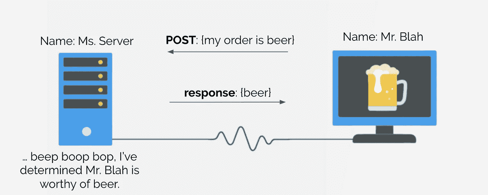

# JS，认识一下 Python——我是 JSON。

> 原文：<https://medium.com/analytics-vidhya/js-meet-python-i-am-json-f0300db8d68f?source=collection_archive---------26----------------------->

## 通过 JSON 对象在 JavaScript 和(Python) Flask 应用程序之间建立本地对话。然后，在谷歌应用引擎上运行它。

> 注意:出于某种原因，使用 Jupyter 中的**请求**包从谷歌应用引擎(GAE)加载请求需要*很长时间..*。为什么？你告诉我！我很想知道。


左边的东西是莱夫·埃里克森用过的烧瓶

# 构建您的应用

你要做的第一件事是构建一个你计划放到 GAE 上的应用程序，并将其保存到某个目录文件夹中。我假设你知道如何在 [Flask](https://www.fullstackpython.com/flask.html) 上设置一个简单的应用，但是如果你不知道，他们在主页上有一个很棒的`hello world`例子。

对于我们对 Flask 的实际使用，我们想要的不仅仅是一个接受 [GET](https://developer.mozilla.org/en-US/docs/Web/HTTP/Methods/GET) 请求并展示有趣内容的应用程序。我们想要构建一个 [API](https://www.freecodecamp.org/news/what-is-an-api-in-english-please-b880a3214a82/) “服务器”,它接受 [POST](https://developer.mozilla.org/en-US/docs/Web/HTTP/Methods/POST) 请求，这些请求包含一些数据的有效载荷，并且根据这些有效载荷，用另一组数据作为响应，供客户端使用。



(非常)粗略的帖子请求草图

你可能已经注意到了，我决定给你链接一些我认为比我更能解释概念的文章。在继续编写代码之前，我强烈建议看一看这些文章。

## 一些代码

不要太深入，让我们先把所有的代码写下来，然后浏览一下:

首先，导入您需要的库，并加载数据

```
from flask import Flask, request
from flask_cors import cross_origin
import json
import pandas as pdapp = Flask(__name__)cross_origins = ['http://localhost:1313', 'http://localhost:8888']
df = pd.read_csv("./datafile.csv")  # df should be loaded upon init
```

然后，编写一个函数来接收来自使用 [**请求**](https://realpython.com/python-requests/) (或者一个替代方案)的 Python 请求或者来自 JavaScript `XMLHttpRequest`的数据。

```
def get_data():
    *'''
    a standard reception of data from POST/GET request.

    '''* # Python call
    try:
        request_data = json.loads(request.data)
        data = json.loads(request_data['json_payload'])
        calltype = 'python'

    # JavaScript call
    except:
        request_data = request.json
        data = request_data['json_payload']
        calltype = 'javascript'

    print(calltype)
    print(request_data)
    print(data)

    return data
```

然后，添加初始化应用程序的路由，以及一个 post 请求的路由。

```
@app.route('/')
@cross_origin(origins=cross_origins)
def index():
    return 'Yay initialization!\n'@app.route('/retrieve_data', methods=['GET', 'POST', 'OPTIONS'])
@cross_origin(origins=cross_origins, allow_headers=['Content-Type'])
def retrieve_data():
    data = get_data() # ... do stuff using `data` and `df`, save result as `df_report` response = {"data": df_report.to_json(orient='records')}

    return response
```

最后，将应用程序设置为在`__main__`实例上运行。*(注:评论中的措辞直接来自* [*GAE app.yaml 讨论*](https://cloud.google.com/appengine/docs/standard/python3/building-app/writing-web-service) *)。)*

```
if __name__ == '__main__':
    # This is used when running locally only. When deploying to GAE
    # a webserver process such as Gunicorn will serve the app. This
    # can be configured by adding an `entrypoint` to app.yaml.
    app.run(host='127.0.0.1', port=8080, debug=True)
```

## 解释 1: CORS

我们在这里做的第一件奇怪的事情是导入一个叫做`flask_cors`的东西，并定义一些`cross_origins`。基本上，有一个叫做[跨源资源共享(CORS)](https://cloud.google.com/storage/docs/cross-origin) 的东西，它是最近开发的，用来提供额外的安全级别。嗯，这导致了许多谷歌(或其他)应用程序的问题，因为大多数(如果不是全部)数据共享发生在多个来源之间。例如，考虑如果*女士服务器*位于 IP 地址 123.456.7.89，而*先生 Blah* 位于 IP 地址 987.654.3.21。然后，对话发生在两个不同的起源之间。更实际的是，如果你有一个来自 GAE 的对 Google 存储容器的请求，那么你也有同样的问题。

CORS 是解决错误产生的问题的方法`No ‘Access-Control-Allow-Origin’ header is present on the requested resource`。

```
...
from flask_cors import cross_origin
......cross_origins = ['http://localhost:1313', 'http://localhost:8888']
...
```

[**flask _ CORS**](https://flask-cors.readthedocs.io/en/latest/)**是一个帮助我们解决问题的库，而`cross_origins`是 API 应该期望 POST 请求并应该满足它们的位置。**

> **注意:Google 确实有一个“内置”解决方案，它包括更新你的 app.yaml 文件以支持特定的 http 头。**然而**，我花了一整天的时间为我的用例尝试这个解决方案的每一个变体，但是我不能让它工作。因此，我使用 **flask_cors** 。在这一点上，有时应用程序会在一开始加载有点慢。Google 针对这个问题提供了一个[预热请求解决方案](https://cloud.google.com/appengine/docs/standard/python3/configuring-warmup-requests)，但是我也发现对我也不起作用！真扫兴。**

## **解释 2: get_data**

**接下来，您会注意到这个`get_data`函数，它对传入的请求做了很多事情。让我一行一行地看完`# Python call`和`# JavaScript call`部分。*注意:稍后，我们将介绍如何在 Python 和 JavaScript 调用中格式化数据以实现这一点。***

1.  ****请求数据。**您想要的数据将保存在变量`request_data`中。在 Python 中，要得到它，使用`json.loads(request.data)`。在 JavaScript 中，使用`request.json`。**
2.  ****提取数据。**稍后，我们将看到数据被格式化，我们想要使用的实际数据存储在`'json_payload'`内发送给应用程序的有效载荷中。因此，为了做到这一点，我们使用 Python `json.loads(request_data[‘json_payload’])`中的 load JSON，或者只使用键从 JavaScript `request_data[‘json_payload’]`中访问数据。**

## **解释 post 请求**

**代码的最后一部分是指向 POST 请求的数据收集部分的应用程序路由。让我们来解决这个问题:**

**`@app.route(‘/retrieve_data’, methods=[‘GET’, ‘POST’, ‘OPTIONS’])`**

**对于这个路由，我们需要接受 GET、POST 和 OPTIONS 请求。目前，POST 请求是唯一对应用程序有意义的请求，但我保留了 GET 和 OPTIONS，以防我决定改变数据处理方式。**

```
@cross_origin(origins=cross_origins, allow_headers=['Content-Type'])
```

**这个装饰器指的是 **flask_cors** 包。我们已经在`cross_origins`中定义了可以跨越数据的原点，所以应该没问题。**

```
data = get_data()
```

**从`get_data()`出来的数据是 POST 请求中发送的客户端数据的提取内容，您不需要传入任何参数就可以让它工作。**

```
response = {"data": df_report.to_json(orient='records')}
```

**最后，这是我们将如何打包数据。这个应用程序的目的是为 D3 可视化提供数据，当数据是以`[{'key': 'value', ...}, ...]`的形式时，D3(和 JavaScript)工作得最好，其中我们的数据被表示为一个对象列表，每个对象独立地规定每个属性的值。因此，出现了`orient="records"`位。**

# **建立 GAE**

**好的，这里重要的事情是非常小心地遵循谷歌给出的[指令](https://cloud.google.com/appengine/docs/standard/python3/building-app/)，但是也要小心地遵循我的指令(我只做几个警告，我不确定谷歌是否已经更新了……我确定他们正在更新。)**

**我们不会使用大量数据(出于我们的目的，我们*可以*在谷歌存储上托管我们的数据，但为了简单起见，我们不需要这么做)。而且，我们不太担心用户的认证。因此，我们将只需要使用步骤 [1](https://cloud.google.com/appengine/docs/standard/python3/building-app/creating-gcp-project) 、 [2](https://cloud.google.com/appengine/docs/standard/python3/building-app/writing-web-service) 、 [3](https://cloud.google.com/appengine/docs/standard/python3/building-app/deploying-web-service) 和 [4](https://cloud.google.com/appengine/docs/standard/python3/building-app/deploying-web-service) 。记住，当你`gcloud app deploy`时，你保留代码的最后一部分`if __name__ == "__main__"`。我会在执行中忽略它所需要的。**

# **从 Python 请求数据**

**在 Python 中，假设您使用上述方法在应用程序中发布数据，您可以使用请求来运行**

```
import requests
import json
import pandas as pd
```

**要导入库**

```
request = requests.get('[https://blah-1.appspot.com/'](https://blog1-256621.appspot.com/'))
# request = requests.get('[https://localhost:1313/'](https://blog1-256621.appspot.com/')) # Flask run
print(request.content.decode())
```

**测试你的应用(无论是在 GAE，还是由 Flask 本地驱动)**

```
data = {'var_1': ['data_stuff1', 'data_stuff2', ...],
        'var_2': ['data_stuff1', 'data_stuff2', ...]}request = requests.post('[https://blah-1.appspot.com/](https://blog1-256621.appspot.com/select_income')retrieve_data',
                         headers={"Content-Type":       
                                  "application/json;charset=UTF-8"},
                         json={'json_payload': json.dumps(data)})
```

**来发送数据。注意，这最后一部分基本上是通过 POST 请求发送有效负载的标准操作方式。**

```
pd.read_json(request.json()['data'])
```

**最后，您可以使用 pandas 以表格形式显示数据。**

# **从 JavaScript 请求数据**

**好吧，这个是个大麻烦。上述 Python 脚本的目的是测试我们的 API。出于某种原因，这需要一段时间，但主要是为了调试和测试。JavaScript 部分是 D3.js 的工作所在，所以我们需要聪明地处理我们的请求。**

## **承诺**

**在深入研究我们的应用程序的 JavaScript 请求之前，首先要理解 JavaScript 承诺。老实说，真正掌握这里发生的事情的最好方法是研究 Mozilla MDN Web 文档中的[理解承诺](https://developer.mozilla.org/en-US/docs/Web/JavaScript/Guide/Using_promises)，然后[构造它们](https://developer.mozilla.org/en-US/docs/Web/JavaScript/Reference/Global_Objects/Promise)。你可以整天(像我一样)研究不同的媒体文章和博客文章，试图找到一个简洁的解释，但在一天结束时，最有价值的信息将来自 MDN web 文档。尽可能点击所有链接，以确保你理解了你正在阅读的内容，并接受在你理解承诺之前，你可能还需要理解 JavaScript 中的其他基本概念。把它想象成维基百科的一篇文章— **不要害怕点击一堆链接**！一旦你经历了这个过程，你仍然会有点失落(就像我一样)，记住这个帮助我的想法:**

> **JS 承诺*不是数据*，但它是一个* **途径，通过它你将获得数据(无论它是否是你想要的)。****
> 
> **是* **而不是** **冰淇淋甜筒*** ，是你最好的朋友答应给你冰淇淋甜筒。**

**所以，当你写类似于`var promise2 = promise1().then(...)`的东西时，只要记住`promise2`真的是一个承诺，而不是数据。**

## **代码**

**同样，我将在这里张贴一大堆数据，我们将浏览这些数据:**

```
function postRequest(url, data) {
  /*
  url - API route
  data - the 'data' (e.g., dictionary) that the API will extract. Get data back from this request using this syntax: var request = postRequest(api_route, data); request.then(function(result) {
    json_data = JSON.parse(JSON.parse(result)['data']);
    // do something with `json_data` ...
  }).catch(function(error) {
    console.log(error);
  });
  */ var xhttp = new XMLHttpRequest();

  // Return the promise of an xhttp request
  // that has successfully posted `data` to the `url` return new Promise(function(resolve, reject) {
    xhttp.onreadystatechange = function() {
      // Set handler to watch for the Ready State to change to DONE
      if (xhttp.readyState == 4) {
        if (xhttp.status >= 300) {
          // Reject promise with error if the post is a failure
          reject("Error, status code = " + xhttp.status);
        } else {
          // (Lazily) Resolve the promise if success
          resolve(xhttp.responseText);
        }
      }
    }
  // Open post request to the Flask App
  xhttp.open('POST', url, true); // Send the proper header information along with the request
  xhttp.setRequestHeader("Content-Type",
                         "application/json;charset=UTF-8"); // My standard for json_payload back and forth
  var payload = {"json_payload": data}; xhttp.send(JSON.stringify(payload));
  });
}
```

****

**这大概就是你 rn 的感受吧。**

1.  ****说明如何调用函数。这段代码的第一步是提供一种关于如何使用该函数的文档(在`/* */`中)。`postRequest`的输出是一个承诺，所以一旦*解决了*，你需要告诉 JavaScript 做什么。我们通过使用`.then`和`.catch`来做到这一点。如果问题解决了，我们就可以使用`JSON.parse(JSON.parse(result)['data'])`语法提取数据后再进行`// do our stuff`，因为这就是我们发送数据的方式(如上所述)。但是如果它被拒绝，我们只想在控制台中记录错误。****
2.  ****功能定义。** *注意:使用 jQuery、Node.js 和其他成熟的 web 开发工具有很多方法可以做到这一点，但我不是一个成熟的 web 开发人员——我只是一个数据科学家。*在这个函数中，我们创建一个`XMLHttpRequest`对象，然后使用函数定义的其余部分来定义它的属性:(1)做什么`.onreadystatechange`，(2)如何`.open`请求，(3)将什么`.setRequestHeader`发送给`.send`，以及如何发送(即使用`JSON.stringify`并将数据放入`{"json_payload": data}`)。使用`onreadystatechange`，函数将返回*一个`.responseText`的承诺*如果承诺是`resolve` d，或者一个`.status`的日志如果承诺是`reject` ed。**

# **一个例子**

**差不多就是这样！如果你想看看这个框架的一个工作示例，请查看 Python Flask App [代码](https://github.com/ltjds/gcp_apps/tree/master/worldbank)中托管在 GAE 的 [D3 可视化](https://ltjds.github.io/post/d3pds_2/)，以及可视化本身的 [JavaScript 代码](https://github.com/ltjds/blog/blob/master/static/js/d3pds/d3pds_4.js)。**

> **就像我之前说的，这个应用程序需要一点时间来加载和运行，但是一旦它启动并运行，一切都很好。**

**感谢阅读，希望有所帮助！如果你看到我可以改进的地方，请告诉我！**