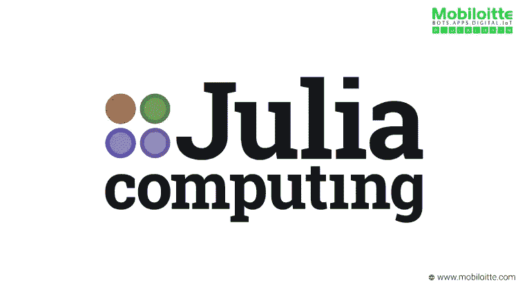
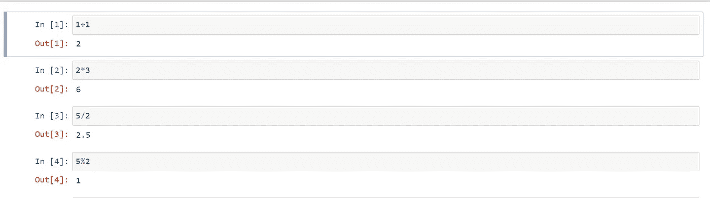
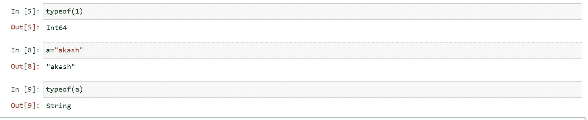
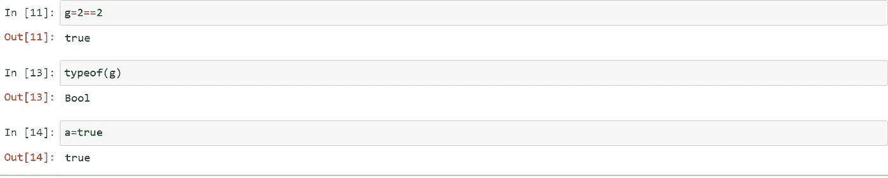
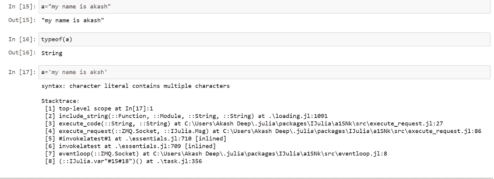
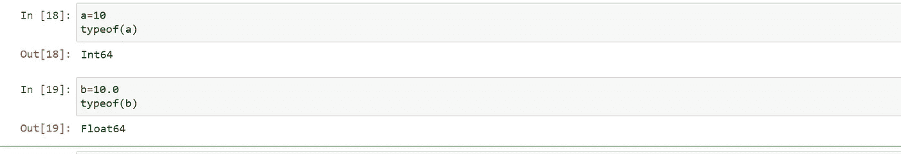
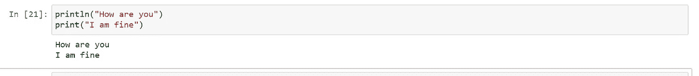
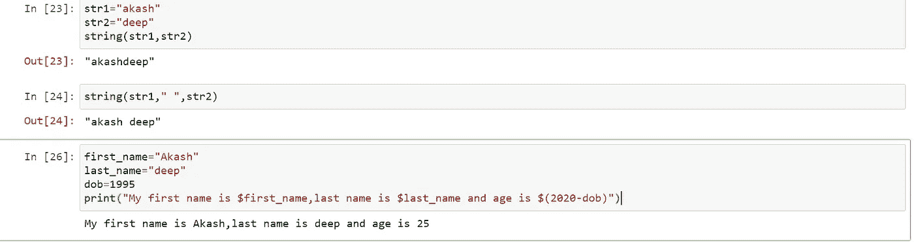
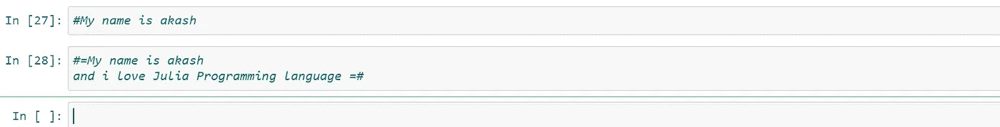

# Julia 编程基础，数据类型，数值运算

> 原文：<https://medium.com/analytics-vidhya/julia-basics-of-programming-data-types-numerical-operations-13f659aff3d0?source=collection_archive---------6----------------------->

朱莉娅

在这篇文章中，我们将试着理解 Julia 编程的基本知识，主要是关于数据类型、字符串操作等等，因为我们都知道这些是任何编程语言的基本构件。通过组合这些基本构件，我们可以编写用例并设计任何产品。在我的上一篇文章中，我们已经讨论了什么是 julia 以及如何在 Jupyter 笔记本中安装和使用 Julia。我强烈建议通读那篇文章，试着理解什么是 julia，它的范围是什么。下面列出了前一篇文章的链接

 [## 在 Jupyter 笔记本上安装 Julia

### 在这篇文章中，我们将尝试了解如何安装 Julia，我们将添加 IDE，这是所谓的 IJulia IDE 在…

medium.com](/analytics-vidhya/installing-julia-using-on-jupyter-notebook-7177742db1cf) 

正如我前面提到的，如果你懂 python，学习 Julia 会很有帮助，也很容易，因为你可以很容易地把编程语言的概念联系起来，比如类、对象、继承、垃圾收集器等等。如果你没有 python 背景，不要担心，我会尽量让概念简单易懂。如果你想澄清任何你不明白的地方，请在下面随意评论，我将非常乐意为你解答。在上一个教程中，我已经讨论了如何在 Jupyter IDE 中安装 Julia，这很重要，因为我们要在 Jupyter 笔记本上练习 Julia。

**气动操作**

在 julia 中，如果你想执行任何算术运算，这是非常简单的，就像 python 一样，只要用操作数写出我们想执行的运算。我们需要明白的一点是，在 julia 中,“2//2”将被视为字符串。关于 BODMAS 规则，它和任何其他编程语言一样，比如 python，java 等等，也就是说，首先是括号，然后是顺序，然后是除法，然后是乘法，最后是减法。如果你有一组你需要执行的算术运算，它将遵循 BODMAS 规则。在 Julia 中，如果我们想要打印指数语句，我们将指定为“10^ 2”，但是在 python 中，我们知道如果我们想要执行相同的操作，我们可以使用“10**2”。下面提供了一些算法操作的屏幕截图

朱莉娅的气管手术

**检查数据类型**

检查数据类型也是主要任务之一，如果您正在编写任何复杂的代码，或者如果您希望在任何类型的产品集成中进一步使用响应输出，这将非常有用。众所周知，在 python 数据类型检查中，我们使用了 **type()** 关键字。在 Julia 中，我们将使用名为 **typeof()** 的关键字进行检查。

类型 of()

**布尔运算**

在 Julia 中，布尔运算的关键字叫做“真”和“假”。在 python 中，我们有“真”和“假”关键字。唯一不同的是，在朱莉娅中，它是以小写字母开头的。

布尔代数学体系的

**字符串定义**

在 python 中，我们知道我们可以在单引号和双引号中定义字符串，我意思是，如果我们想在 python 中将 akash 定义为字符串，我们可以在“akash”或“akash”中这样做，两种方式都可以。但是在 julia 中，如果我们定义一个字符串，我们只需要把它放在双引号中，比如“akash ”,如果我们把它放在单引号中，我们会遇到错误。在下面的例子中，我们看到，如果我们试图在单引号中定义字符串，就会在 julia 中遇到错误。如果我们想在 Julia 中初始化多行字符串，我们需要在" " " " " " 3 下指定多行字符串，像在 python 中一样使用双引号。

字符串定义

**变量初始化**

在 Julia 中，定义或初始化变量和 python 一样简单。我们不需要像在 c++或 java 中那样指定变量的数据类型。在 Julia 中，编译器会自动理解变量的类型，即我们已经赋值的类型，我们不需要显式地指定变量的类型。

变量赋值

**打印功能**

在 Julia 中，我们使用了 print()和 println()函数来打印任何语句。我们都知道在 python 中只有一个打印函数，即 print()。Julia 中的 println()指定在新行中打印语句。在 python 中，我们没有任何名为 println()的函数。

打印报表

**字符串格式化**

字符串格式是任何编程语言的有用特性之一。在 Julia 中，字符串格式化非常简单，我们只需要在字符串函数中指定需要格式化的参数。我们有两个字符串变量 str1 和 str2，我们希望连接这两个字符串，我们将指定字符串 str1 和 str2 作为字符串函数中的参数，这将导致两个字符串的连接。同样，我们可以连接多个字符串。关于字符串格式，对于 Julia 来说非常简单。在 python 中，我们通常需要使用 format()函数来执行字符串格式化，但是在 Julia 中，我们只需要在 print 语句中指定需要用美元符号格式化的字符串，并且我们还可以通过在小括号中指定它来执行任何运算。我们将看到下面的例子。

字符串格式和连接

**朱丽亚评论**

注释是处理任何编程语言时最有用的实践之一，因为如果你在组织中编写任何框架或开发任何应用程序，我们需要遵循注释代码的实践，因为这将有助于将来看到你的代码的其他人，有时也有助于你，因为我们将来可能会忘记你的代码的行为，并且当你将更新你的代码和执行任何调试操作时，这也是非常有帮助的。在 python 中，我们已经知道，如果我们想要指定单行注释，我们只需使用“#”符号，只需编写注释即可。在 Julia 中，我们将遵循同样的方法来指定单行注释。我们将在“#”符号下指定我们想要评论的任何陈述。如果我们想执行多行注释，我们可以在注释的开始和结束时使用“#=”，我们将像这样以相反的方式使用上面的语句“=#”。参见下面的例子

朱莉娅评论

在本文中，我们讨论了非常基本的 Julia 操作，并试图理解概念和语法。如果您有任何疑问或困惑，请在下面的评论框中发表评论，我很乐意帮助您，如果您想了解更多关于数据科学和 DL 和 ML 概念的信息，我建议您查看我以前的文章，我相信它会有所帮助。在 Julia 教程下的下一篇文章中，我们将讨论更高级的概念和语法，当我们看到使用 Julia 的机器学习时，这些概念和语法将对进一步的构建模块非常有帮助。

# **敬请期待**