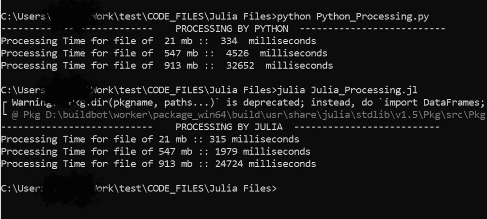

# 朱莉娅:性能助推器

> 原文：<https://medium.com/analytics-vidhya/julia-the-performance-booster-a6d42725b597?source=collection_archive---------29----------------------->

随着我们进入云时代，现在没有人使用本地存储，我不认为下一代人会知道什么是笔衍生。每秒钟，世界上的数据都在以 TB 为单位增加，我们已经开始谈论 PB 大小的数据。因此，管理大量数据是目前编程语言的最低要求。

在我 5 年的全栈开发中，我接触过 PHP、JavaScript、Python、SQL，我认为每种语言都针对一个特定的问题，它们也有自己的缺点。像 Python 非常易学，开发者不用担心内存分配或者垃圾回收。它是一种通用编程语言，可用于脚本编写、自动化、数据分析、可视化、web 开发等等。如果你能理解英语，那么你就能理解 Python。是的，很容易学。

*打印(" Python")* →在输出窗口中简单地打印" Python "。

但问题是，由于动态内存分配，在处理较大的数据时会占用大量的空间和时间。例如大小在 GB 或更高范围内的文件。

因此出现了照片中的朱莉娅。朱丽亚的设计目标是 ***科学计算领域*** 。这是一种在 2012 年创造的新鲜语言，从 2018 年开始吸引了开发者的目光。Julia 在特性、结构*方面与 Python 非常相似，这使得学习曲线很短，*在执行速度和性能方面仅次于“C ”,这使得它独一无二。到目前为止，我已经探索了这种语言并阅读了一些文章，我认为**速度**和**性能**是 Julia 仍然存在的原因，即使在这个行业中我们已经有了许多稳定的语言。

让我们来看一个演示。

我从 [kaggle](https://www.kaggle.com/) 下载了 3 个不同大小的文件(21Mb、547MB 和 913MB ),并执行了读取 CSV 文件和获取过滤数据的简单操作。以下是结果

Python 和 Julia 执行 3 个不同大小的文件

从上面的执行我们可以说:

1.  ***当我们需要处理一个拥抱大小的数据时，我们应该使用 Julia。*** 从上面的结果你可以看到对于大/更大的文件它们在执行时间上是有显著差异的。因为它是为科学计算而设计的，如果我们使用这种语言来处理小规模的数据，比如 20 或 50 MB，那么它就没有任何意义，因为你可以看到处理时间几乎相等。就像我们可以用手折断一根棍子，但要打破一堵墙，我们需要一把锤子。即使锤子可以折断棍子，我们仍然用手。

那么我们可以在我现有的 Python 项目中使用 Julia 吗？

**是 。Julia 可以通过使用 [pyjulia](https://github.com/JuliaPy/pyjulia) 包与 Python 集成。例如，假设您有一个需要生成发票的 web 应用程序，它需要对公式的 excel 文件、获取不同参数值的 csv 文件、数据库交互以及最后的一些计算进行大量处理。您可以在 Julia 中构建您的发票模块，并将该模块导入到您的 Python(或 Django 视图)中，以便可以临时安排处理时间。通过这种方式，您可以从 Julia 开始，然后通过一个接一个地实现不同的模块，慢慢地向它迁移。**

但是让我们看看硬币的另一面。

1.  与 30 岁的巨蟒相比，朱莉娅是个 8 岁的孩子。所以它的社区很小。但就像一个孩子，它随着时间而成长。
2.  **JIT(Just in time)** :由于 Julia 程序需要一点时间来加载你第一次执行时使用的*包。但在那之后，性能会加快。这就像我们学习驾驶时的第一档问题。一旦我们成功地从一档起步，加速就变得有趣了。*

所以，喝一杯浓咖啡，仔细考虑你的项目的复杂性。如果这是一个简单的问题，那么就没有必要通过增加另一个维度来使你的生活变得困难。

最后一个热点问题 Julia 会取代 Python 吗？我不知道。编程语言只是我们用来实现业务的工具，所以如果业务需要执行一些需要 Julia 的操作，那么行业会立即适应它。例如，10 年前，我们习惯于在网站上填写我们的详细信息并点击提交按钮，但现在我们希望网络从我们的图像中读取数据。因此，正如谢耳朵所说的那样，“变化的必然性可能是一个普遍的常数”。

谢谢……