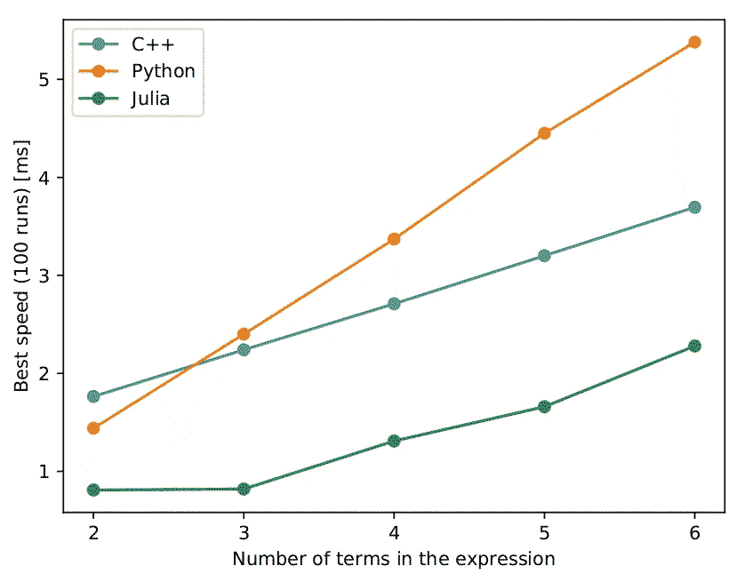

# Julia vs. Python:你该怎么选？

> 原文：<https://medium.com/analytics-vidhya/julia-vs-python-what-should-you-choose-bbb20647f406?source=collection_archive---------6----------------------->

从记事起，Python 就已经存在了。Python 的实现始于蒂姆·伯纳斯·李发明万维网的那一年(1989 年)。它的哲学可以用 19 条“指导原则”来描述，也就是 Python 的禅宗:

> 漂亮总比难看好。
> 显性比隐性好。
> 简单比复杂好。
> 复杂总比复杂好。
> 扁平比嵌套好。
> 稀疏胜于密集。
> 可读性很重要。特例不足以特殊到打破规则。
> 虽然实用性战胜了纯度。错误永远不会无声无息地过去。
> 除非明确消音。
> 面对暧昧，拒绝猜测的诱惑。应该有一种——最好只有一种——显而易见的方法。虽然这种方式一开始可能并不明显，除非你是荷兰人。
> 现在总比没有好。
> 虽然永远也不会比*正确*现在好。如果实现很难解释，这是个坏主意。
> 如果实现容易解释，可能是个好主意。
> 名称空间是一个非常棒的想法——让我们多做一些吧！

它被设想为一种通用编程语言，不杂乱，易于理解，简约但高度可扩展。上述特性使它非常适合初学者学习、理解和编写 Python 代码。

另一方面，朱莉娅被其创作者描述为“贪婪”。创作者在 2012 年 2 月的一篇[博客中解释他们的座右铭为:](https://julialang.org/blog/2012/02/why-we-created-julia/)

> 我们想要一种开源的语言，有一个自由的许可证。我们想要 C 的速度和 Ruby 的活力。我们想要一种同形异义的语言，既有像 Lisp 那样的真正的宏，又有像 Matlab 那样明显、熟悉的数学符号。我们想要像 Python 一样可用于一般编程，像 R 一样易于统计，像 Perl 一样自然用于字符串处理，像 Matlab 一样强大用于线性代数，像 shell 一样善于将程序粘合在一起。这种东西学习起来非常简单，却能让最严肃的黑客感到高兴。我们希望它是交互式的，我们希望它是编译过的。

Julia 于 2009 年开始开发，并于 2012 年作为 Julia 1.0 首次向公众发布。虽然 Python 还没有一个大的粉丝群，正如 TIOBE index 所显示的，Python 是继 C 和 Java 之后第三受欢迎的语言，而 Julia 排在第 40 位，但它仍然值得一游。在这篇文章中，展示了 Julia 和 Python 之间的比较，以及你应该选择什么的一般规则。

## 速度

C++、Python 和 Julia 中执行率的比较

很容易看出，就速度而言，Julia 比 Python 快很多。这里起作用的主要特征是，朱莉娅没有被解释；而是使用快速 LLVM 框架进行编译。Julia 无需许多优化就能快速给出结果，并且擅长数值计算。然而，Python 最近在这方面有所改进(对多核和并行处理的改进)。

## 图书馆

Julia 的一个显著缺点是本地的 Julia 包相对较少。创建者试图通过使 Julia 能够与 C 库和 Python 库接口(使用 PyCall)来弥补这一点，但与 Python 相比，这并不是很好。Python 在这方面远远超过了 Julia。作为一种通用编程语言和可扩展的理念，它提供了一个庞大的标准库和各种社区维护的开源库，用于从 web 开发(flask 和 django)到数学编程(numpy 和 scipy)的多种任务。

## 平行

Python 和 Julia 都可以在多个处理器上运行，并且都有内置的并行处理。Python 并行编程方法需要对数据进行序列化和反序列化，以便在线程之间实现并行化。而 Julia 的并行化要精细得多。与 Python 相比，Julia 还拥有更少的头重脚轻的并行化语法，从而降低了使用它的门槛。

## 代码转换

从 Python 或 C 转换到 Julia 是相当容易的。将代码从 Python 转换成 C 以及从 C 转换成 Python 是一项艰巨的任务。PyCall 等库使得在 Julia 内部使用 python 代码变得更加容易。

朱莉娅中 PyCall 的例子

## 打字和索引

Julia 和 Python 都是动态类型的(即开发人员不必指定变量)。然而，你也可以在 Julia 中使用静态类型。
Python 是 0 索引的，即 list 和其他索引从 0 开始，但是 Julia 是 1 索引的。索引可能是一个问题，因为大多数黑客、程序员习惯于 0 索引，但是有些人(使用 Mathematica 等。)有 1-indexing 的经验。

## 社区

Julia 有一个不断增长的热情的社区，但它相对较新，因此规模小得多。Python 拥有一个非常庞大且有用的社区。在不同的网站上获得帮助要容易得多，包括 python 文档和 stack overflow，因为许多人经常用 Python 编程，而不是 Julia。作为任何语言的初学者，拥有一个由经验丰富的开发人员组成的大型社区来帮助解决代码中的问题/错误是一个巨大的好处。因此，大多数人从 Python、C 或 Java 等流行语言开始是合适的。

## 多才多艺

朱莉娅速度更快，数学更好；这有助于朱莉娅更好地为学术界服务。Julia 是由 academians 在麻省理工学院创建的，因此，它面向学术编程，很像 MATLAB 或 Statistica。使用 Julia 的包和开发人员越少，通用编程的其他方面就越差。从纯数学(numpy)到图像处理(pillow ),甚至是 web 开发(flask ), Python 有更广泛的软件包可用于不同的任务。Python 可以作为一种语言用于[全栈开发](https://www.guru99.com/full-stack-developer.html)和在线部署应用以及在不同的桌面或 android 系统中部署应用。

## 外壳集成

在 Julia 中使用 shell 非常容易，因为所有变量都是作为 shell 中的环境变量导出的，而且 Julia 可以访问 shell 命令来打开、编辑和保存文件以及执行其他任务。Python 中同样的任务并不那么简单。

## 例子

朱莉娅中的二分搜索法

蟒蛇皮二分搜索法

上面的程序都很相似，都是 11 行。茱莉亚代码更快；然而，Python 代码更易于阅读。注意 Python 中的索引是从 0 开始的，而在 Julia 中是从 1 开始的。

# 结论

没有人能预测未来会发生什么，但可以肯定的是，两种语言之间会有激烈的竞争。虽然 Julia 更快，更适合学者，但就目前而言，Python 在理解、接受和完善的社区方面胜过它。如果你是从编程开始，那么我建议你使用 Python，因为它为你提供了一个更大的开发者群体，你可以在遇到任何问题时寻求帮助。Julia 鼓励那些精通 Mathematica 并且想要 MATLAB 的开源替代品的人。然而，数据科学家需要意识到这样一个事实，即 Julia 以发达的社区为代价提供了速度。有经验的程序员可能会尝试两者，看看哪一个最适合他们。对我来说，速度不是问题，我对 Python 现在提供的内容很满意。

# 在你走之前…

**在**[**insta gram**](https://www.instagram.com/om_arpit/)**和** [**脸书**](https://www.facebook.com/ompuri55555) **上跟我连线。如果你喜欢这个故事，按下拍手按钮(一个按钮你可以拍手 50 次！)还有关注我更多这样的文章！**

> *分享，推荐，评论走！参与有助于我们沟通和更人性化！*